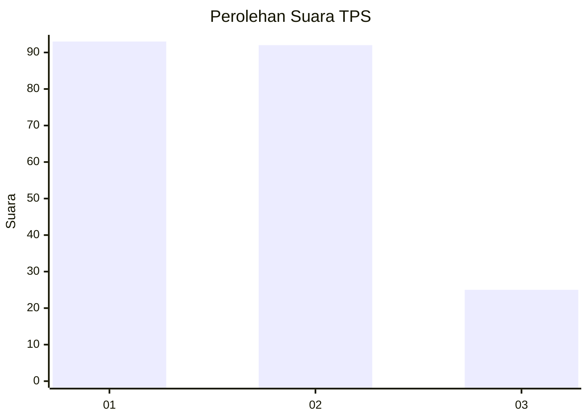
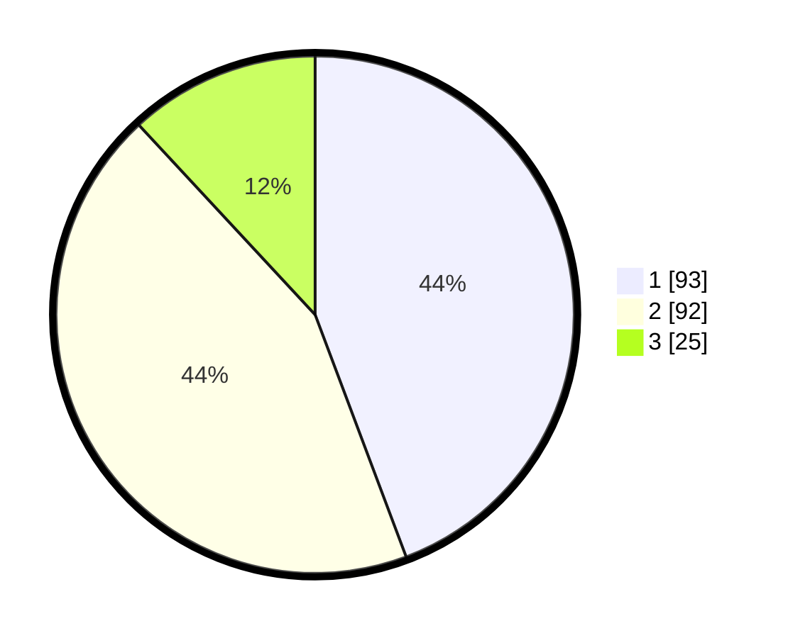

# Hasil

## Grafik

## Tabel

| No. | Nama Paslon    | Suara | Suara (raw) | Persentase |
|:--- |:-------------- | -----:| -----------:| ----------:|
| 1   | ANIES MUHAIMIN | 93    | [93][p-1]   | 44,29      |
| 2   | PRABOWO GIBRAN | 92    | [92][p-2]   | 43,81      |
| 3   | GANJAR MAHFUD  | 25    | [25][p-3]   | 11,90      |

[p-1]: https://github.com/gigit-pemilu/pemilu-2024-36-banten/blob/main/pilpres/hitung-suara/sub/36-banten/sub/71-kota-tangerang/sub/06-ciledug/sub/1001-paninggilan/sub/007-tps/sub/paslon-1.txt
[p-2]: https://github.com/gigit-pemilu/pemilu-2024-36-banten/blob/main/pilpres/hitung-suara/sub/36-banten/sub/71-kota-tangerang/sub/06-ciledug/sub/1001-paninggilan/sub/007-tps/sub/paslon-2.txt
[p-3]: https://github.com/gigit-pemilu/pemilu-2024-36-banten/blob/main/pilpres/hitung-suara/sub/36-banten/sub/71-kota-tangerang/sub/06-ciledug/sub/1001-paninggilan/sub/007-tps/sub/paslon-3.txt

## Foto C Plano

https://sirekap-obj-formc.kpu.go.id/a4c0/pemilu/ppwp/36/71/06/10/01/3671061001007-20240215-002919--b172f032-c6ae-427b-9117-91bdb0732fab.jpg

https://sirekap-obj-formc.kpu.go.id/a4c0/pemilu/ppwp/36/71/06/10/01/3671061001007-20240215-003721--2cc0d6c4-b043-4f83-b0ac-b46637d570d0.jpg

https://sirekap-obj-formc.kpu.go.id/a4c0/pemilu/ppwp/36/71/06/10/01/3671061001007-20240215-004506--d7b562ef-997e-48ba-9ce8-2ee1c481c8d5.jpg

## Metadata

| Key        | Value               |
| ---------- | ------------------- |
| Time Stamp | 2024-02-15 21:30:27 |

