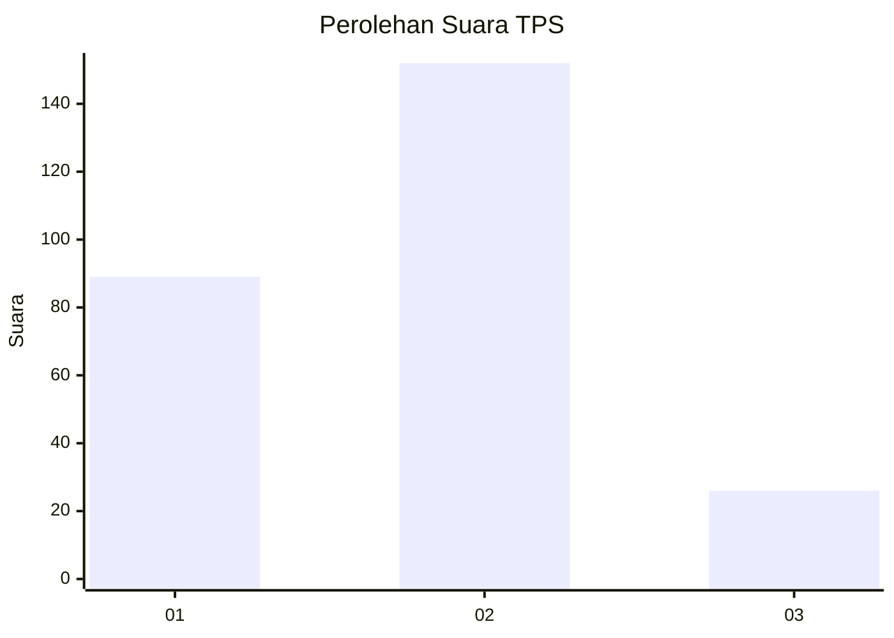
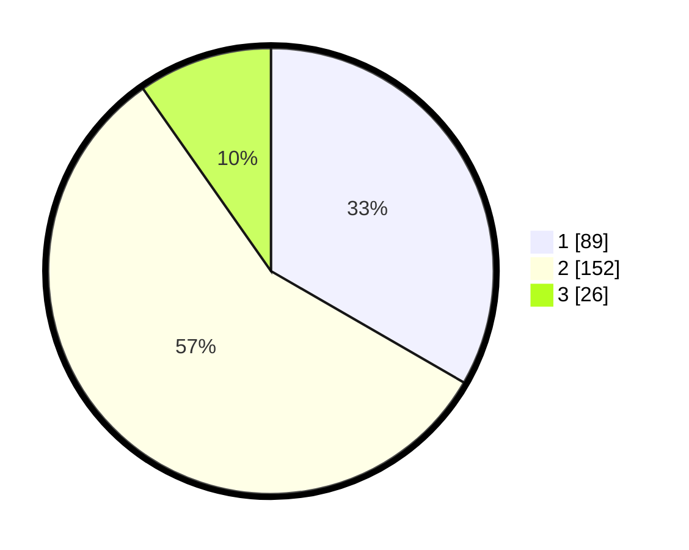

# Hasil

## Grafik

## Tabel

| No. | Nama Paslon    | Suara | Suara (raw) | Persentase |
|:--- |:-------------- | -----:| -----------:| ----------:|
| 1   | ANIES MUHAIMIN | 89    | [89][p-1]   | 33,33      |
| 2   | PRABOWO GIBRAN | 152   | [152][p-2]  | 56,93      |
| 3   | GANJAR MAHFUD  | 26    | [26][p-3]   | 9,74       |

[p-1]: https://github.com/gigit-pemilu/pemilu-2024-36-banten/blob/main/pilpres/hitung-suara/sub/36-banten/sub/71-kota-tangerang/sub/06-ciledug/sub/1005-parung-serab/sub/030-tps/sub/paslon-1.txt
[p-2]: https://github.com/gigit-pemilu/pemilu-2024-36-banten/blob/main/pilpres/hitung-suara/sub/36-banten/sub/71-kota-tangerang/sub/06-ciledug/sub/1005-parung-serab/sub/030-tps/sub/paslon-2.txt
[p-3]: https://github.com/gigit-pemilu/pemilu-2024-36-banten/blob/main/pilpres/hitung-suara/sub/36-banten/sub/71-kota-tangerang/sub/06-ciledug/sub/1005-parung-serab/sub/030-tps/sub/paslon-3.txt

## Foto C Plano

https://sirekap-obj-formc.kpu.go.id/3a86/pemilu/ppwp/36/71/06/10/05/3671061005030-20240214-220035--00826411-4a5f-48dd-94b5-76dc421dae7a.jpg

https://sirekap-obj-formc.kpu.go.id/3a86/pemilu/ppwp/36/71/06/10/05/3671061005030-20240215-115112--3f13d021-7962-4185-b8a4-d5cbf8b5c638.jpg

https://sirekap-obj-formc.kpu.go.id/3a86/pemilu/ppwp/36/71/06/10/05/3671061005030-20240214-220841--50dc1aa1-7a2e-4c1d-91e1-0c4c9a91e63f.jpg

## Metadata

| Key        | Value               |
| ---------- | ------------------- |
| Time Stamp | 2024-02-16 16:25:10 |

