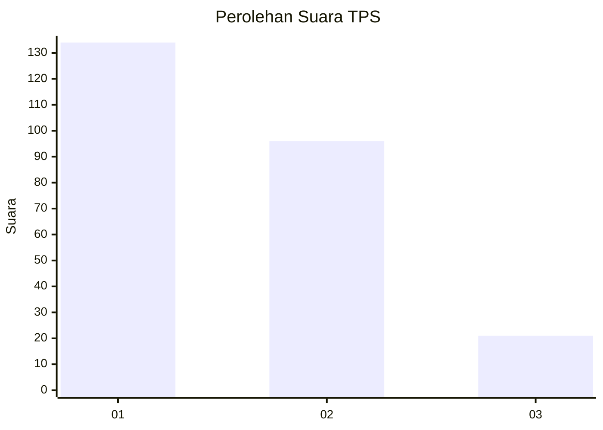
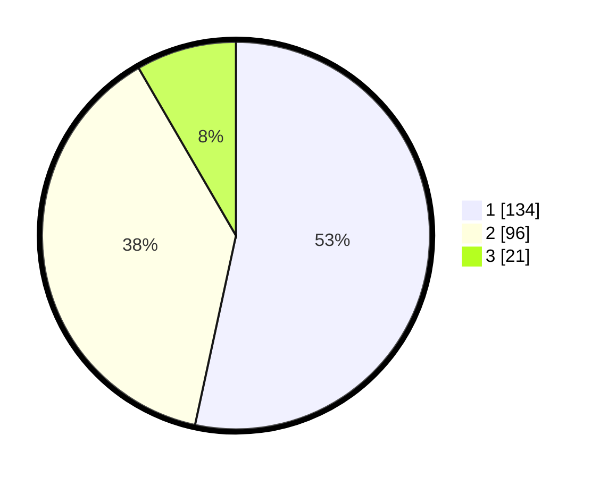

# Hasil

## Grafik

## Tabel

| No. | Nama Paslon    | Suara | Suara (raw) | Persentase |
|:--- |:-------------- | -----:| -----------:| ----------:|
| 1   | ANIES MUHAIMIN | 134   | [134][p-1]  | 53,39      |
| 2   | PRABOWO GIBRAN | 96    | [96][p-2]   | 38,25      |
| 3   | GANJAR MAHFUD  | 21    | [21][p-3]   | 8,37       |

[p-1]: https://github.com/gigit-pemilu/pemilu-2024-36-banten/blob/main/pilpres/hitung-suara/sub/36-banten/sub/71-kota-tangerang/sub/06-ciledug/sub/1006-sudimara-jaya/sub/001-tps/sub/paslon-1.txt
[p-2]: https://github.com/gigit-pemilu/pemilu-2024-36-banten/blob/main/pilpres/hitung-suara/sub/36-banten/sub/71-kota-tangerang/sub/06-ciledug/sub/1006-sudimara-jaya/sub/001-tps/sub/paslon-2.txt
[p-3]: https://github.com/gigit-pemilu/pemilu-2024-36-banten/blob/main/pilpres/hitung-suara/sub/36-banten/sub/71-kota-tangerang/sub/06-ciledug/sub/1006-sudimara-jaya/sub/001-tps/sub/paslon-3.txt

## Foto C Plano

https://sirekap-obj-formc.kpu.go.id/2671/pemilu/ppwp/36/71/06/10/06/3671061006001-20240220-133811--e33917a9-c64a-4d3f-9ac3-8a2d0ebc6f53.jpg

https://sirekap-obj-formc.kpu.go.id/2671/pemilu/ppwp/36/71/06/10/06/3671061006001-20240220-133917--7cb55402-ecb2-4993-8692-b2fdc3032730.jpg

https://sirekap-obj-formc.kpu.go.id/2671/pemilu/ppwp/36/71/06/10/06/3671061006001-20240220-134013--63c69f40-7e5c-4ad8-86c5-3a8ea1778806.jpg

## Metadata

| Key        | Value               |
| ---------- | ------------------- |
| Time Stamp | 2024-02-24 22:31:28 |

