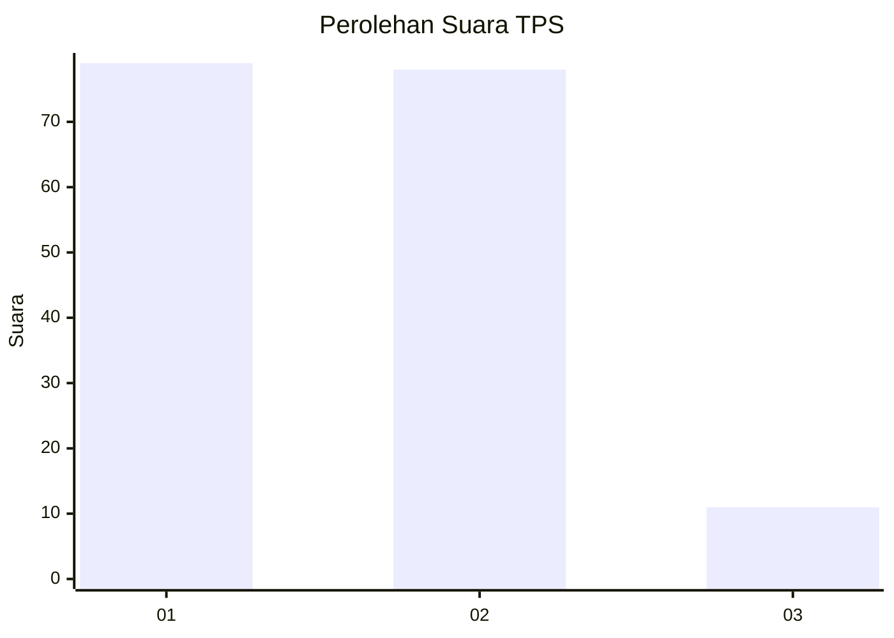
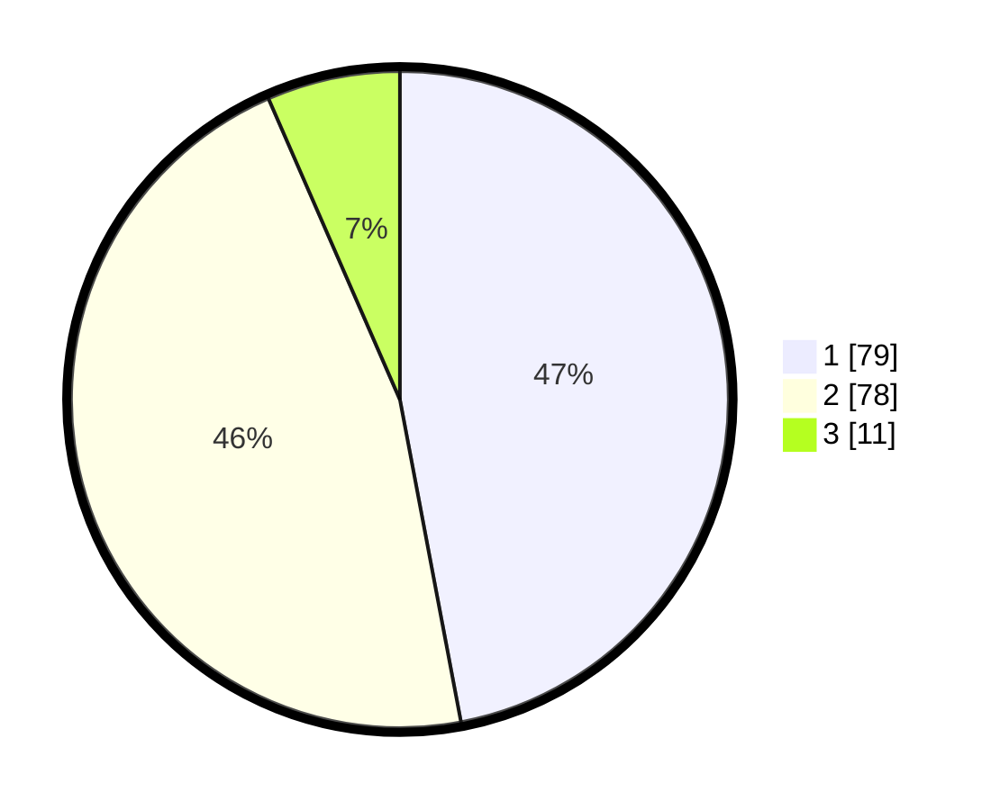

# Hasil

## Grafik

## Tabel

| No. | Nama Paslon    | Suara | Suara (raw) | Persentase |
|:--- |:-------------- | -----:| -----------:| ----------:|
| 1   | ANIES MUHAIMIN | 79    | [79][p-1]   | 47,02      |
| 2   | PRABOWO GIBRAN | 78    | [78][p-2]   | 46,43      |
| 3   | GANJAR MAHFUD  | 11    | [11][p-3]   | 6,55       |

[p-1]: https://github.com/gigit-pemilu/pemilu-2024-36-banten/blob/main/pilpres/hitung-suara/sub/36-banten/sub/71-kota-tangerang/sub/07-karawaci/sub/1001-karawaci/sub/001-tps/sub/paslon-1.txt
[p-2]: https://github.com/gigit-pemilu/pemilu-2024-36-banten/blob/main/pilpres/hitung-suara/sub/36-banten/sub/71-kota-tangerang/sub/07-karawaci/sub/1001-karawaci/sub/001-tps/sub/paslon-2.txt
[p-3]: https://github.com/gigit-pemilu/pemilu-2024-36-banten/blob/main/pilpres/hitung-suara/sub/36-banten/sub/71-kota-tangerang/sub/07-karawaci/sub/1001-karawaci/sub/001-tps/sub/paslon-3.txt

## Foto C Plano

https://sirekap-obj-formc.kpu.go.id/ca4a/pemilu/ppwp/36/71/07/10/01/3671071001001-20240220-191452--5202532b-a3ee-4899-96b2-69d57b4581a8.jpg

https://sirekap-obj-formc.kpu.go.id/ca4a/pemilu/ppwp/36/71/07/10/01/3671071001001-20240220-191557--c18fe3a8-782c-4c12-b1af-eba221b3fa5c.jpg

https://sirekap-obj-formc.kpu.go.id/ca4a/pemilu/ppwp/36/71/07/10/01/3671071001001-20240220-191653--e742cbde-4886-4bcc-9296-6fc278e927d2.jpg

## Metadata

| Key        | Value               |
| ---------- | ------------------- |
| Time Stamp | 2024-02-24 22:31:28 |

