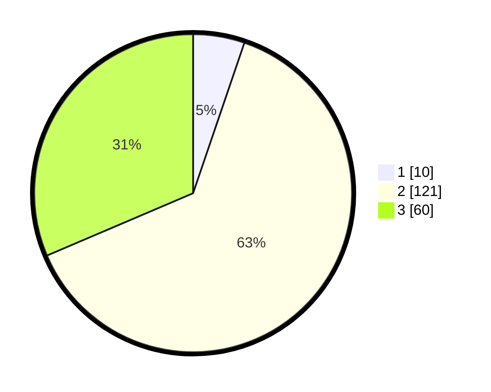

# Hasil

## Grafik

## Tabel

| No. | Nama Paslon    | Suara | Suara (raw) | Persentase |
|:--- |:-------------- | -----:| -----------:| ----------:|
| 1   | ANIES MUHAIMIN | 10    | [10][p-1]   | 5,24       |
| 2   | PRABOWO GIBRAN | 121   | [121][p-2]  | 63,35      |
| 3   | GANJAR MAHFUD  | 60    | [60][p-3]   | 31,41      |

[p-1]: https://github.com/gigit-pemilu/pemilu-2024-36-banten/blob/main/pilpres/hitung-suara/sub/36-banten/sub/71-kota-tangerang/sub/07-karawaci/sub/1001-karawaci/sub/002-tps/sub/paslon-1.txt
[p-2]: https://github.com/gigit-pemilu/pemilu-2024-36-banten/blob/main/pilpres/hitung-suara/sub/36-banten/sub/71-kota-tangerang/sub/07-karawaci/sub/1001-karawaci/sub/002-tps/sub/paslon-2.txt
[p-3]: https://github.com/gigit-pemilu/pemilu-2024-36-banten/blob/main/pilpres/hitung-suara/sub/36-banten/sub/71-kota-tangerang/sub/07-karawaci/sub/1001-karawaci/sub/002-tps/sub/paslon-3.txt

## Foto C Plano

https://sirekap-obj-formc.kpu.go.id/bd41/pemilu/ppwp/36/71/07/10/01/3671071001002-20240214-230645--ca56c159-56fa-4d14-817d-2d7e1db5c708.jpg

https://sirekap-obj-formc.kpu.go.id/bd41/pemilu/ppwp/36/71/07/10/01/3671071001002-20240214-192135--15378ba0-ffb7-465f-ad63-e9ec0612aa5f.jpg

https://sirekap-obj-formc.kpu.go.id/bd41/pemilu/ppwp/36/71/07/10/01/3671071001002-20240214-193836--359cb23c-fe0c-4b53-b5d4-4640ecddf2c4.jpg

## Metadata

| Key        | Value               |
| ---------- | ------------------- |
| Time Stamp | 2024-02-15 05:00:24 |

