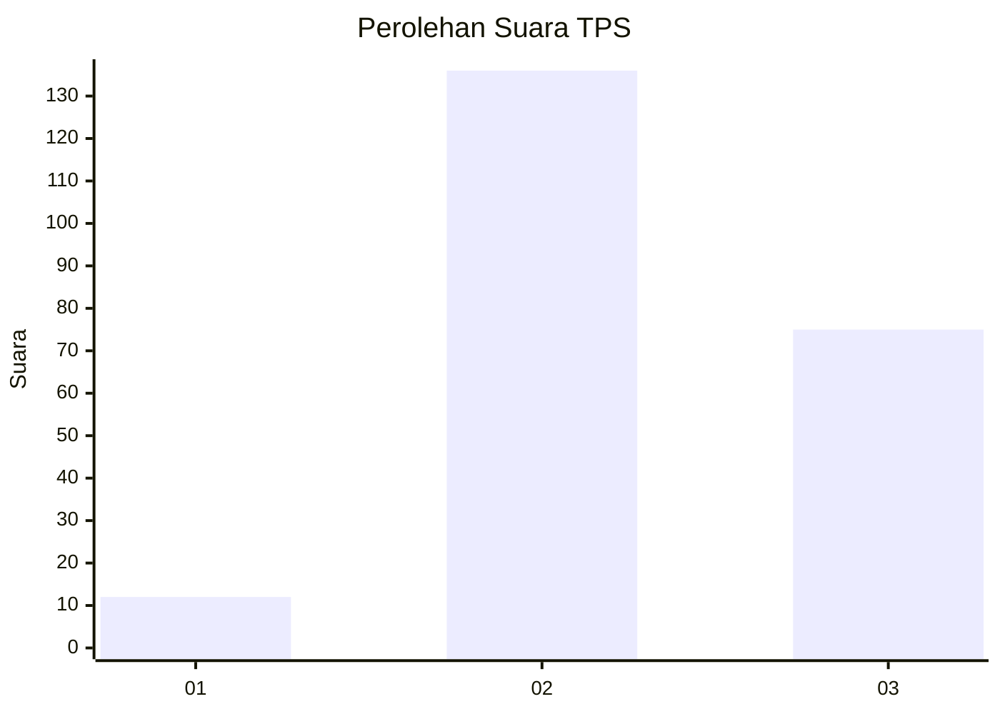
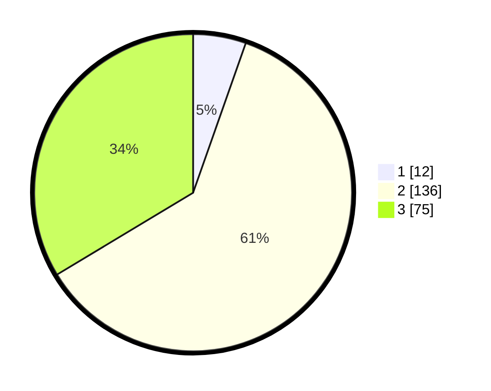

# Hasil

## Grafik

## Tabel

| No. | Nama Paslon    | Suara | Suara (raw) | Persentase |
|:--- |:-------------- | -----:| -----------:| ----------:|
| 1   | ANIES MUHAIMIN | 12    | [12][p-1]   | 5,38       |
| 2   | PRABOWO GIBRAN | 136   | [136][p-2]  | 60,99      |
| 3   | GANJAR MAHFUD  | 75    | [75][p-3]   | 33,63      |

[p-1]: https://github.com/gigit-pemilu/pemilu-2024/blob/main/pilpres/hitung-suara/sub/36-banten/sub/71-kota-tangerang/sub/07-karawaci/sub/1001-karawaci/sub/003-tps/sub/paslon-1.txt
[p-2]: https://github.com/gigit-pemilu/pemilu-2024/blob/main/pilpres/hitung-suara/sub/36-banten/sub/71-kota-tangerang/sub/07-karawaci/sub/1001-karawaci/sub/003-tps/sub/paslon-2.txt
[p-3]: https://github.com/gigit-pemilu/pemilu-2024/blob/main/pilpres/hitung-suara/sub/36-banten/sub/71-kota-tangerang/sub/07-karawaci/sub/1001-karawaci/sub/003-tps/sub/paslon-3.txt

## Foto C Plano

https://sirekap-obj-formc.kpu.go.id/5159/pemilu/ppwp/36/71/07/10/01/3671071001003-20240215-000919--4085f395-4292-45f4-bb64-a1f2e2a099ad.jpg

https://sirekap-obj-formc.kpu.go.id/5159/pemilu/ppwp/36/71/07/10/01/3671071001003-20240215-001124--2decf1a4-c9c3-4bb4-ae23-e159688afa3d.jpg

https://sirekap-obj-formc.kpu.go.id/5159/pemilu/ppwp/36/71/07/10/01/3671071001003-20240215-001027--39421fa3-96f5-4d72-9e6c-898bdad57dc2.jpg

## Metadata

| Key        | Value               |
| ---------- | ------------------- |
| Time Stamp | 2024-02-24 22:31:28 |

