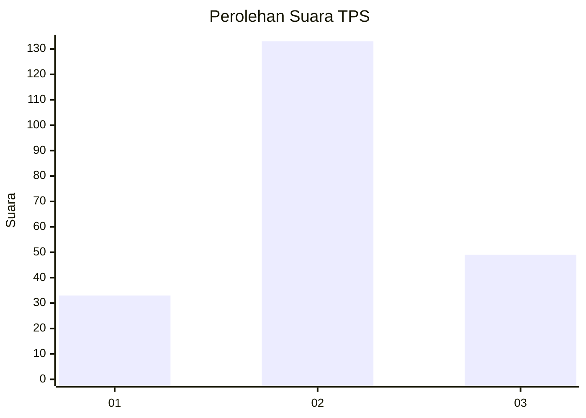
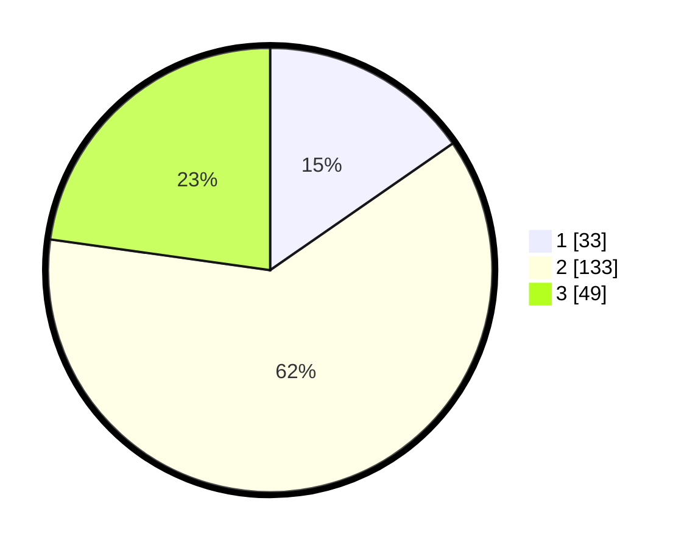

# Hasil

## Grafik

## Tabel

| No. | Nama Paslon    | Suara | Suara (raw) | Persentase |
|:--- |:-------------- | -----:| -----------:| ----------:|
| 1   | ANIES MUHAIMIN | 33    | [33][p-1]   | 15,35      |
| 2   | PRABOWO GIBRAN | 133   | [133][p-2]  | 61,86      |
| 3   | GANJAR MAHFUD  | 49    | [49][p-3]   | 22,79      |

[p-1]: https://github.com/gigit-pemilu/pemilu-2024/blob/main/pilpres/hitung-suara/sub/36-banten/sub/71-kota-tangerang/sub/07-karawaci/sub/1001-karawaci/sub/005-tps/sub/paslon-1.txt
[p-2]: https://github.com/gigit-pemilu/pemilu-2024/blob/main/pilpres/hitung-suara/sub/36-banten/sub/71-kota-tangerang/sub/07-karawaci/sub/1001-karawaci/sub/005-tps/sub/paslon-2.txt
[p-3]: https://github.com/gigit-pemilu/pemilu-2024/blob/main/pilpres/hitung-suara/sub/36-banten/sub/71-kota-tangerang/sub/07-karawaci/sub/1001-karawaci/sub/005-tps/sub/paslon-3.txt

## Foto C Plano

https://sirekap-obj-formc.kpu.go.id/7429/pemilu/ppwp/36/71/07/10/01/3671071001005-20240215-001027--798ae6de-6583-4e76-94f1-a4da324b7676.jpg

https://sirekap-obj-formc.kpu.go.id/7429/pemilu/ppwp/36/71/07/10/01/3671071001005-20240215-001609--61fc016c-d6ee-41a6-8289-d2532b81d829.jpg

https://sirekap-obj-formc.kpu.go.id/7429/pemilu/ppwp/36/71/07/10/01/3671071001005-20240215-002034--e6a926c0-2088-43ee-9ae4-7c9a46df05ec.jpg

## Metadata

| Key        | Value               |
| ---------- | ------------------- |
| Time Stamp | 2024-02-24 22:31:28 |

