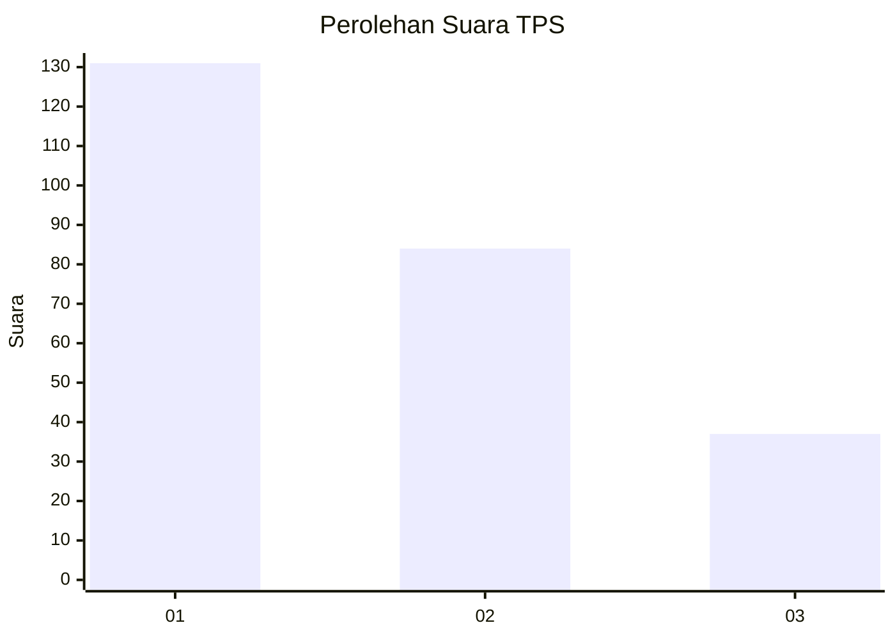
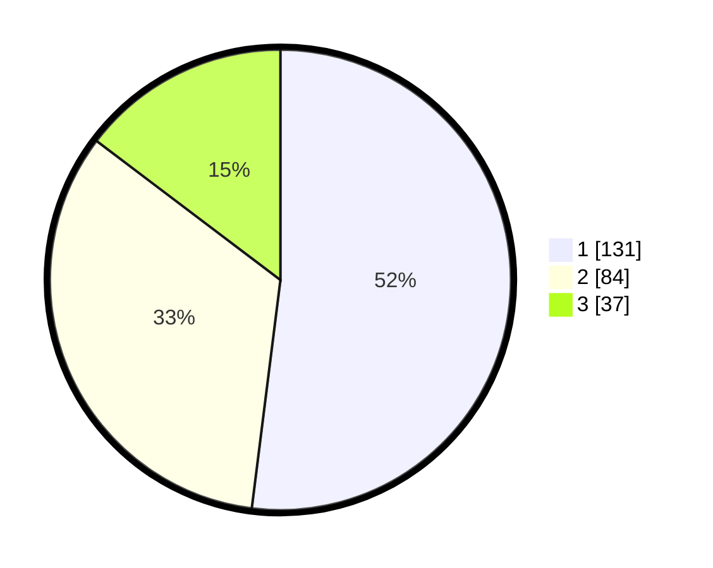

# Hasil

## Grafik

## Tabel

| No. | Nama Paslon    | Suara | Suara (raw) | Persentase |
|:--- |:-------------- | -----:| -----------:| ----------:|
| 1   | ANIES MUHAIMIN | 131   | [131][p-1]  | 51,98      |
| 2   | PRABOWO GIBRAN | 84    | [84][p-2]   | 33,33      |
| 3   | GANJAR MAHFUD  | 37    | [37][p-3]   | 14,68      |

[p-1]: https://github.com/gigit-pemilu/pemilu-2024/blob/main/pilpres/hitung-suara/sub/36-banten/sub/71-kota-tangerang/sub/07-karawaci/sub/1003-karawaci-baru/sub/002-tps/sub/paslon-1.txt
[p-2]: https://github.com/gigit-pemilu/pemilu-2024/blob/main/pilpres/hitung-suara/sub/36-banten/sub/71-kota-tangerang/sub/07-karawaci/sub/1003-karawaci-baru/sub/002-tps/sub/paslon-2.txt
[p-3]: https://github.com/gigit-pemilu/pemilu-2024/blob/main/pilpres/hitung-suara/sub/36-banten/sub/71-kota-tangerang/sub/07-karawaci/sub/1003-karawaci-baru/sub/002-tps/sub/paslon-3.txt

## Foto C Plano

https://sirekap-obj-formc.kpu.go.id/3878/pemilu/ppwp/36/71/07/10/03/3671071003002-20240215-025008--cadf3cc7-f045-48bb-9ec5-7896c33e5227.jpg

https://sirekap-obj-formc.kpu.go.id/3878/pemilu/ppwp/36/71/07/10/03/3671071003002-20240215-025209--2867706b-4428-4efb-87e9-c6ba2beed14c.jpg

https://sirekap-obj-formc.kpu.go.id/3878/pemilu/ppwp/36/71/07/10/03/3671071003002-20240215-025422--35e03007-29a1-4314-bcbb-02e579e45b92.jpg

## Metadata

| Key        | Value               |
| ---------- | ------------------- |
| Time Stamp | 2024-02-24 22:31:28 |

