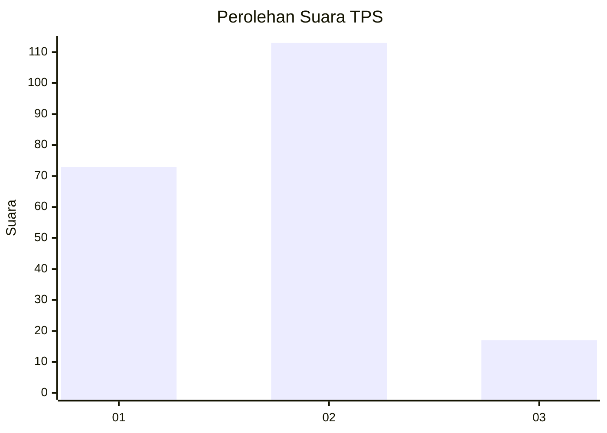

# Hasil

## Grafik

## Tabel

| No. | Nama Paslon    | Suara | Suara (raw) | Persentase |
|:--- |:-------------- | -----:| -----------:| ----------:|
| 1   | ANIES MUHAIMIN | 73    | [73][p-1]   | 35,96      |
| 2   | PRABOWO GIBRAN | 113   | [113][p-2]  | 55,67      |
| 3   | GANJAR MAHFUD  | 17    | [17][p-3]   | 8,37       |

[p-1]: https://github.com/gigit-pemilu/pemilu-2024/blob/main/pilpres/hitung-suara/sub/36-banten/sub/71-kota-tangerang/sub/08-periuk/sub/1001-periuk/sub/004-tps/sub/paslon-1.txt
[p-2]: https://github.com/gigit-pemilu/pemilu-2024/blob/main/pilpres/hitung-suara/sub/36-banten/sub/71-kota-tangerang/sub/08-periuk/sub/1001-periuk/sub/004-tps/sub/paslon-2.txt
[p-3]: https://github.com/gigit-pemilu/pemilu-2024/blob/main/pilpres/hitung-suara/sub/36-banten/sub/71-kota-tangerang/sub/08-periuk/sub/1001-periuk/sub/004-tps/sub/paslon-3.txt

## Foto C Plano

https://sirekap-obj-formc.kpu.go.id/4a84/pemilu/ppwp/36/71/08/10/01/3671081001004-20240215-000124--f26ff93d-a91d-4bdf-a426-3a9287b5ec4e.jpg

https://sirekap-obj-formc.kpu.go.id/4a84/pemilu/ppwp/36/71/08/10/01/3671081001004-20240215-000227--d7345369-b906-4bf8-b2c4-2b3d485d3102.jpg

https://sirekap-obj-formc.kpu.go.id/4a84/pemilu/ppwp/36/71/08/10/01/3671081001004-20240214-212443--c9089073-4578-405e-afb9-9535ec198d7c.jpg

## Metadata

| Key        | Value               |
| ---------- | ------------------- |
| Time Stamp | 2024-02-15 20:30:46 |

