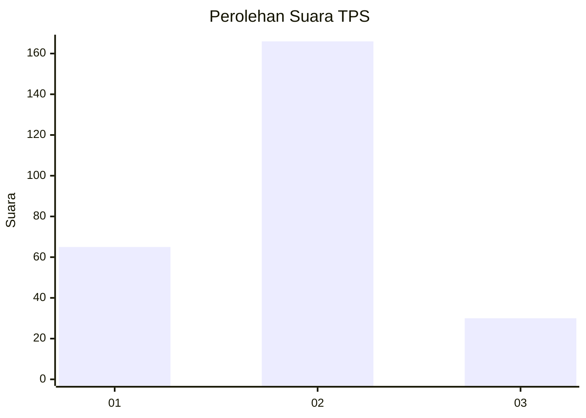
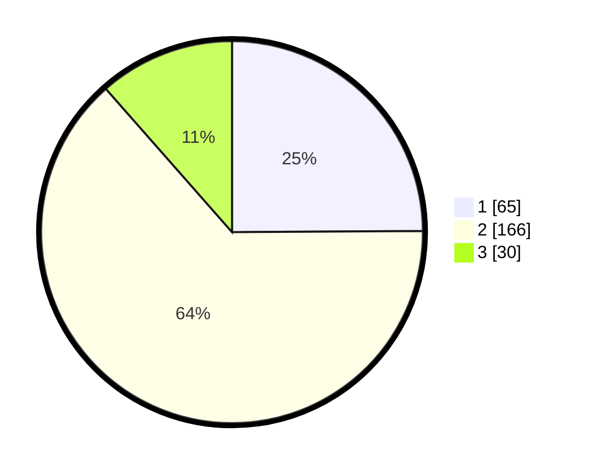

# Hasil

## Grafik

## Tabel

| No. | Nama Paslon    | Suara | Suara (raw) | Persentase |
|:--- |:-------------- | -----:| -----------:| ----------:|
| 1   | ANIES MUHAIMIN | 65    | [65][p-1]   | 24,90      |
| 2   | PRABOWO GIBRAN | 166   | [166][p-2]  | 63,60      |
| 3   | GANJAR MAHFUD  | 30    | [30][p-3]   | 11,49      |

[p-1]: https://github.com/gigit-pemilu/pemilu-2024/blob/main/pilpres/hitung-suara/sub/36-banten/sub/71-kota-tangerang/sub/08-periuk/sub/1001-periuk/sub/005-tps/sub/paslon-1.txt
[p-2]: https://github.com/gigit-pemilu/pemilu-2024/blob/main/pilpres/hitung-suara/sub/36-banten/sub/71-kota-tangerang/sub/08-periuk/sub/1001-periuk/sub/005-tps/sub/paslon-2.txt
[p-3]: https://github.com/gigit-pemilu/pemilu-2024/blob/main/pilpres/hitung-suara/sub/36-banten/sub/71-kota-tangerang/sub/08-periuk/sub/1001-periuk/sub/005-tps/sub/paslon-3.txt

## Foto C Plano

https://sirekap-obj-formc.kpu.go.id/88ec/pemilu/ppwp/36/71/08/10/01/3671081001005-20240214-202753--ad0f9887-b28d-4d37-aa8d-3ff71e7b6f43.jpg

https://sirekap-obj-formc.kpu.go.id/88ec/pemilu/ppwp/36/71/08/10/01/3671081001005-20240214-220003--c968ac49-5a5e-4cc8-b8b2-86879b572a1c.jpg

https://sirekap-obj-formc.kpu.go.id/88ec/pemilu/ppwp/36/71/08/10/01/3671081001005-20240214-202844--381e3aad-3c74-49c2-aa47-9239ba978fa4.jpg

## Metadata

| Key        | Value               |
| ---------- | ------------------- |
| Time Stamp | 2024-02-24 22:31:28 |

