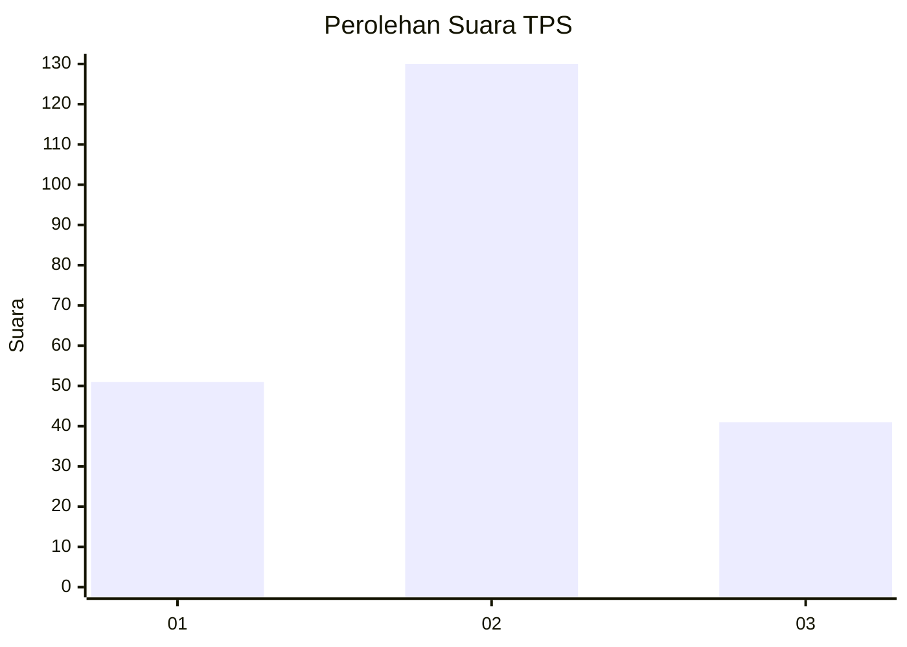
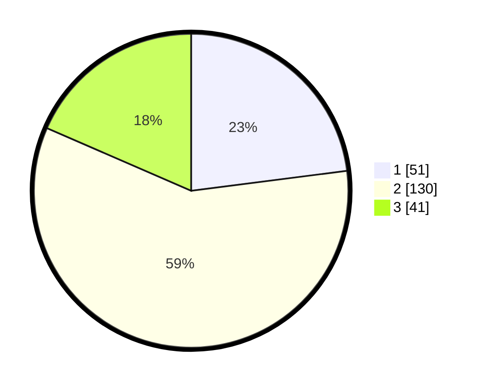

# Hasil

## Grafik

## Tabel

| No. | Nama Paslon    | Suara | Suara (raw) | Persentase |
|:--- |:-------------- | -----:| -----------:| ----------:|
| 1   | ANIES MUHAIMIN | 51    | [51][p-1]   | 22,97      |
| 2   | PRABOWO GIBRAN | 130   | [130][p-2]  | 58,56      |
| 3   | GANJAR MAHFUD  | 41    | [41][p-3]   | 18,47      |

[p-1]: https://github.com/gigit-pemilu/pemilu-2024-36-banten/blob/main/pilpres/hitung-suara/sub/36-banten/sub/71-kota-tangerang/sub/08-periuk/sub/1001-periuk/sub/007-tps/sub/paslon-1.txt
[p-2]: https://github.com/gigit-pemilu/pemilu-2024-36-banten/blob/main/pilpres/hitung-suara/sub/36-banten/sub/71-kota-tangerang/sub/08-periuk/sub/1001-periuk/sub/007-tps/sub/paslon-2.txt
[p-3]: https://github.com/gigit-pemilu/pemilu-2024-36-banten/blob/main/pilpres/hitung-suara/sub/36-banten/sub/71-kota-tangerang/sub/08-periuk/sub/1001-periuk/sub/007-tps/sub/paslon-3.txt

## Foto C Plano

https://sirekap-obj-formc.kpu.go.id/670a/pemilu/ppwp/36/71/08/10/01/3671081001007-20240215-004307--d144340c-de06-44b5-81c4-371de726a0a4.jpg

https://sirekap-obj-formc.kpu.go.id/670a/pemilu/ppwp/36/71/08/10/01/3671081001007-20240214-192051--47cc425b-b004-4c3c-b89f-ea65c1053f40.jpg

https://sirekap-obj-formc.kpu.go.id/670a/pemilu/ppwp/36/71/08/10/01/3671081001007-20240214-192406--9dfc0dd5-d0c1-47db-9b0f-72707687d7eb.jpg

## Metadata

| Key        | Value               |
| ---------- | ------------------- |
| Time Stamp | 2024-02-24 22:31:28 |

