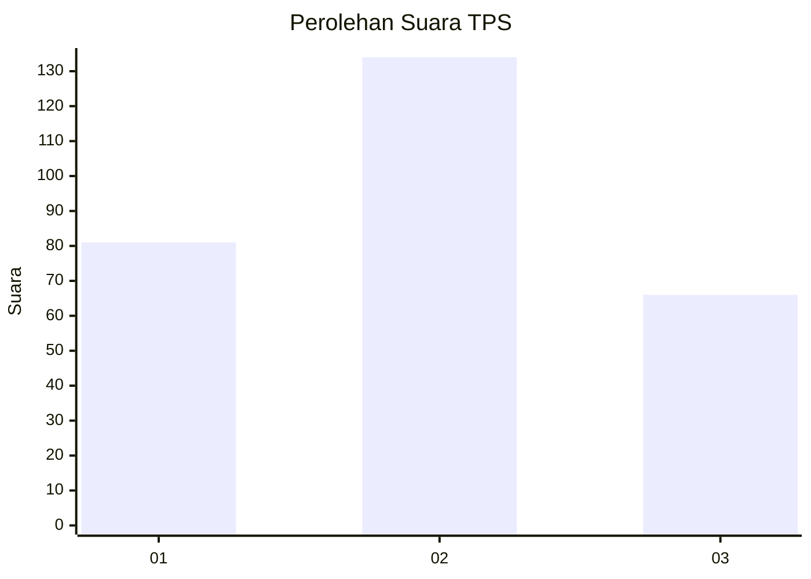
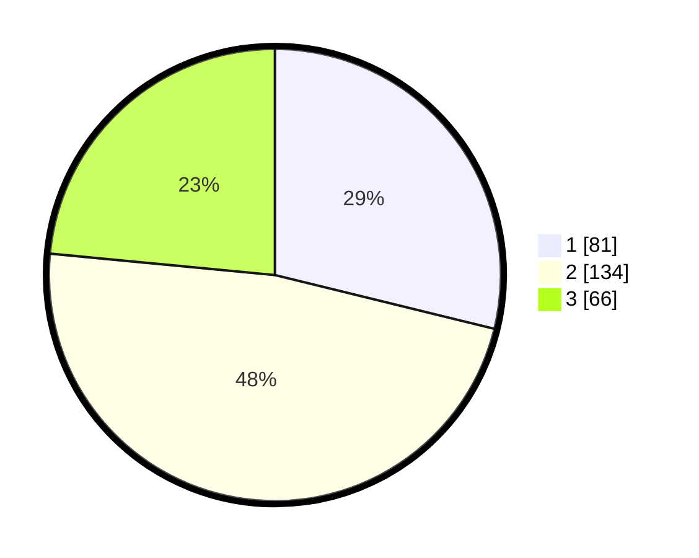

# Hasil

## Grafik

## Tabel

| No. | Nama Paslon    | Suara | Suara (raw) | Persentase |
|:--- |:-------------- | -----:| -----------:| ----------:|
| 1   | ANIES MUHAIMIN | 81    | [81][p-1]   | 28,83      |
| 2   | PRABOWO GIBRAN | 134   | [134][p-2]  | 47,69      |
| 3   | GANJAR MAHFUD  | 66    | [66][p-3]   | 23,49      |

[p-1]: https://github.com/gigit-pemilu/pemilu-2024/blob/main/pilpres/hitung-suara/sub/36-banten/sub/71-kota-tangerang/sub/08-periuk/sub/1003-gebang-raya/sub/105-tps/sub/paslon-1.txt
[p-2]: https://github.com/gigit-pemilu/pemilu-2024/blob/main/pilpres/hitung-suara/sub/36-banten/sub/71-kota-tangerang/sub/08-periuk/sub/1003-gebang-raya/sub/105-tps/sub/paslon-2.txt
[p-3]: https://github.com/gigit-pemilu/pemilu-2024/blob/main/pilpres/hitung-suara/sub/36-banten/sub/71-kota-tangerang/sub/08-periuk/sub/1003-gebang-raya/sub/105-tps/sub/paslon-3.txt

## Foto C Plano

https://sirekap-obj-formc.kpu.go.id/698e/pemilu/ppwp/36/71/08/10/03/3671081003105-20240215-033851--792243e6-527f-4be2-aee7-8b04b14de7ee.jpg

https://sirekap-obj-formc.kpu.go.id/698e/pemilu/ppwp/36/71/08/10/03/3671081003105-20240214-205053--f6c61291-a7b0-4b0c-94f4-803755091e84.jpg

https://sirekap-obj-formc.kpu.go.id/698e/pemilu/ppwp/36/71/08/10/03/3671081003105-20240214-205059--7ba8412d-788b-4979-ac3a-16dec0d5b484.jpg

## Metadata

| Key        | Value               |
| ---------- | ------------------- |
| Time Stamp | 2024-02-25 12:00:00 |

