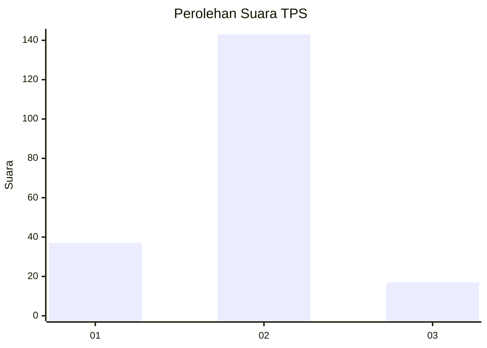
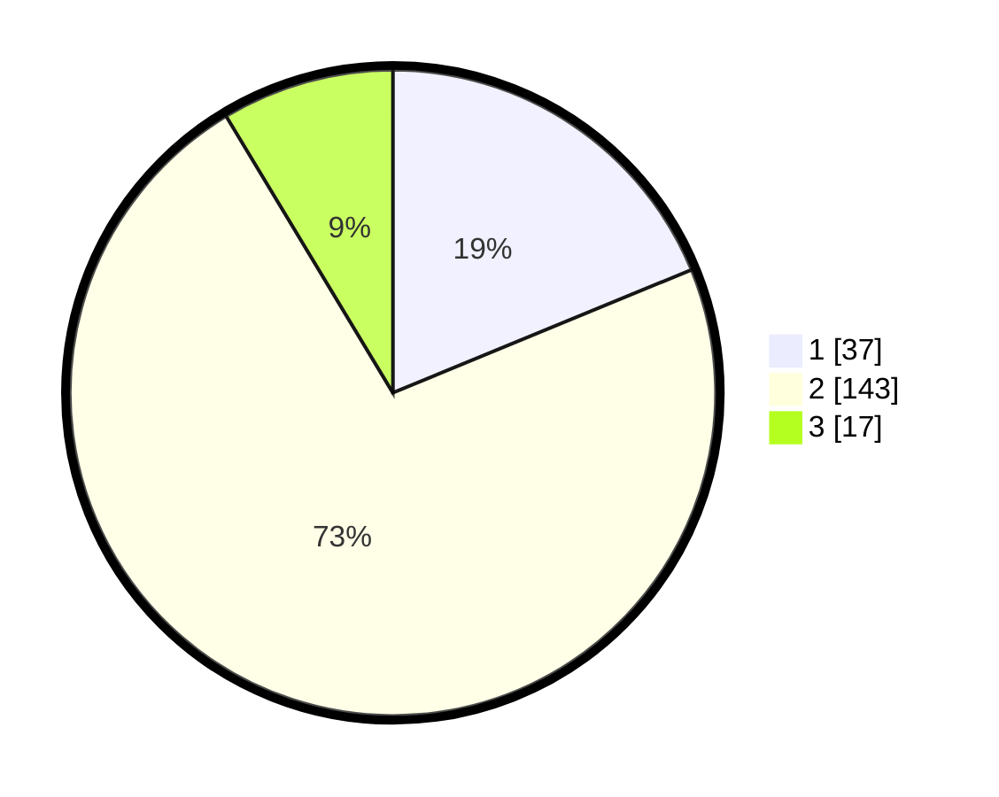

# Hasil

## Grafik

## Tabel

| No. | Nama Paslon    | Suara | Suara (raw) | Persentase |
|:--- |:-------------- | -----:| -----------:| ----------:|
| 1   | ANIES MUHAIMIN | 37    | [37][p-1]   | 18,78      |
| 2   | PRABOWO GIBRAN | 143   | [143][p-2]  | 72,59      |
| 3   | GANJAR MAHFUD  | 17    | [17][p-3]   | 8,63       |

[p-1]: https://github.com/gigit-pemilu/pemilu-2024-36-banten/blob/main/pilpres/hitung-suara/sub/36-banten/sub/71-kota-tangerang/sub/09-cibodas/sub/1001-cibodas/sub/005-tps/sub/paslon-1.txt
[p-2]: https://github.com/gigit-pemilu/pemilu-2024-36-banten/blob/main/pilpres/hitung-suara/sub/36-banten/sub/71-kota-tangerang/sub/09-cibodas/sub/1001-cibodas/sub/005-tps/sub/paslon-2.txt
[p-3]: https://github.com/gigit-pemilu/pemilu-2024-36-banten/blob/main/pilpres/hitung-suara/sub/36-banten/sub/71-kota-tangerang/sub/09-cibodas/sub/1001-cibodas/sub/005-tps/sub/paslon-3.txt

## Foto C Plano

https://sirekap-obj-formc.kpu.go.id/041c/pemilu/ppwp/36/71/09/10/01/3671091001005-20240214-212502--c856f7f5-2456-4a95-ba52-ad007d0d3801.jpg

https://sirekap-obj-formc.kpu.go.id/041c/pemilu/ppwp/36/71/09/10/01/3671091001005-20240215-004245--9c5f8c19-52f8-404a-96f9-3a18c78b9336.jpg

https://sirekap-obj-formc.kpu.go.id/041c/pemilu/ppwp/36/71/09/10/01/3671091001005-20240215-002949--328bc466-bb5f-4d19-aa96-09fa07c058e1.jpg

## Metadata

| Key        | Value               |
| ---------- | ------------------- |
| Time Stamp | 2024-02-24 22:31:28 |

