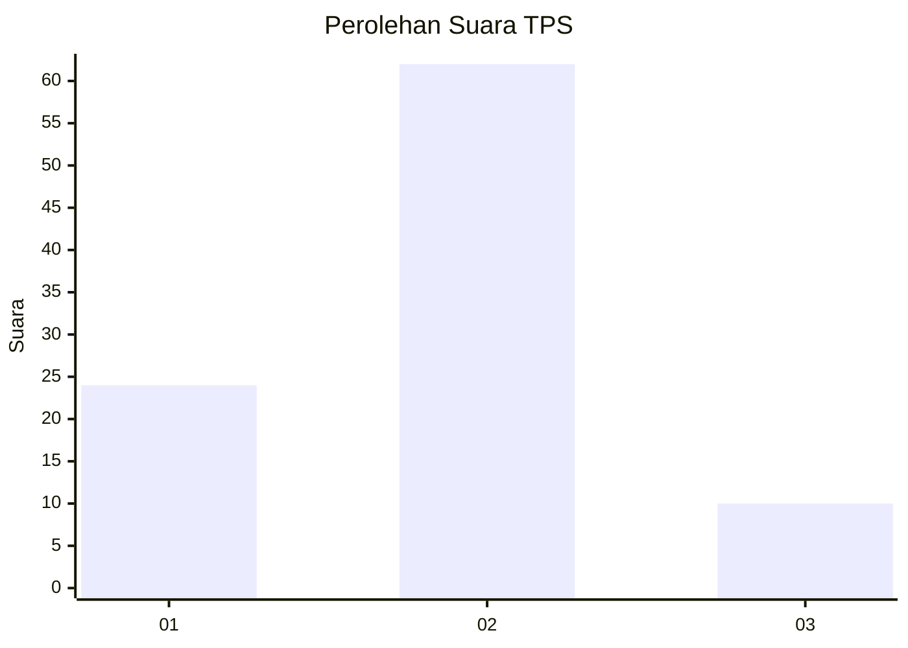

# Hasil

## Grafik

## Tabel

| No. | Nama Paslon    | Suara | Suara (raw) | Persentase |
|:--- |:-------------- | -----:| -----------:| ----------:|
| 1   | ANIES MUHAIMIN | 24    | [24][p-1]   | 25,00      |
| 2   | PRABOWO GIBRAN | 62    | [62][p-2]   | 64,58      |
| 3   | GANJAR MAHFUD  | 10    | [10][p-3]   | 10,42      |

[p-1]: https://github.com/gigit-pemilu/pemilu-2024-36-banten/blob/main/pilpres/hitung-suara/sub/36-banten/sub/71-kota-tangerang/sub/09-cibodas/sub/1001-cibodas/sub/067-tps/sub/paslon-1.txt
[p-2]: https://github.com/gigit-pemilu/pemilu-2024-36-banten/blob/main/pilpres/hitung-suara/sub/36-banten/sub/71-kota-tangerang/sub/09-cibodas/sub/1001-cibodas/sub/067-tps/sub/paslon-2.txt
[p-3]: https://github.com/gigit-pemilu/pemilu-2024-36-banten/blob/main/pilpres/hitung-suara/sub/36-banten/sub/71-kota-tangerang/sub/09-cibodas/sub/1001-cibodas/sub/067-tps/sub/paslon-3.txt

## Foto C Plano

https://sirekap-obj-formc.kpu.go.id/87ea/pemilu/ppwp/36/71/09/10/01/3671091001067-20240215-004755--5f9b6fd5-caaf-46b4-9c42-9b73a71d0128.jpg

https://sirekap-obj-formc.kpu.go.id/87ea/pemilu/ppwp/36/71/09/10/01/3671091001067-20240214-224634--e29ce267-a2d6-446f-b719-7bedc197d785.jpg

https://sirekap-obj-formc.kpu.go.id/87ea/pemilu/ppwp/36/71/09/10/01/3671091001067-20240214-224741--38486f49-8a3a-4837-9679-be9fd6aa05a3.jpg

## Metadata

| Key        | Value               |
| ---------- | ------------------- |
| Time Stamp | 2024-02-15 22:00:27 |

