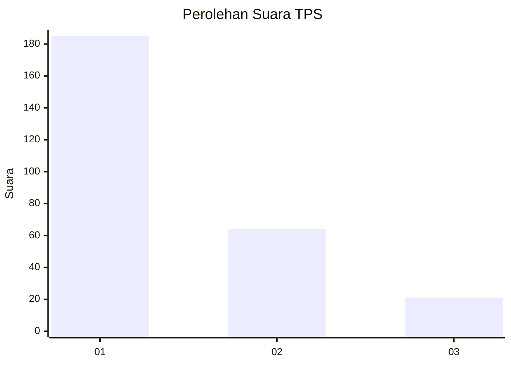
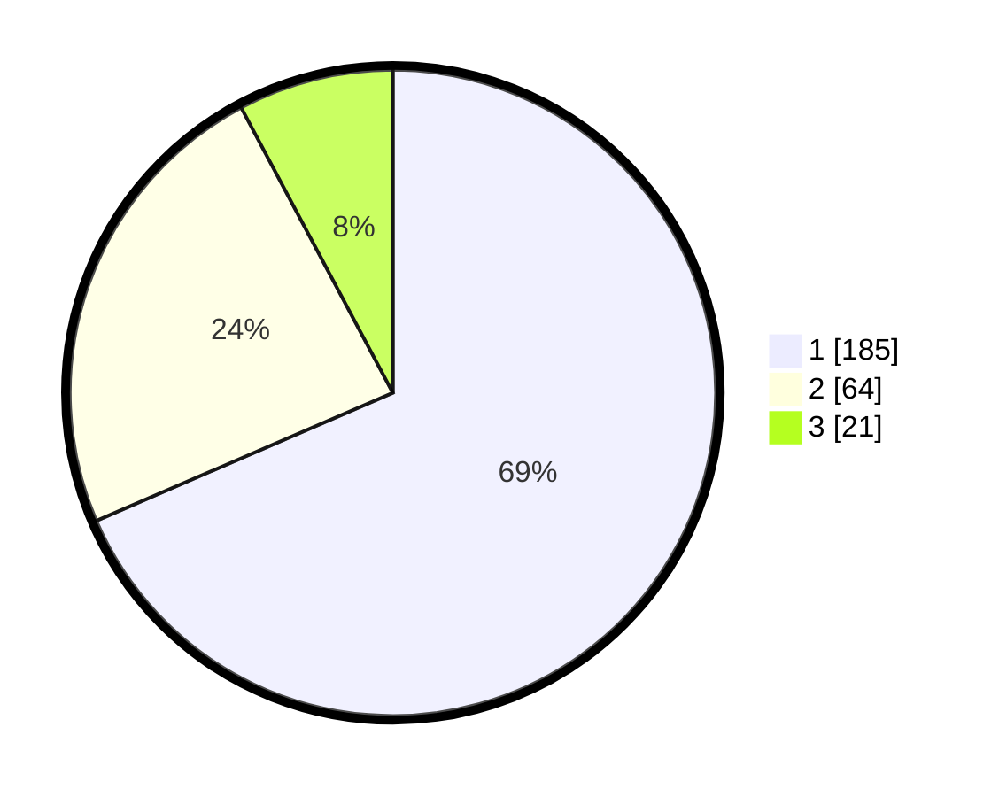

# Hasil

## Grafik

## Tabel

| No. | Nama Paslon    | Suara | Suara (raw) | Persentase |
|:--- |:-------------- | -----:| -----------:| ----------:|
| 1   | ANIES MUHAIMIN | 185   | [185][p-1]  | 68,52      |
| 2   | PRABOWO GIBRAN | 64    | [64][p-2]   | 23,70      |
| 3   | GANJAR MAHFUD  | 21    | [21][p-3]   | 7,78       |

[p-1]: https://github.com/gigit-pemilu/pemilu-2024-36-banten/blob/main/pilpres/hitung-suara/sub/36-banten/sub/71-kota-tangerang/sub/09-cibodas/sub/1004-panunggangan-barat/sub/053-tps/sub/paslon-1.txt
[p-2]: https://github.com/gigit-pemilu/pemilu-2024-36-banten/blob/main/pilpres/hitung-suara/sub/36-banten/sub/71-kota-tangerang/sub/09-cibodas/sub/1004-panunggangan-barat/sub/053-tps/sub/paslon-2.txt
[p-3]: https://github.com/gigit-pemilu/pemilu-2024-36-banten/blob/main/pilpres/hitung-suara/sub/36-banten/sub/71-kota-tangerang/sub/09-cibodas/sub/1004-panunggangan-barat/sub/053-tps/sub/paslon-3.txt

## Foto C Plano

https://sirekap-obj-formc.kpu.go.id/0d6a/pemilu/ppwp/36/71/09/10/04/3671091004053-20240215-072645--c8a17390-0f25-4a62-b590-ab7e601642a7.jpg

https://sirekap-obj-formc.kpu.go.id/0d6a/pemilu/ppwp/36/71/09/10/04/3671091004053-20240215-072801--76200d76-c897-41a9-a2c2-622dab2549da.jpg

https://sirekap-obj-formc.kpu.go.id/0d6a/pemilu/ppwp/36/71/09/10/04/3671091004053-20240215-072855--77d429b8-3bd6-4ecd-a037-9f5dfd646c6b.jpg

## Metadata

| Key        | Value               |
| ---------- | ------------------- |
| Time Stamp | 2024-02-17 18:00:00 |

