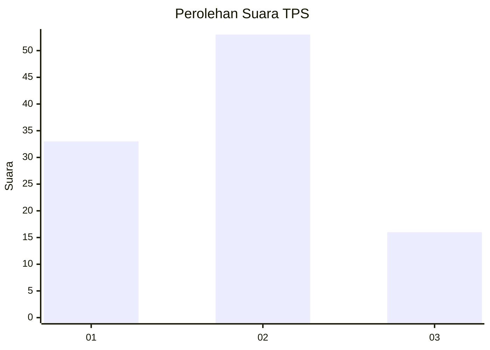
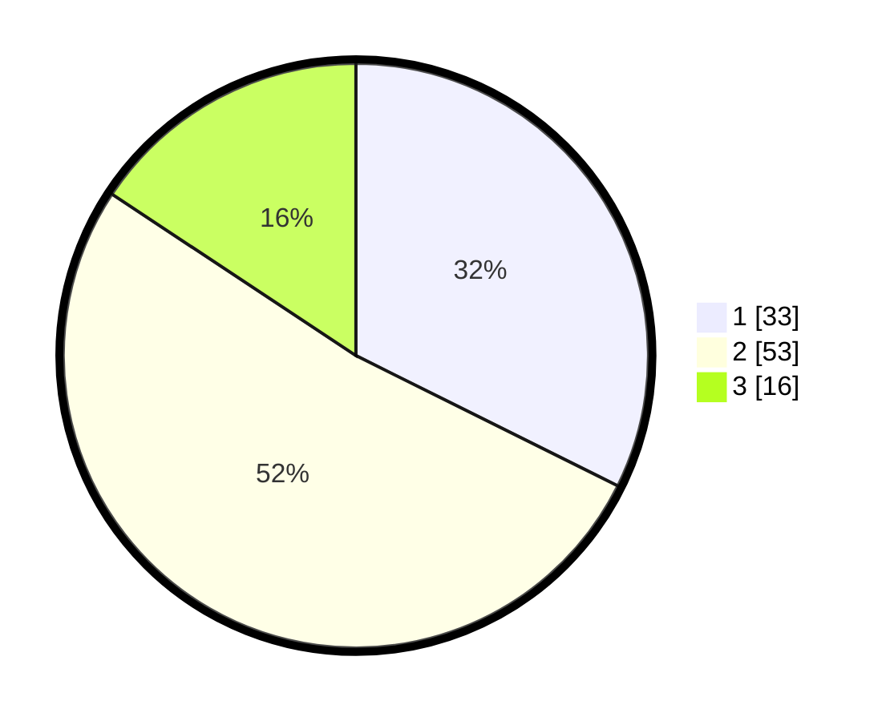

# Hasil

## Grafik

## Tabel

| No. | Nama Paslon    | Suara | Suara (raw) | Persentase |
|:--- |:-------------- | -----:| -----------:| ----------:|
| 1   | ANIES MUHAIMIN | 33    | [33][p-1]   | 32,35      |
| 2   | PRABOWO GIBRAN | 53    | [53][p-2]   | 51,96      |
| 3   | GANJAR MAHFUD  | 16    | [16][p-3]   | 15,69      |

[p-1]: https://github.com/gigit-pemilu/pemilu-2024/blob/main/pilpres/hitung-suara/sub/36-banten/sub/71-kota-tangerang/sub/09-cibodas/sub/1005-uwung-jaya/sub/007-tps/sub/paslon-1.txt
[p-2]: https://github.com/gigit-pemilu/pemilu-2024/blob/main/pilpres/hitung-suara/sub/36-banten/sub/71-kota-tangerang/sub/09-cibodas/sub/1005-uwung-jaya/sub/007-tps/sub/paslon-2.txt
[p-3]: https://github.com/gigit-pemilu/pemilu-2024/blob/main/pilpres/hitung-suara/sub/36-banten/sub/71-kota-tangerang/sub/09-cibodas/sub/1005-uwung-jaya/sub/007-tps/sub/paslon-3.txt

## Foto C Plano

https://sirekap-obj-formc.kpu.go.id/af3a/pemilu/ppwp/36/71/09/10/05/3671091005007-20240215-032111--68b8b237-d9a0-4652-ad12-a8869d0529e0.jpg

https://sirekap-obj-formc.kpu.go.id/af3a/pemilu/ppwp/36/71/09/10/05/3671091005007-20240215-032245--4f8d32f4-00a1-4047-b06c-f3e7bfebc600.jpg

https://sirekap-obj-formc.kpu.go.id/af3a/pemilu/ppwp/36/71/09/10/05/3671091005007-20240215-010349--277e15b0-52e7-44b7-b0fe-50288e827b49.jpg

## Metadata

| Key        | Value               |
| ---------- | ------------------- |
| Time Stamp | 2024-02-24 22:31:28 |

