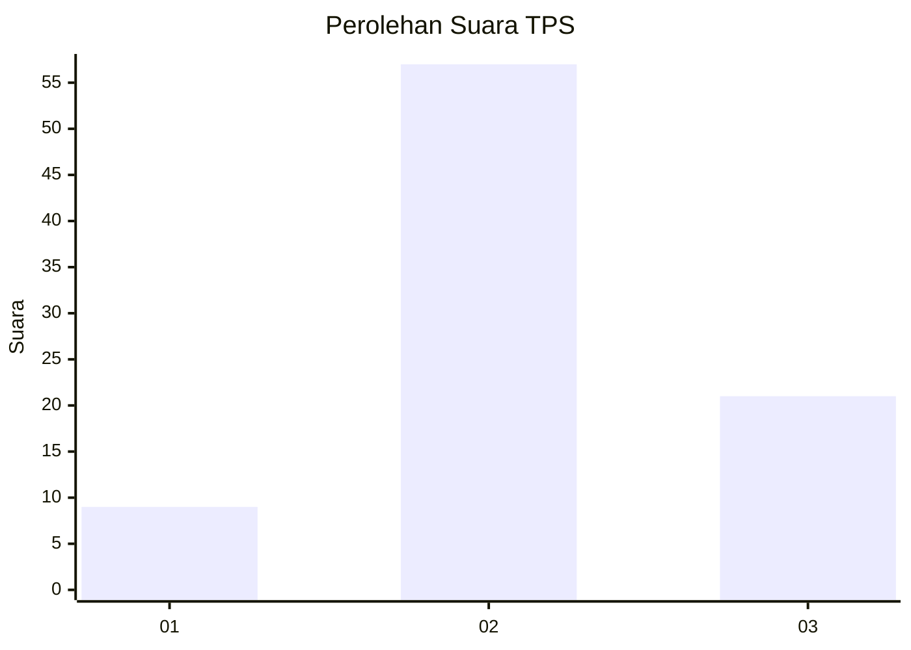
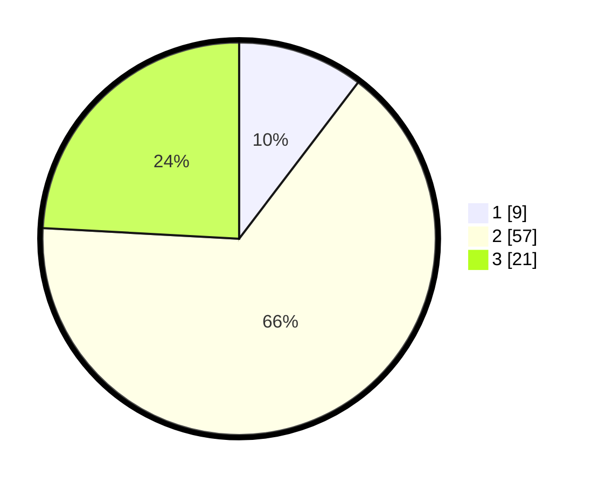

# Hasil

## Grafik

## Tabel

| No. | Nama Paslon    | Suara | Suara (raw) | Persentase |
|:--- |:-------------- | -----:| -----------:| ----------:|
| 1   | ANIES MUHAIMIN | 9     | [9][p-1]    | 10,34      |
| 2   | PRABOWO GIBRAN | 57    | [57][p-2]   | 65,52      |
| 3   | GANJAR MAHFUD  | 21    | [21][p-3]   | 24,14      |

[p-1]: https://github.com/gigit-pemilu/pemilu-2024-36-banten/blob/main/pilpres/hitung-suara/sub/36-banten/sub/71-kota-tangerang/sub/09-cibodas/sub/1005-uwung-jaya/sub/061-tps/sub/paslon-1.txt
[p-2]: https://github.com/gigit-pemilu/pemilu-2024-36-banten/blob/main/pilpres/hitung-suara/sub/36-banten/sub/71-kota-tangerang/sub/09-cibodas/sub/1005-uwung-jaya/sub/061-tps/sub/paslon-2.txt
[p-3]: https://github.com/gigit-pemilu/pemilu-2024-36-banten/blob/main/pilpres/hitung-suara/sub/36-banten/sub/71-kota-tangerang/sub/09-cibodas/sub/1005-uwung-jaya/sub/061-tps/sub/paslon-3.txt

## Foto C Plano

https://sirekap-obj-formc.kpu.go.id/898a/pemilu/ppwp/36/71/09/10/05/3671091005061-20240215-013946--4d84223b-1cd7-41c8-930d-e73e6fd48d0d.jpg

https://sirekap-obj-formc.kpu.go.id/898a/pemilu/ppwp/36/71/09/10/05/3671091005061-20240215-014100--9a690f0f-5e08-46a7-b906-1cb203feb91f.jpg

https://sirekap-obj-formc.kpu.go.id/898a/pemilu/ppwp/36/71/09/10/05/3671091005061-20240215-014155--488f96bb-f78b-4e5a-817b-405ceed1f77e.jpg

## Metadata

| Key        | Value               |
| ---------- | ------------------- |
| Time Stamp | 2024-02-24 22:31:28 |

