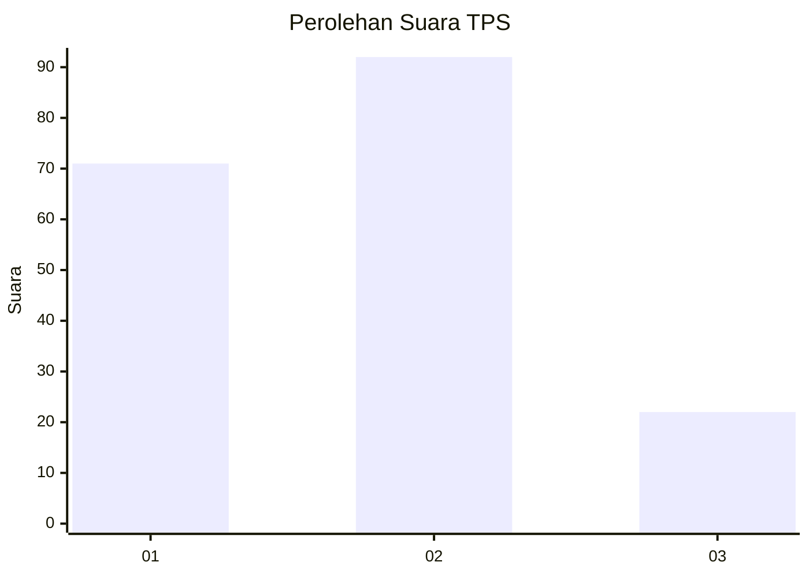
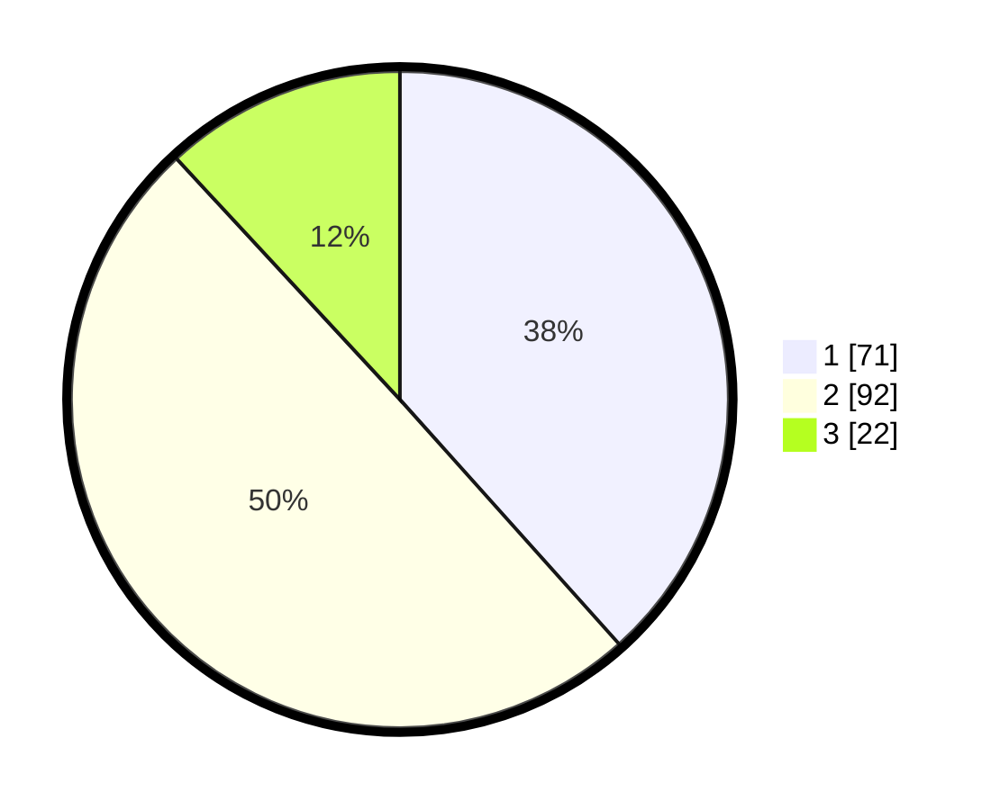

# Hasil

## Grafik

## Tabel

| No. | Nama Paslon    | Suara | Suara (raw) | Persentase |
|:--- |:-------------- | -----:| -----------:| ----------:|
| 1   | ANIES MUHAIMIN | 71    | [71][p-1]   | 38,38      |
| 2   | PRABOWO GIBRAN | 92    | [92][p-2]   | 49,73      |
| 3   | GANJAR MAHFUD  | 22    | [22][p-3]   | 11,89      |

[p-1]: https://github.com/gigit-pemilu/pemilu-2024/blob/main/pilpres/hitung-suara/sub/36-banten/sub/71-kota-tangerang/sub/10-neglasari/sub/1001-neglasari/sub/001-tps/sub/paslon-1.txt
[p-2]: https://github.com/gigit-pemilu/pemilu-2024/blob/main/pilpres/hitung-suara/sub/36-banten/sub/71-kota-tangerang/sub/10-neglasari/sub/1001-neglasari/sub/001-tps/sub/paslon-2.txt
[p-3]: https://github.com/gigit-pemilu/pemilu-2024/blob/main/pilpres/hitung-suara/sub/36-banten/sub/71-kota-tangerang/sub/10-neglasari/sub/1001-neglasari/sub/001-tps/sub/paslon-3.txt

## Foto C Plano

https://sirekap-obj-formc.kpu.go.id/1383/pemilu/ppwp/36/71/10/10/01/3671101001001-20240214-235921--79895348-498c-47db-9f64-4beaa4dd5ef1.jpg

https://sirekap-obj-formc.kpu.go.id/1383/pemilu/ppwp/36/71/10/10/01/3671101001001-20240215-000043--ff3aacbb-9b7f-4996-9ec7-3378c06bb7b7.jpg

https://sirekap-obj-formc.kpu.go.id/1383/pemilu/ppwp/36/71/10/10/01/3671101001001-20240214-235941--4654c4b3-809f-4bcb-8a89-c1ecce222524.jpg

## Metadata

| Key        | Value               |
| ---------- | ------------------- |
| Time Stamp | 2024-02-24 22:31:28 |

