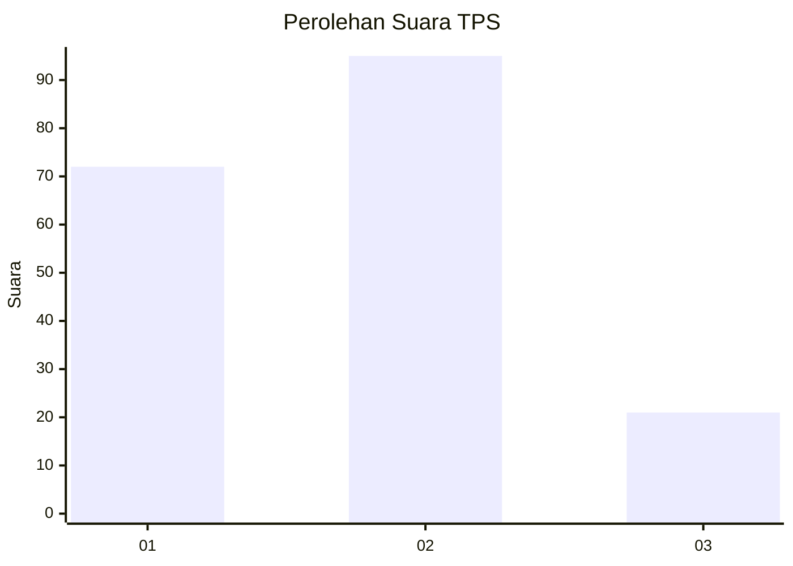
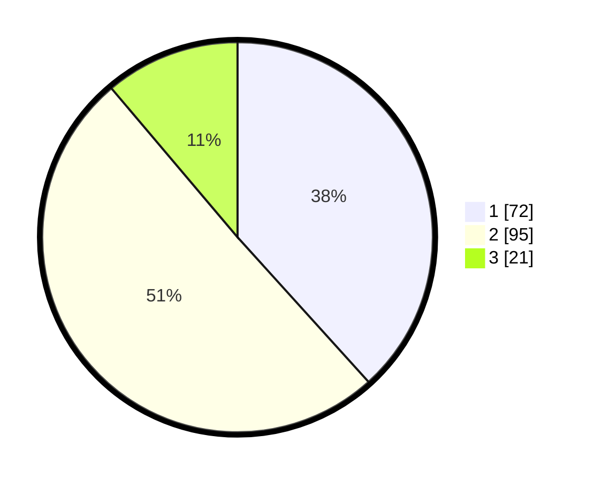

# Hasil

## Grafik

## Tabel

| No. | Nama Paslon    | Suara | Suara (raw) | Persentase |
|:--- |:-------------- | -----:| -----------:| ----------:|
| 1   | ANIES MUHAIMIN | 72    | [72][p-1]   | 38,30      |
| 2   | PRABOWO GIBRAN | 95    | [95][p-2]   | 50,53      |
| 3   | GANJAR MAHFUD  | 21    | [21][p-3]   | 11,17      |

[p-1]: https://github.com/gigit-pemilu/pemilu-2024-36-banten/blob/main/pilpres/hitung-suara/sub/36-banten/sub/71-kota-tangerang/sub/10-neglasari/sub/1001-neglasari/sub/005-tps/sub/paslon-1.txt
[p-2]: https://github.com/gigit-pemilu/pemilu-2024-36-banten/blob/main/pilpres/hitung-suara/sub/36-banten/sub/71-kota-tangerang/sub/10-neglasari/sub/1001-neglasari/sub/005-tps/sub/paslon-2.txt
[p-3]: https://github.com/gigit-pemilu/pemilu-2024-36-banten/blob/main/pilpres/hitung-suara/sub/36-banten/sub/71-kota-tangerang/sub/10-neglasari/sub/1001-neglasari/sub/005-tps/sub/paslon-3.txt

## Foto C Plano

https://sirekap-obj-formc.kpu.go.id/c7b6/pemilu/ppwp/36/71/10/10/01/3671101001005-20240215-095913--d975ff4b-94f7-476e-93ce-5c8e1d62f731.jpg

https://sirekap-obj-formc.kpu.go.id/c7b6/pemilu/ppwp/36/71/10/10/01/3671101001005-20240215-172051--ef1d3b59-bbc0-499f-8282-87e04a45e848.jpg

https://sirekap-obj-formc.kpu.go.id/c7b6/pemilu/ppwp/36/71/10/10/01/3671101001005-20240215-172243--e07adbc4-57c0-46cf-a2ac-a1fd5a016c48.jpg

## Metadata

| Key        | Value               |
| ---------- | ------------------- |
| Time Stamp | 2024-02-24 22:31:28 |

