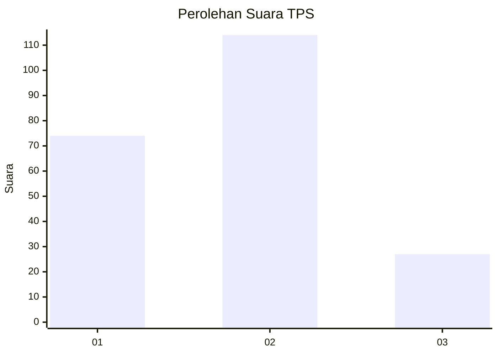
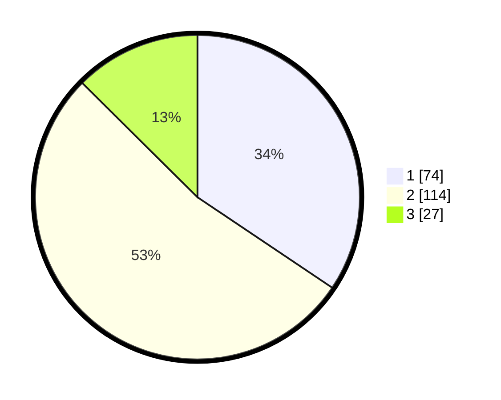

# Hasil

## Grafik

## Tabel

| No. | Nama Paslon    | Suara | Suara (raw) | Persentase |
|:--- |:-------------- | -----:| -----------:| ----------:|
| 1   | ANIES MUHAIMIN | 74    | [74][p-1]   | 34,42      |
| 2   | PRABOWO GIBRAN | 114   | [114][p-2]  | 53,02      |
| 3   | GANJAR MAHFUD  | 27    | [27][p-3]   | 12,56      |

[p-1]: https://github.com/gigit-pemilu/pemilu-2024-36-banten/blob/main/pilpres/hitung-suara/sub/36-banten/sub/71-kota-tangerang/sub/10-neglasari/sub/1001-neglasari/sub/006-tps/sub/paslon-1.txt
[p-2]: https://github.com/gigit-pemilu/pemilu-2024-36-banten/blob/main/pilpres/hitung-suara/sub/36-banten/sub/71-kota-tangerang/sub/10-neglasari/sub/1001-neglasari/sub/006-tps/sub/paslon-2.txt
[p-3]: https://github.com/gigit-pemilu/pemilu-2024-36-banten/blob/main/pilpres/hitung-suara/sub/36-banten/sub/71-kota-tangerang/sub/10-neglasari/sub/1001-neglasari/sub/006-tps/sub/paslon-3.txt

## Foto C Plano

https://sirekap-obj-formc.kpu.go.id/eba1/pemilu/ppwp/36/71/10/10/01/3671101001006-20240215-000115--84bde259-d069-403e-ad47-25f557edc2c9.jpg

https://sirekap-obj-formc.kpu.go.id/eba1/pemilu/ppwp/36/71/10/10/01/3671101001006-20240215-000209--e6cc5ebf-3627-40e6-984f-f8071f78528f.jpg

https://sirekap-obj-formc.kpu.go.id/eba1/pemilu/ppwp/36/71/10/10/01/3671101001006-20240215-000322--f2dd5c3d-8909-4305-ae52-e5b97ddc3a9e.jpg

## Metadata

| Key        | Value               |
| ---------- | ------------------- |
| Time Stamp | 2024-02-24 22:31:28 |

