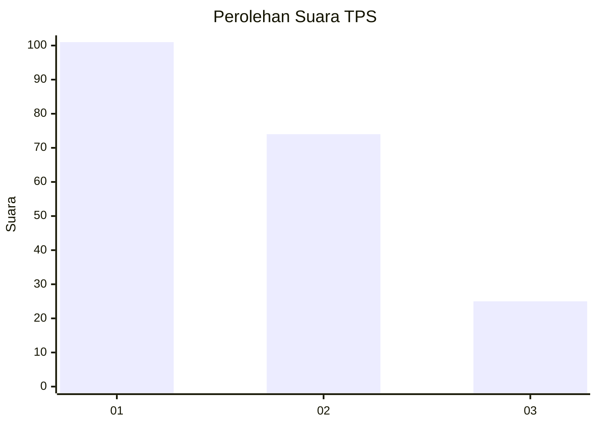
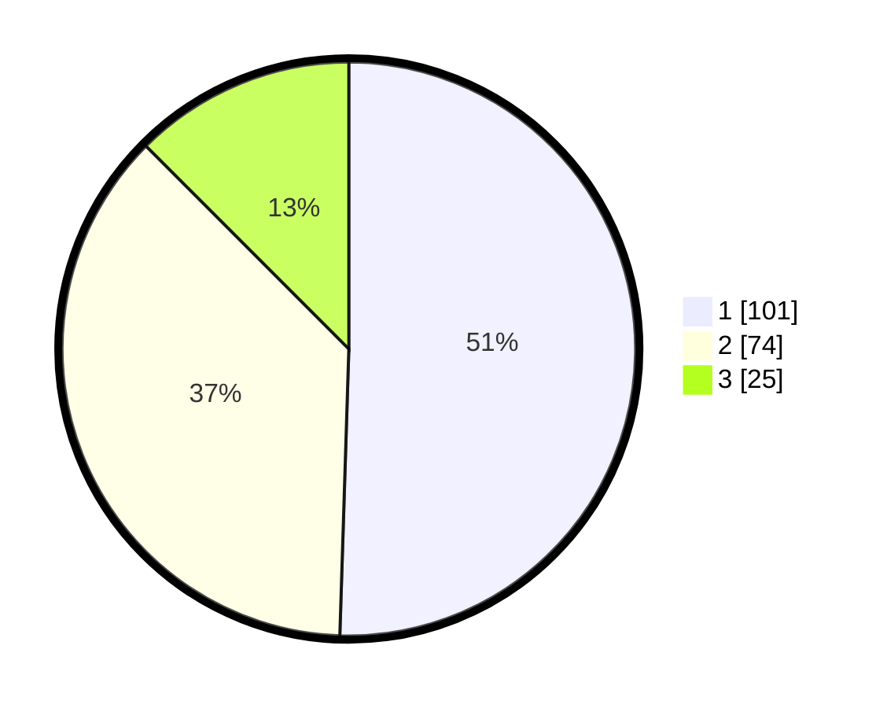

# Hasil

## Grafik

## Tabel

| No. | Nama Paslon    | Suara | Suara (raw) | Persentase |
|:--- |:-------------- | -----:| -----------:| ----------:|
| 1   | ANIES MUHAIMIN | 101   | [101][p-1]  | 50,50      |
| 2   | PRABOWO GIBRAN | 74    | [74][p-2]   | 37,00      |
| 3   | GANJAR MAHFUD  | 25    | [25][p-3]   | 12,50      |

[p-1]: https://github.com/gigit-pemilu/pemilu-2024-36-banten/blob/main/pilpres/hitung-suara/sub/36-banten/sub/71-kota-tangerang/sub/11-pinang/sub/1001-pinang/sub/002-tps/sub/paslon-1.txt
[p-2]: https://github.com/gigit-pemilu/pemilu-2024-36-banten/blob/main/pilpres/hitung-suara/sub/36-banten/sub/71-kota-tangerang/sub/11-pinang/sub/1001-pinang/sub/002-tps/sub/paslon-2.txt
[p-3]: https://github.com/gigit-pemilu/pemilu-2024-36-banten/blob/main/pilpres/hitung-suara/sub/36-banten/sub/71-kota-tangerang/sub/11-pinang/sub/1001-pinang/sub/002-tps/sub/paslon-3.txt

## Foto C Plano

https://sirekap-obj-formc.kpu.go.id/03a3/pemilu/ppwp/36/71/11/10/01/3671111001002-20240214-213631--b1c378b6-e3af-4886-afad-e02f2f5daa7b.jpg

https://sirekap-obj-formc.kpu.go.id/03a3/pemilu/ppwp/36/71/11/10/01/3671111001002-20240214-213812--6118995a-0e4b-4a76-8a1a-42f3105b6898.jpg

https://sirekap-obj-formc.kpu.go.id/03a3/pemilu/ppwp/36/71/11/10/01/3671111001002-20240214-213938--1a9f615a-078b-41c7-8580-3740b9135437.jpg

## Metadata

| Key        | Value               |
| ---------- | ------------------- |
| Time Stamp | 2024-02-25 17:00:00 |

