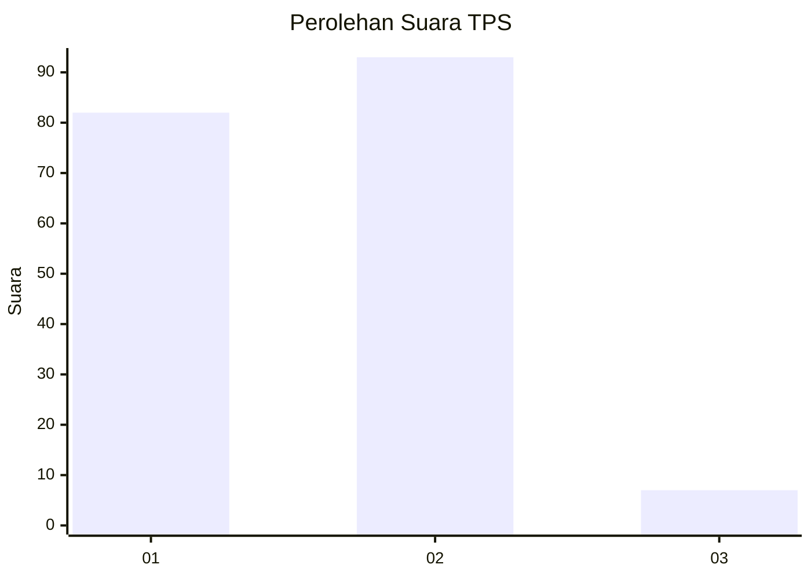
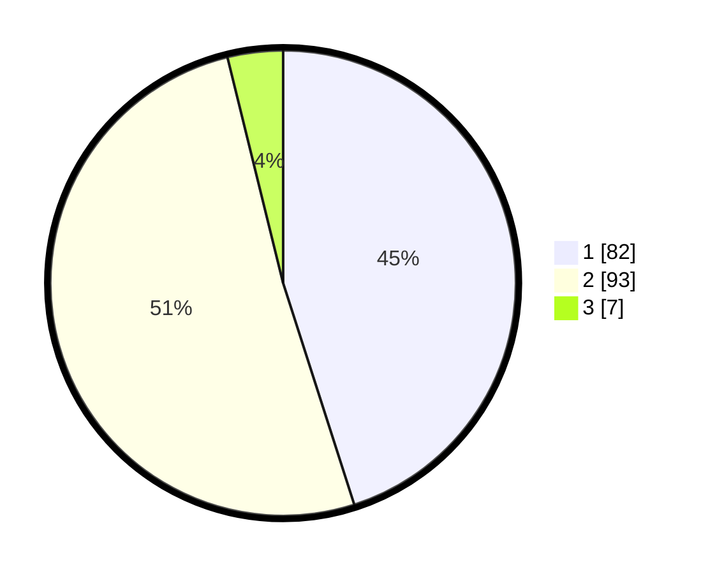

# Hasil

## Grafik

## Tabel

| No. | Nama Paslon    | Suara | Suara (raw) | Persentase |
|:--- |:-------------- | -----:| -----------:| ----------:|
| 1   | ANIES MUHAIMIN | 82    | [82][p-1]   | 45,05      |
| 2   | PRABOWO GIBRAN | 93    | [93][p-2]   | 51,10      |
| 3   | GANJAR MAHFUD  | 7     | [7][p-3]    | 3,85       |

[p-1]: https://github.com/gigit-pemilu/pemilu-2024/blob/main/pilpres/hitung-suara/sub/36-banten/sub/71-kota-tangerang/sub/11-pinang/sub/1001-pinang/sub/006-tps/sub/paslon-1.txt
[p-2]: https://github.com/gigit-pemilu/pemilu-2024/blob/main/pilpres/hitung-suara/sub/36-banten/sub/71-kota-tangerang/sub/11-pinang/sub/1001-pinang/sub/006-tps/sub/paslon-2.txt
[p-3]: https://github.com/gigit-pemilu/pemilu-2024/blob/main/pilpres/hitung-suara/sub/36-banten/sub/71-kota-tangerang/sub/11-pinang/sub/1001-pinang/sub/006-tps/sub/paslon-3.txt

## Foto C Plano

https://sirekap-obj-formc.kpu.go.id/5043/pemilu/ppwp/36/71/11/10/01/3671111001006-20240214-212646--8591ff7d-4f6e-40f5-92a9-52b061f63684.jpg

https://sirekap-obj-formc.kpu.go.id/5043/pemilu/ppwp/36/71/11/10/01/3671111001006-20240214-212626--619a6b5e-0ba6-4314-9631-03bfda07fd8d.jpg

https://sirekap-obj-formc.kpu.go.id/5043/pemilu/ppwp/36/71/11/10/01/3671111001006-20240214-212738--9ddecfd0-188b-409e-95f1-d14e07149d91.jpg

## Metadata

| Key        | Value               |
| ---------- | ------------------- |
| Time Stamp | 2024-02-24 22:31:28 |

