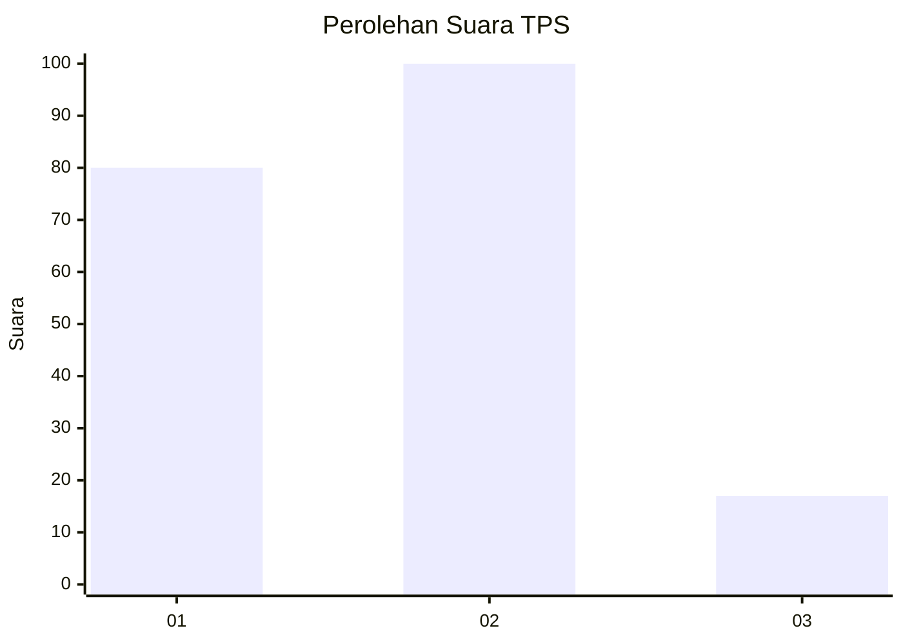
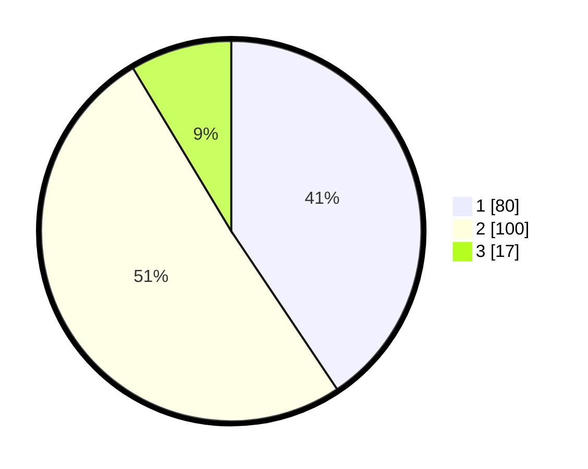

# Hasil

## Grafik

## Tabel

| No. | Nama Paslon    | Suara | Suara (raw) | Persentase |
|:--- |:-------------- | -----:| -----------:| ----------:|
| 1   | ANIES MUHAIMIN | 80    | [80][p-1]   | 40,61      |
| 2   | PRABOWO GIBRAN | 100   | [100][p-2]  | 50,76      |
| 3   | GANJAR MAHFUD  | 17    | [17][p-3]   | 8,63       |

[p-1]: https://github.com/gigit-pemilu/pemilu-2024-36-banten/blob/main/pilpres/hitung-suara/sub/36-banten/sub/71-kota-tangerang/sub/11-pinang/sub/1001-pinang/sub/007-tps/sub/paslon-1.txt
[p-2]: https://github.com/gigit-pemilu/pemilu-2024-36-banten/blob/main/pilpres/hitung-suara/sub/36-banten/sub/71-kota-tangerang/sub/11-pinang/sub/1001-pinang/sub/007-tps/sub/paslon-2.txt
[p-3]: https://github.com/gigit-pemilu/pemilu-2024-36-banten/blob/main/pilpres/hitung-suara/sub/36-banten/sub/71-kota-tangerang/sub/11-pinang/sub/1001-pinang/sub/007-tps/sub/paslon-3.txt

## Foto C Plano

https://sirekap-obj-formc.kpu.go.id/53e3/pemilu/ppwp/36/71/11/10/01/3671111001007-20240214-221216--a015f2e4-4ae8-42a9-b9d4-6224a8269da3.jpg

https://sirekap-obj-formc.kpu.go.id/53e3/pemilu/ppwp/36/71/11/10/01/3671111001007-20240214-221332--fafb6bef-c17b-46e1-af16-18d0272dc4be.jpg

https://sirekap-obj-formc.kpu.go.id/53e3/pemilu/ppwp/36/71/11/10/01/3671111001007-20240214-221502--24cce62b-484b-4944-9fd1-9850920c6c13.jpg

## Metadata

| Key        | Value               |
| ---------- | ------------------- |
| Time Stamp | 2024-02-24 22:31:28 |

