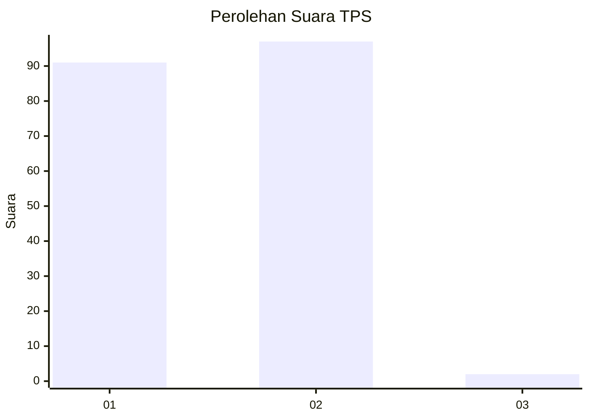
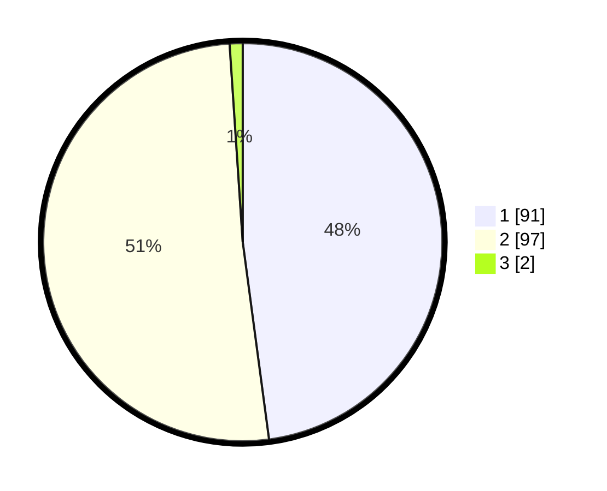

# Hasil

## Grafik

## Tabel

| No. | Nama Paslon    | Suara | Suara (raw) | Persentase |
|:--- |:-------------- | -----:| -----------:| ----------:|
| 1   | ANIES MUHAIMIN | 91    | [91][p-1]   | 47,89      |
| 2   | PRABOWO GIBRAN | 97    | [97][p-2]   | 51,05      |
| 3   | GANJAR MAHFUD  | 2     | [2][p-3]    | 1,05       |

[p-1]: https://github.com/gigit-pemilu/pemilu-2024/blob/main/pilpres/hitung-suara/sub/36-banten/sub/71-kota-tangerang/sub/11-pinang/sub/1001-pinang/sub/013-tps/sub/paslon-1.txt
[p-2]: https://github.com/gigit-pemilu/pemilu-2024/blob/main/pilpres/hitung-suara/sub/36-banten/sub/71-kota-tangerang/sub/11-pinang/sub/1001-pinang/sub/013-tps/sub/paslon-2.txt
[p-3]: https://github.com/gigit-pemilu/pemilu-2024/blob/main/pilpres/hitung-suara/sub/36-banten/sub/71-kota-tangerang/sub/11-pinang/sub/1001-pinang/sub/013-tps/sub/paslon-3.txt

## Foto C Plano

https://sirekap-obj-formc.kpu.go.id/b20e/pemilu/ppwp/36/71/11/10/01/3671111001013-20240214-211932--f02b377f-04c5-4a90-9d93-bea5ca31f1f8.jpg

https://sirekap-obj-formc.kpu.go.id/b20e/pemilu/ppwp/36/71/11/10/01/3671111001013-20240214-211711--ca906833-5fe3-4f47-b633-159680f8440d.jpg

https://sirekap-obj-formc.kpu.go.id/b20e/pemilu/ppwp/36/71/11/10/01/3671111001013-20240214-212034--2217bdd3-ee92-41ac-b8a2-f95201f07889.jpg

## Metadata

| Key        | Value               |
| ---------- | ------------------- |
| Time Stamp | 2024-02-24 22:31:28 |

