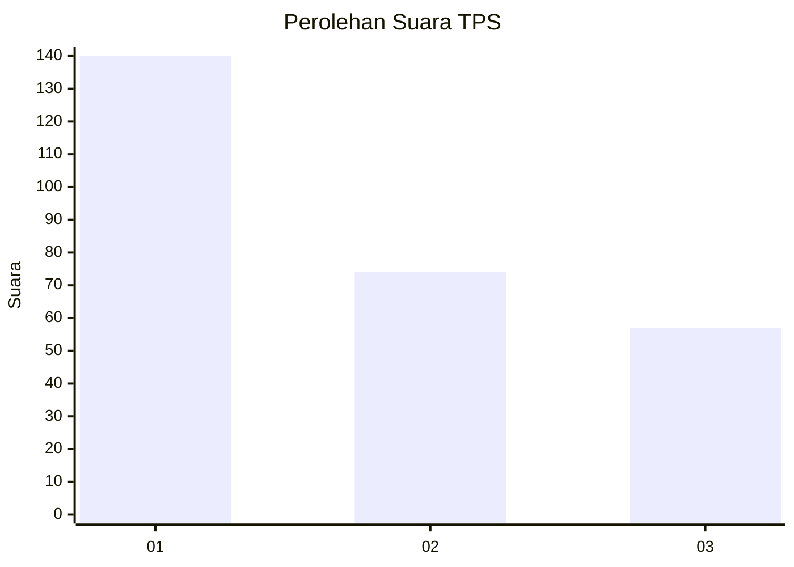
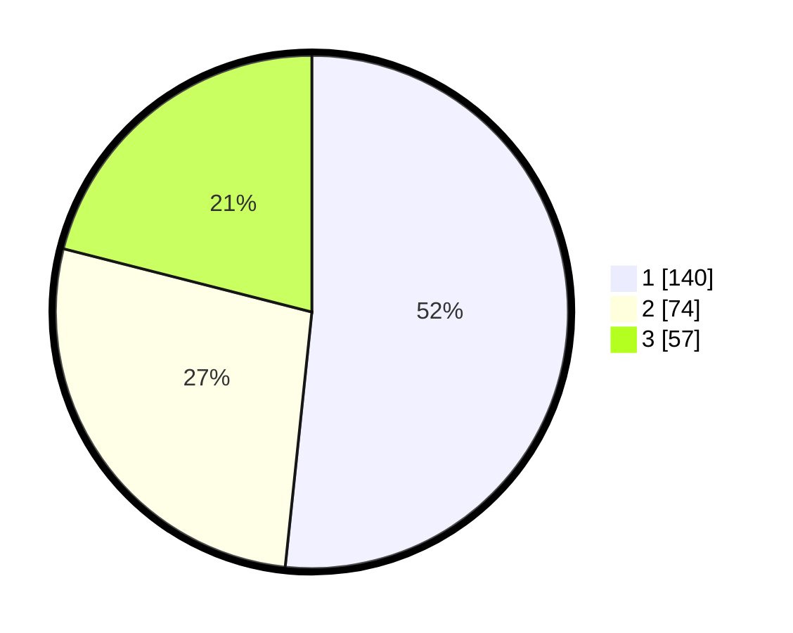

# Hasil

## Grafik

## Tabel

| No. | Nama Paslon    | Suara | Suara (raw) | Persentase |
|:--- |:-------------- | -----:| -----------:| ----------:|
| 1   | ANIES MUHAIMIN | 140   | [140][p-1]  | 51,66      |
| 2   | PRABOWO GIBRAN | 74    | [74][p-2]   | 27,31      |
| 3   | GANJAR MAHFUD  | 57    | [57][p-3]   | 21,03      |

[p-1]: https://github.com/gigit-pemilu/pemilu-2024/blob/main/pilpres/hitung-suara/sub/36-banten/sub/71-kota-tangerang/sub/11-pinang/sub/1001-pinang/sub/051-tps/sub/paslon-1.txt
[p-2]: https://github.com/gigit-pemilu/pemilu-2024/blob/main/pilpres/hitung-suara/sub/36-banten/sub/71-kota-tangerang/sub/11-pinang/sub/1001-pinang/sub/051-tps/sub/paslon-2.txt
[p-3]: https://github.com/gigit-pemilu/pemilu-2024/blob/main/pilpres/hitung-suara/sub/36-banten/sub/71-kota-tangerang/sub/11-pinang/sub/1001-pinang/sub/051-tps/sub/paslon-3.txt

## Foto C Plano

https://sirekap-obj-formc.kpu.go.id/111d/pemilu/ppwp/36/71/11/10/01/3671111001051-20240214-214216--2d5caf05-a82b-4dc6-819e-01102acf786b.jpg

https://sirekap-obj-formc.kpu.go.id/111d/pemilu/ppwp/36/71/11/10/01/3671111001051-20240214-214319--c402b9de-a498-46d8-a74d-7b0210b7977b.jpg

https://sirekap-obj-formc.kpu.go.id/111d/pemilu/ppwp/36/71/11/10/01/3671111001051-20240214-214428--ee1249d7-ee4a-4533-aec5-47d213d0074d.jpg

## Metadata

| Key        | Value               |
| ---------- | ------------------- |
| Time Stamp | 2024-02-24 22:31:28 |

