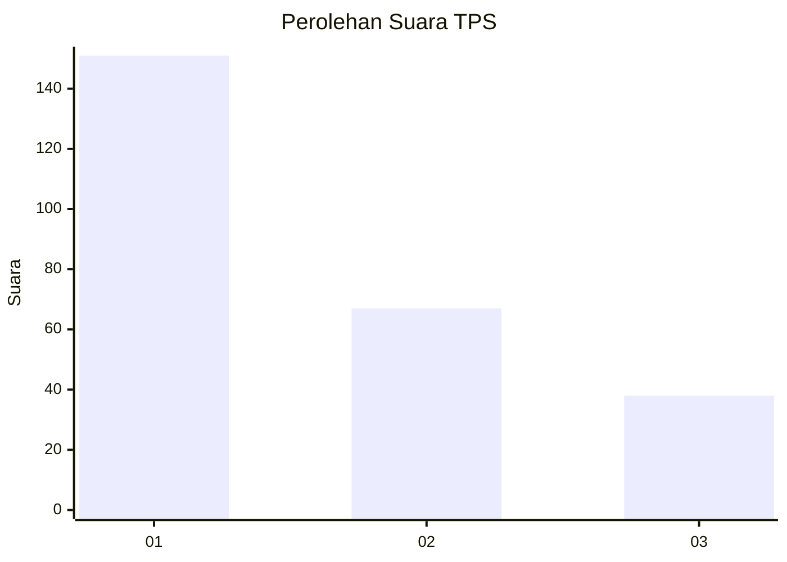
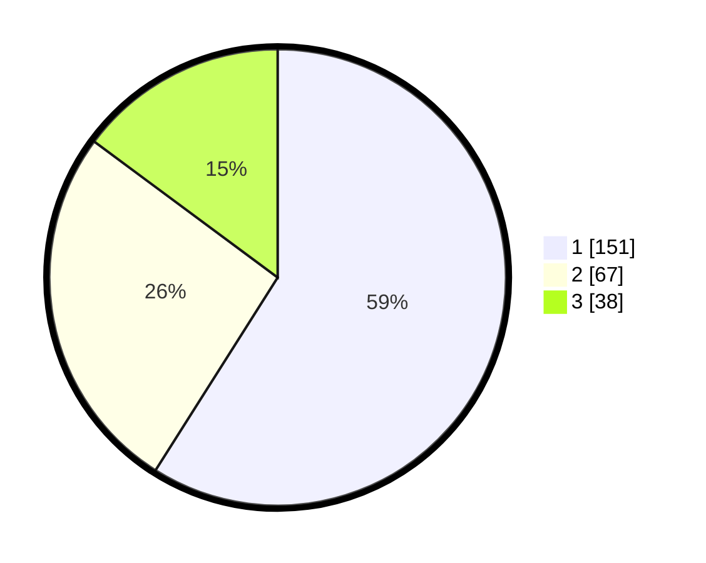

# Hasil

## Grafik

## Tabel

| No. | Nama Paslon    | Suara | Suara (raw) | Persentase |
|:--- |:-------------- | -----:| -----------:| ----------:|
| 1   | ANIES MUHAIMIN | 151   | [151][p-1]  | 58,98      |
| 2   | PRABOWO GIBRAN | 67    | [67][p-2]   | 26,17      |
| 3   | GANJAR MAHFUD  | 38    | [38][p-3]   | 14,84      |

[p-1]: https://github.com/gigit-pemilu/pemilu-2024/blob/main/pilpres/hitung-suara/sub/36-banten/sub/71-kota-tangerang/sub/11-pinang/sub/1004-kunciran/sub/034-tps/sub/paslon-1.txt
[p-2]: https://github.com/gigit-pemilu/pemilu-2024/blob/main/pilpres/hitung-suara/sub/36-banten/sub/71-kota-tangerang/sub/11-pinang/sub/1004-kunciran/sub/034-tps/sub/paslon-2.txt
[p-3]: https://github.com/gigit-pemilu/pemilu-2024/blob/main/pilpres/hitung-suara/sub/36-banten/sub/71-kota-tangerang/sub/11-pinang/sub/1004-kunciran/sub/034-tps/sub/paslon-3.txt

## Foto C Plano

https://sirekap-obj-formc.kpu.go.id/90c5/pemilu/ppwp/36/71/11/10/04/3671111004034-20240214-211959--a142eb8a-c50e-428d-80d4-2bf9685f9740.jpg

https://sirekap-obj-formc.kpu.go.id/90c5/pemilu/ppwp/36/71/11/10/04/3671111004034-20240214-212215--9014ec47-c469-476a-968a-3cf877e52d4a.jpg

https://sirekap-obj-formc.kpu.go.id/90c5/pemilu/ppwp/36/71/11/10/04/3671111004034-20240214-192513--a9d651dc-f01a-4db1-b696-fe0b5889c250.jpg

## Metadata

| Key        | Value               |
| ---------- | ------------------- |
| Time Stamp | 2024-02-24 22:31:28 |

