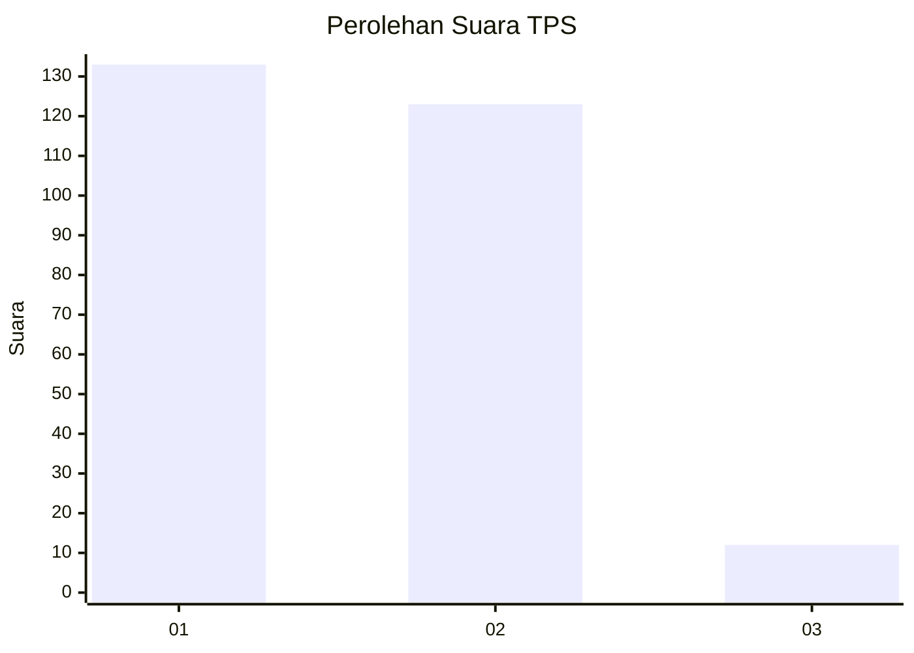
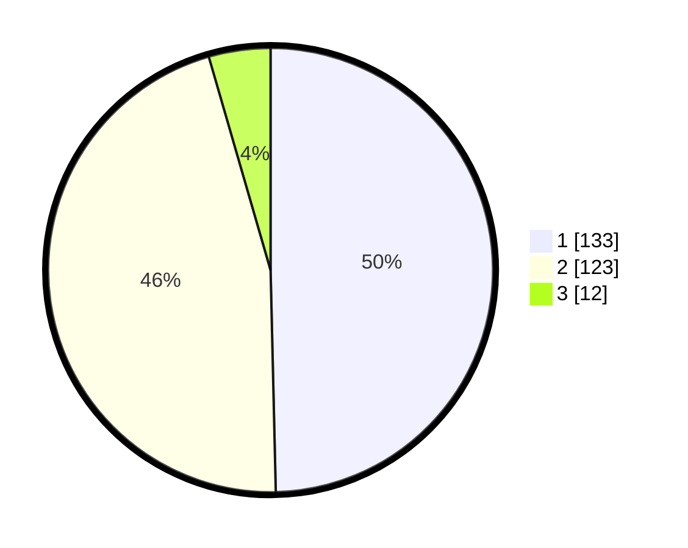

# Hasil

## Grafik

## Tabel

| No. | Nama Paslon    | Suara | Suara (raw) | Persentase |
|:--- |:-------------- | -----:| -----------:| ----------:|
| 1   | ANIES MUHAIMIN | 133   | [133][p-1]  | 49,63      |
| 2   | PRABOWO GIBRAN | 123   | [123][p-2]  | 45,90      |
| 3   | GANJAR MAHFUD  | 12    | [12][p-3]   | 4,48       |

[p-1]: https://github.com/gigit-pemilu/pemilu-2024/blob/main/pilpres/hitung-suara/sub/36-banten/sub/71-kota-tangerang/sub/11-pinang/sub/1007-cipete/sub/002-tps/sub/paslon-1.txt
[p-2]: https://github.com/gigit-pemilu/pemilu-2024/blob/main/pilpres/hitung-suara/sub/36-banten/sub/71-kota-tangerang/sub/11-pinang/sub/1007-cipete/sub/002-tps/sub/paslon-2.txt
[p-3]: https://github.com/gigit-pemilu/pemilu-2024/blob/main/pilpres/hitung-suara/sub/36-banten/sub/71-kota-tangerang/sub/11-pinang/sub/1007-cipete/sub/002-tps/sub/paslon-3.txt

## Foto C Plano

https://sirekap-obj-formc.kpu.go.id/cb3c/pemilu/ppwp/36/71/11/10/07/3671111007002-20240214-213824--e37a2aa9-fd7b-4250-a4cc-e0473f62d0c1.jpg

https://sirekap-obj-formc.kpu.go.id/cb3c/pemilu/ppwp/36/71/11/10/07/3671111007002-20240214-214141--19773c1c-d38c-4486-a9c3-4cc320e1dcf8.jpg

https://sirekap-obj-formc.kpu.go.id/cb3c/pemilu/ppwp/36/71/11/10/07/3671111007002-20240214-214245--81482399-f9b6-4781-bd24-9b677e8ec452.jpg

## Metadata

| Key        | Value               |
| ---------- | ------------------- |
| Time Stamp | 2024-02-24 22:31:28 |

