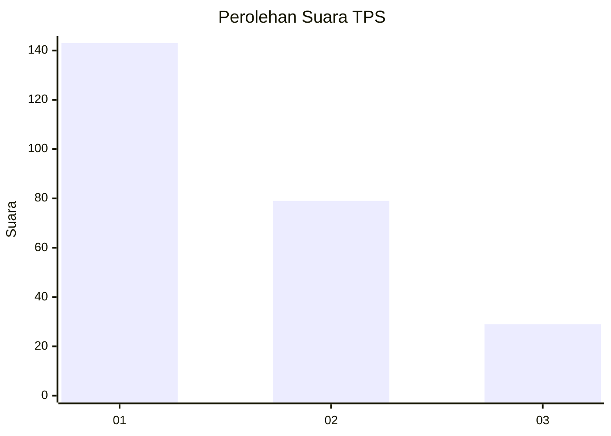
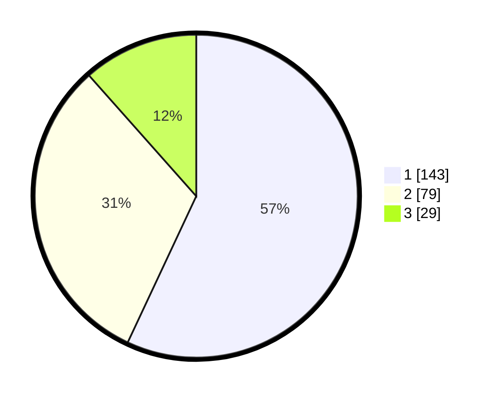

# Hasil

## Grafik

## Tabel

| No. | Nama Paslon    | Suara | Suara (raw) | Persentase |
|:--- |:-------------- | -----:| -----------:| ----------:|
| 1   | ANIES MUHAIMIN | 143   | [143][p-1]  | 56,97      |
| 2   | PRABOWO GIBRAN | 79    | [79][p-2]   | 31,47      |
| 3   | GANJAR MAHFUD  | 29    | [29][p-3]   | 11,55      |

[p-1]: https://github.com/gigit-pemilu/pemilu-2024/blob/main/pilpres/hitung-suara/sub/36-banten/sub/71-kota-tangerang/sub/11-pinang/sub/1010-panunggangan-utara/sub/028-tps/sub/paslon-1.txt
[p-2]: https://github.com/gigit-pemilu/pemilu-2024/blob/main/pilpres/hitung-suara/sub/36-banten/sub/71-kota-tangerang/sub/11-pinang/sub/1010-panunggangan-utara/sub/028-tps/sub/paslon-2.txt
[p-3]: https://github.com/gigit-pemilu/pemilu-2024/blob/main/pilpres/hitung-suara/sub/36-banten/sub/71-kota-tangerang/sub/11-pinang/sub/1010-panunggangan-utara/sub/028-tps/sub/paslon-3.txt

## Foto C Plano

https://sirekap-obj-formc.kpu.go.id/1452/pemilu/ppwp/36/71/11/10/10/3671111010028-20240215-035845--4251a323-3c83-4ed6-b5e4-927aa1057cf7.jpg

https://sirekap-obj-formc.kpu.go.id/1452/pemilu/ppwp/36/71/11/10/10/3671111010028-20240215-040030--a3edf4eb-1360-472c-a1d0-e8d27a0ec04e.jpg

https://sirekap-obj-formc.kpu.go.id/1452/pemilu/ppwp/36/71/11/10/10/3671111010028-20240215-040131--69ce2109-1ff9-42a0-99b5-2f882946d1ba.jpg

## Metadata

| Key        | Value               |
| ---------- | ------------------- |
| Time Stamp | 2024-02-24 22:31:28 |

