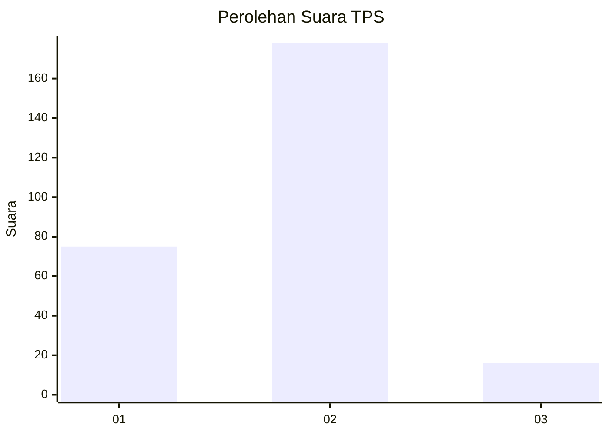
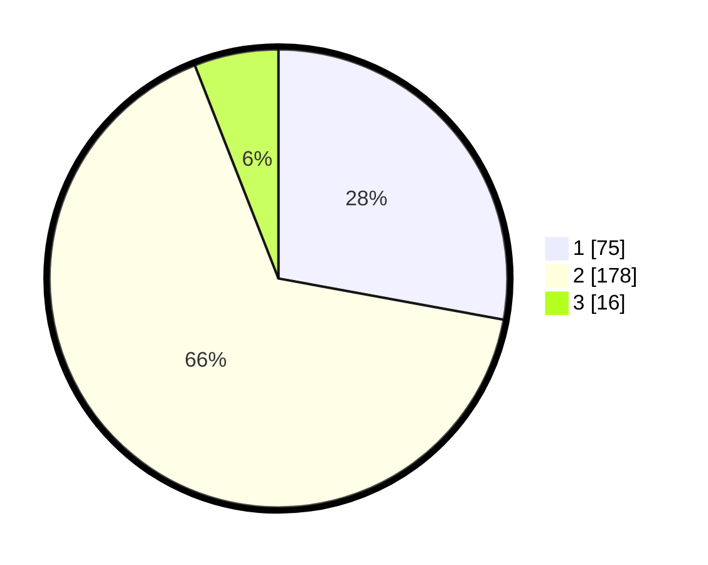

# Hasil

## Grafik

## Tabel

| No. | Nama Paslon    | Suara | Suara (raw) | Persentase |
|:--- |:-------------- | -----:| -----------:| ----------:|
| 1   | ANIES MUHAIMIN | 75    | [75][p-1]   | 27,88      |
| 2   | PRABOWO GIBRAN | 178   | [178][p-2]  | 66,17      |
| 3   | GANJAR MAHFUD  | 16    | [16][p-3]   | 5,95       |

[p-1]: https://github.com/gigit-pemilu/pemilu-2024-36-banten/blob/main/pilpres/hitung-suara/sub/36-banten/sub/71-kota-tangerang/sub/11-pinang/sub/1011-panunggangan-timur/sub/008-tps/sub/paslon-1.txt
[p-2]: https://github.com/gigit-pemilu/pemilu-2024-36-banten/blob/main/pilpres/hitung-suara/sub/36-banten/sub/71-kota-tangerang/sub/11-pinang/sub/1011-panunggangan-timur/sub/008-tps/sub/paslon-2.txt
[p-3]: https://github.com/gigit-pemilu/pemilu-2024-36-banten/blob/main/pilpres/hitung-suara/sub/36-banten/sub/71-kota-tangerang/sub/11-pinang/sub/1011-panunggangan-timur/sub/008-tps/sub/paslon-3.txt

## Foto C Plano

https://sirekap-obj-formc.kpu.go.id/70c9/pemilu/ppwp/36/71/11/10/11/3671111011008-20240214-191929--aa93ab06-6f0f-4d4a-a5e8-f9fcccf6be62.jpg

https://sirekap-obj-formc.kpu.go.id/70c9/pemilu/ppwp/36/71/11/10/11/3671111011008-20240214-192048--9d19005e-b934-4580-82a9-2e0569a58e8a.jpg

https://sirekap-obj-formc.kpu.go.id/70c9/pemilu/ppwp/36/71/11/10/11/3671111011008-20240214-192215--13c007f9-f378-4310-870c-6d0499fbe933.jpg

## Metadata

| Key        | Value               |
| ---------- | ------------------- |
| Time Stamp | 2024-02-24 22:31:28 |

