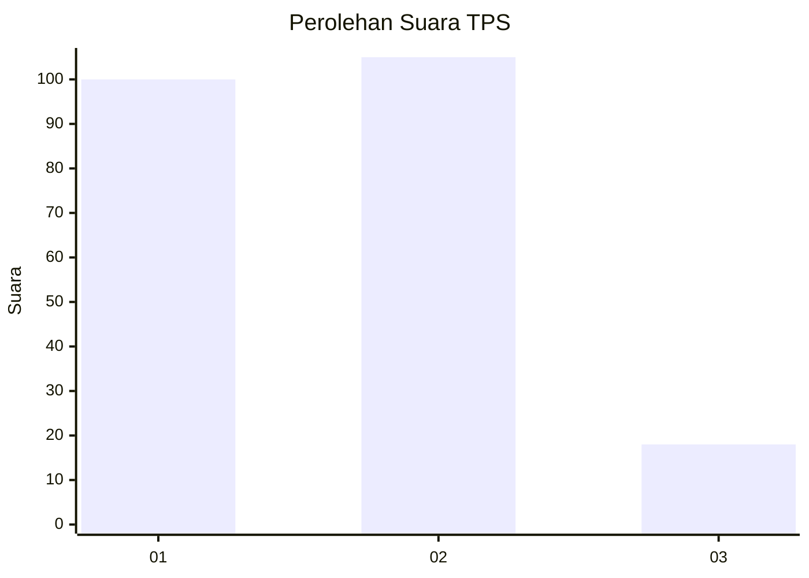
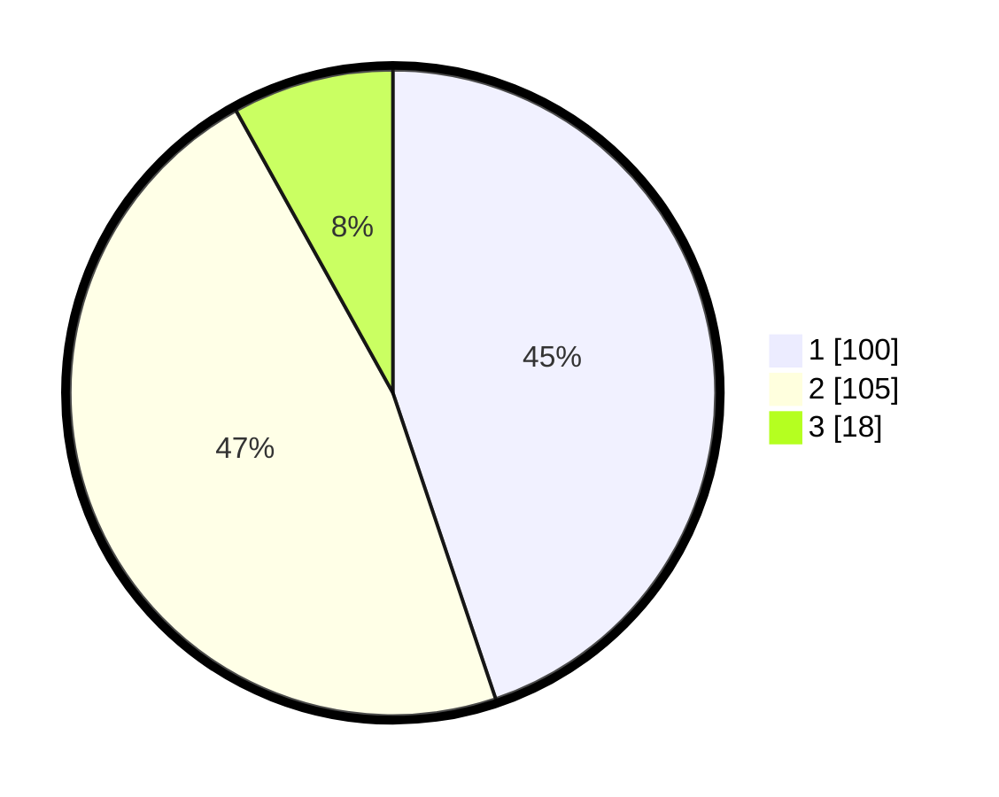

# Hasil

## Grafik

## Tabel

| No. | Nama Paslon    | Suara | Suara (raw) | Persentase |
|:--- |:-------------- | -----:| -----------:| ----------:|
| 1   | ANIES MUHAIMIN | 100   | [100][p-1]  | 44,84      |
| 2   | PRABOWO GIBRAN | 105   | [105][p-2]  | 47,09      |
| 3   | GANJAR MAHFUD  | 18    | [18][p-3]   | 8,07       |

[p-1]: https://github.com/gigit-pemilu/pemilu-2024-36-banten/blob/main/pilpres/hitung-suara/sub/36-banten/sub/71-kota-tangerang/sub/12-karang-tengah/sub/1001-karang-tengah/sub/003-tps/sub/paslon-1.txt
[p-2]: https://github.com/gigit-pemilu/pemilu-2024-36-banten/blob/main/pilpres/hitung-suara/sub/36-banten/sub/71-kota-tangerang/sub/12-karang-tengah/sub/1001-karang-tengah/sub/003-tps/sub/paslon-2.txt
[p-3]: https://github.com/gigit-pemilu/pemilu-2024-36-banten/blob/main/pilpres/hitung-suara/sub/36-banten/sub/71-kota-tangerang/sub/12-karang-tengah/sub/1001-karang-tengah/sub/003-tps/sub/paslon-3.txt

## Foto C Plano

https://sirekap-obj-formc.kpu.go.id/ad14/pemilu/ppwp/36/71/12/10/01/3671121001003-20240214-160140--7b900339-40de-4bbb-983b-41f87d2a4bc9.jpg

https://sirekap-obj-formc.kpu.go.id/ad14/pemilu/ppwp/36/71/12/10/01/3671121001003-20240214-204727--adcf6bdb-8c19-4f45-ba96-3e51bfd0eade.jpg

https://sirekap-obj-formc.kpu.go.id/ad14/pemilu/ppwp/36/71/12/10/01/3671121001003-20240214-204946--15fc070e-d9a7-4e7d-9ed0-64091a12cb47.jpg

## Metadata

| Key        | Value               |
| ---------- | ------------------- |
| Time Stamp | 2024-02-24 22:31:28 |

