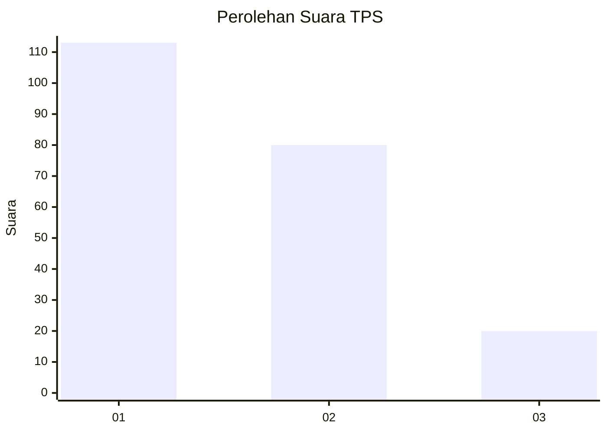
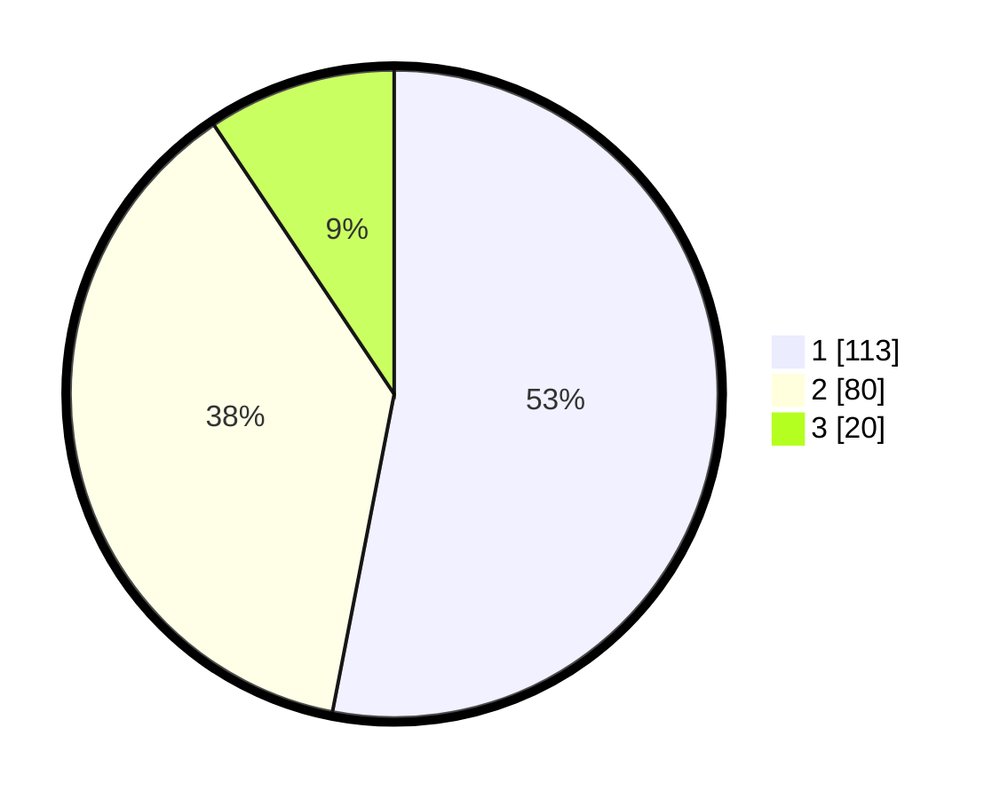

# Hasil

## Grafik

## Tabel

| No. | Nama Paslon    | Suara | Suara (raw) | Persentase |
|:--- |:-------------- | -----:| -----------:| ----------:|
| 1   | ANIES MUHAIMIN | 113   | [113][p-1]  | 53,05      |
| 2   | PRABOWO GIBRAN | 80    | [80][p-2]   | 37,56      |
| 3   | GANJAR MAHFUD  | 20    | [20][p-3]   | 9,39       |

[p-1]: https://github.com/gigit-pemilu/pemilu-2024/blob/main/pilpres/hitung-suara/sub/36-banten/sub/71-kota-tangerang/sub/12-karang-tengah/sub/1001-karang-tengah/sub/005-tps/sub/paslon-1.txt
[p-2]: https://github.com/gigit-pemilu/pemilu-2024/blob/main/pilpres/hitung-suara/sub/36-banten/sub/71-kota-tangerang/sub/12-karang-tengah/sub/1001-karang-tengah/sub/005-tps/sub/paslon-2.txt
[p-3]: https://github.com/gigit-pemilu/pemilu-2024/blob/main/pilpres/hitung-suara/sub/36-banten/sub/71-kota-tangerang/sub/12-karang-tengah/sub/1001-karang-tengah/sub/005-tps/sub/paslon-3.txt

## Foto C Plano

https://sirekap-obj-formc.kpu.go.id/9df0/pemilu/ppwp/36/71/12/10/01/3671121001005-20240214-202651--8dfc0f9f-e11f-4e5f-8c00-0b2860b46f43.jpg

https://sirekap-obj-formc.kpu.go.id/9df0/pemilu/ppwp/36/71/12/10/01/3671121001005-20240214-202940--3069c786-7e9e-4334-8c94-15177fdd959a.jpg

https://sirekap-obj-formc.kpu.go.id/9df0/pemilu/ppwp/36/71/12/10/01/3671121001005-20240214-203035--c780fb98-2b82-48cf-9e8d-a3621707abc6.jpg

## Metadata

| Key        | Value               |
| ---------- | ------------------- |
| Time Stamp | 2024-02-24 22:31:28 |

