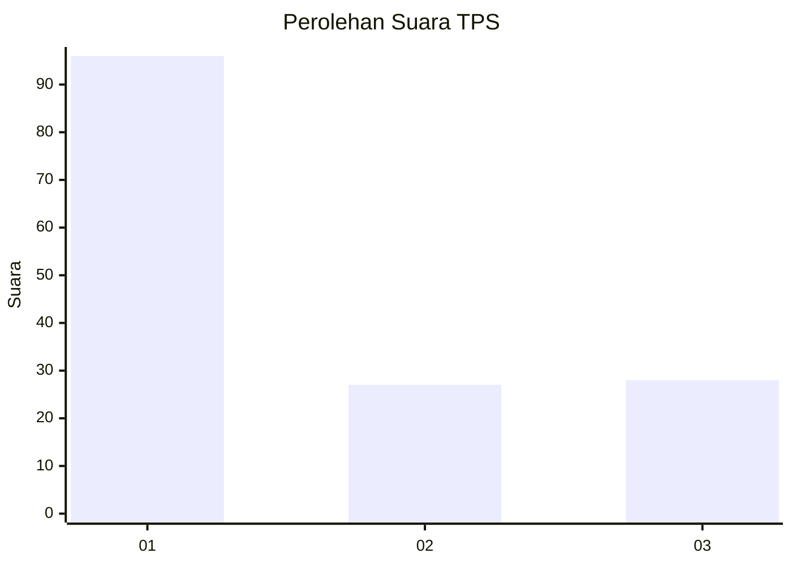
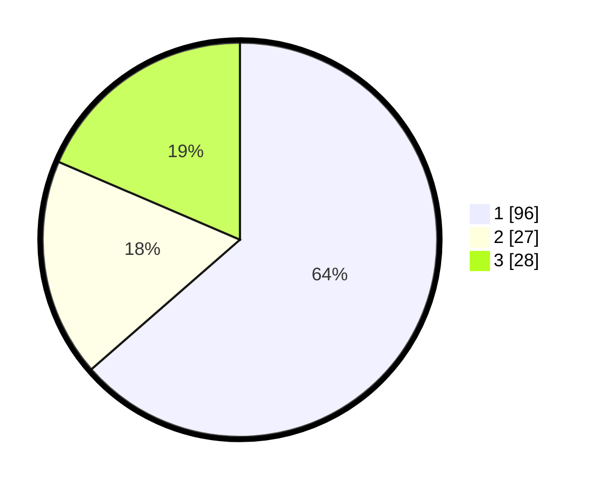

# Hasil

## Grafik

## Tabel

| No. | Nama Paslon    | Suara | Suara (raw) | Persentase |
|:--- |:-------------- | -----:| -----------:| ----------:|
| 1   | ANIES MUHAIMIN | 96    | [96][p-1]   | 63,58      |
| 2   | PRABOWO GIBRAN | 27    | [27][p-2]   | 17,88      |
| 3   | GANJAR MAHFUD  | 28    | [28][p-3]   | 18,54      |

[p-1]: https://github.com/gigit-pemilu/pemilu-2024-36-banten/blob/main/pilpres/hitung-suara/sub/36-banten/sub/71-kota-tangerang/sub/12-karang-tengah/sub/1001-karang-tengah/sub/061-tps/sub/paslon-1.txt
[p-2]: https://github.com/gigit-pemilu/pemilu-2024-36-banten/blob/main/pilpres/hitung-suara/sub/36-banten/sub/71-kota-tangerang/sub/12-karang-tengah/sub/1001-karang-tengah/sub/061-tps/sub/paslon-2.txt
[p-3]: https://github.com/gigit-pemilu/pemilu-2024-36-banten/blob/main/pilpres/hitung-suara/sub/36-banten/sub/71-kota-tangerang/sub/12-karang-tengah/sub/1001-karang-tengah/sub/061-tps/sub/paslon-3.txt

## Foto C Plano

https://sirekap-obj-formc.kpu.go.id/bbc6/pemilu/ppwp/36/71/12/10/01/3671121001061-20240214-212522--e408cb90-4340-4cea-a434-d6fb1171ee8b.jpg

https://sirekap-obj-formc.kpu.go.id/bbc6/pemilu/ppwp/36/71/12/10/01/3671121001061-20240214-214207--3e39ec96-2ea2-46ec-bd3e-51b3f92028c4.jpg

https://sirekap-obj-formc.kpu.go.id/bbc6/pemilu/ppwp/36/71/12/10/01/3671121001061-20240214-214223--5cbb121c-50a0-4618-8d40-7a2345f7fd6a.jpg

## Metadata

| Key        | Value               |
| ---------- | ------------------- |
| Time Stamp | 2024-02-24 22:31:28 |

