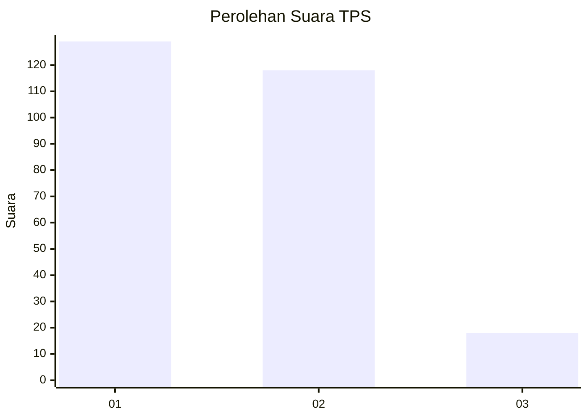
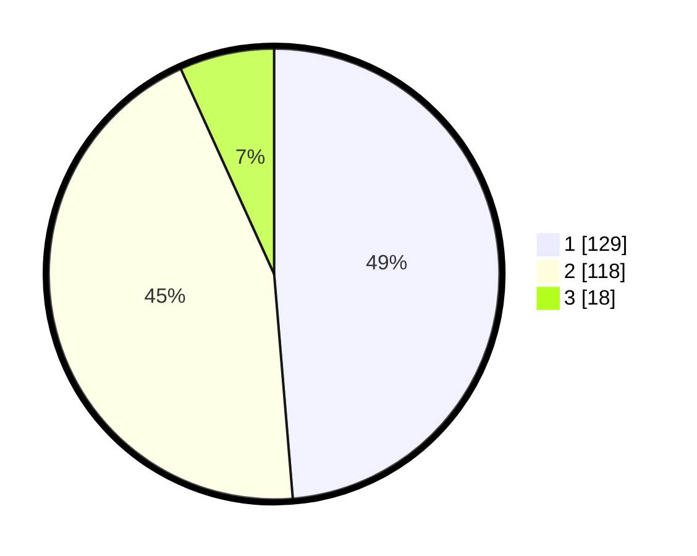

# Hasil

## Grafik

## Tabel

| No. | Nama Paslon    | Suara | Suara (raw) | Persentase |
|:--- |:-------------- | -----:| -----------:| ----------:|
| 1   | ANIES MUHAIMIN | 129   | [129][p-1]  | 48,68      |
| 2   | PRABOWO GIBRAN | 118   | [118][p-2]  | 44,53      |
| 3   | GANJAR MAHFUD  | 18    | [18][p-3]   | 6,79       |

[p-1]: https://github.com/gigit-pemilu/pemilu-2024/blob/main/pilpres/hitung-suara/sub/36-banten/sub/71-kota-tangerang/sub/12-karang-tengah/sub/1004-pondok-pucung/sub/025-tps/sub/paslon-1.txt
[p-2]: https://github.com/gigit-pemilu/pemilu-2024/blob/main/pilpres/hitung-suara/sub/36-banten/sub/71-kota-tangerang/sub/12-karang-tengah/sub/1004-pondok-pucung/sub/025-tps/sub/paslon-2.txt
[p-3]: https://github.com/gigit-pemilu/pemilu-2024/blob/main/pilpres/hitung-suara/sub/36-banten/sub/71-kota-tangerang/sub/12-karang-tengah/sub/1004-pondok-pucung/sub/025-tps/sub/paslon-3.txt

## Foto C Plano

https://sirekap-obj-formc.kpu.go.id/8f8b/pemilu/ppwp/36/71/12/10/04/3671121004025-20240214-225708--f6fcc2b7-a6fd-4165-8788-1bc55de491a4.jpg

https://sirekap-obj-formc.kpu.go.id/8f8b/pemilu/ppwp/36/71/12/10/04/3671121004025-20240214-223949--60d0ca40-81b0-400a-9827-f5007fa5ed2f.jpg

https://sirekap-obj-formc.kpu.go.id/8f8b/pemilu/ppwp/36/71/12/10/04/3671121004025-20240214-225635--7ba561f7-ccda-4bac-b725-7d00d2fd7c47.jpg

## Metadata

| Key        | Value               |
| ---------- | ------------------- |
| Time Stamp | 2024-02-16 14:30:33 |

