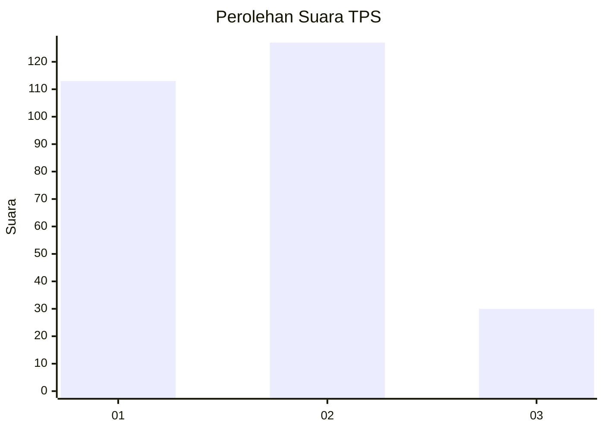
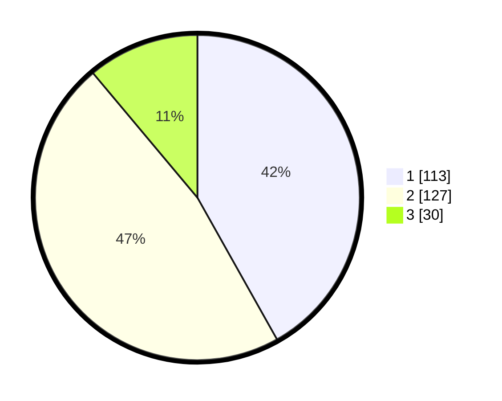

# Hasil

## Grafik

## Tabel

| No. | Nama Paslon    | Suara | Suara (raw) | Persentase |
|:--- |:-------------- | -----:| -----------:| ----------:|
| 1   | ANIES MUHAIMIN | 113   | [113][p-1]  | 41,85      |
| 2   | PRABOWO GIBRAN | 127   | [127][p-2]  | 47,04      |
| 3   | GANJAR MAHFUD  | 30    | [30][p-3]   | 11,11      |

[p-1]: https://github.com/gigit-pemilu/pemilu-2024/blob/main/pilpres/hitung-suara/sub/36-banten/sub/72-kota-cilegon/sub/01-cibeber/sub/1001-cibeber/sub/043-tps/sub/paslon-1.txt
[p-2]: https://github.com/gigit-pemilu/pemilu-2024/blob/main/pilpres/hitung-suara/sub/36-banten/sub/72-kota-cilegon/sub/01-cibeber/sub/1001-cibeber/sub/043-tps/sub/paslon-2.txt
[p-3]: https://github.com/gigit-pemilu/pemilu-2024/blob/main/pilpres/hitung-suara/sub/36-banten/sub/72-kota-cilegon/sub/01-cibeber/sub/1001-cibeber/sub/043-tps/sub/paslon-3.txt

## Foto C Plano

https://sirekap-obj-formc.kpu.go.id/4839/pemilu/ppwp/36/72/01/10/01/3672011001043-20240215-051840--d46928e3-8c45-4462-b5d9-e41018453c2d.jpg

https://sirekap-obj-formc.kpu.go.id/4839/pemilu/ppwp/36/72/01/10/01/3672011001043-20240215-051959--800d0703-4179-4ca7-ac1f-f5beecc6ca9e.jpg

https://sirekap-obj-formc.kpu.go.id/4839/pemilu/ppwp/36/72/01/10/01/3672011001043-20240215-052131--d537d3c1-47b4-402e-b246-3b7b2d16dc61.jpg

## Metadata

| Key        | Value               |
| ---------- | ------------------- |
| Time Stamp | 2024-02-15 15:00:29 |

