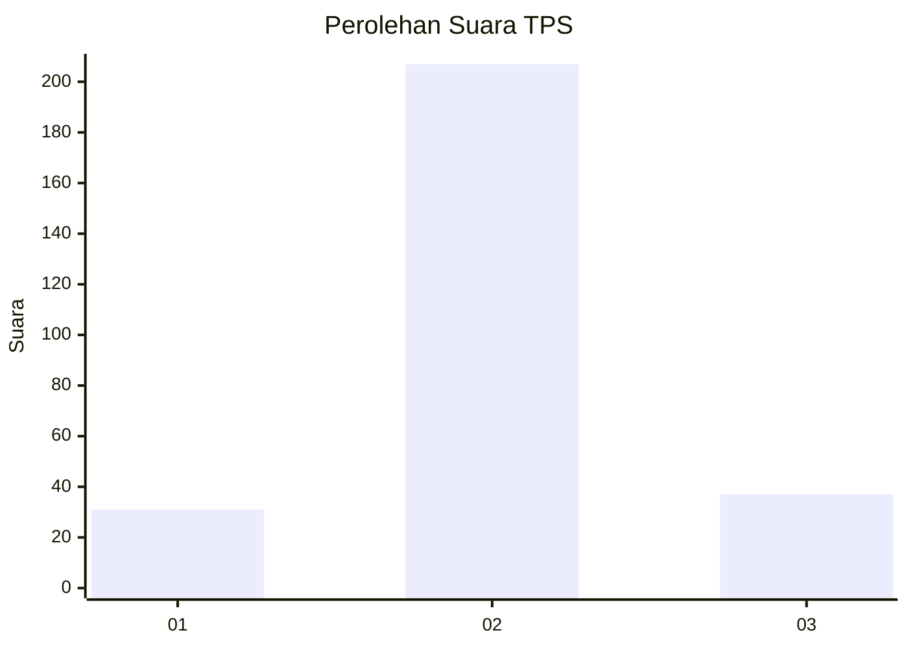
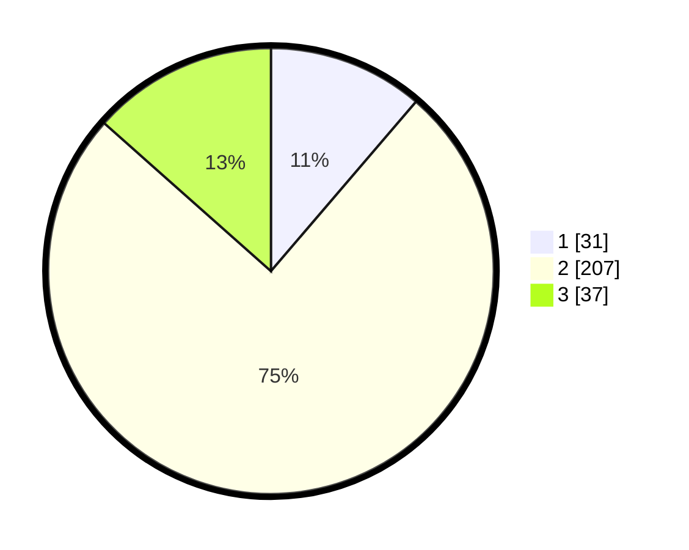

# Hasil

## Grafik

## Tabel

| No. | Nama Paslon    | Suara | Suara (raw) | Persentase |
|:--- |:-------------- | -----:| -----------:| ----------:|
| 1   | ANIES MUHAIMIN | 31    | [31][p-1]   | 11,27      |
| 2   | PRABOWO GIBRAN | 207   | [207][p-2]  | 75,27      |
| 3   | GANJAR MAHFUD  | 37    | [37][p-3]   | 13,45      |

[p-1]: https://github.com/gigit-pemilu/pemilu-2024/blob/main/pilpres/hitung-suara/sub/36-banten/sub/72-kota-cilegon/sub/01-cibeber/sub/1006-kalitimbang/sub/905-tps/sub/paslon-1.txt
[p-2]: https://github.com/gigit-pemilu/pemilu-2024/blob/main/pilpres/hitung-suara/sub/36-banten/sub/72-kota-cilegon/sub/01-cibeber/sub/1006-kalitimbang/sub/905-tps/sub/paslon-2.txt
[p-3]: https://github.com/gigit-pemilu/pemilu-2024/blob/main/pilpres/hitung-suara/sub/36-banten/sub/72-kota-cilegon/sub/01-cibeber/sub/1006-kalitimbang/sub/905-tps/sub/paslon-3.txt

## Foto C Plano

https://sirekap-obj-formc.kpu.go.id/cfc1/pemilu/ppwp/36/72/01/10/06/3672011006905-20240215-005752--08312256-76fa-472d-ba75-1e46ceb311b7.jpg

https://sirekap-obj-formc.kpu.go.id/cfc1/pemilu/ppwp/36/72/01/10/06/3672011006905-20240215-005829--db01a32a-7374-4838-bde9-5ac8049f57be.jpg

https://sirekap-obj-formc.kpu.go.id/cfc1/pemilu/ppwp/36/72/01/10/06/3672011006905-20240215-005900--71c5388d-ec48-404f-b3ed-04535a9c3b9e.jpg

## Metadata

| Key        | Value               |
| ---------- | ------------------- |
| Time Stamp | 2024-02-15 15:00:29 |

