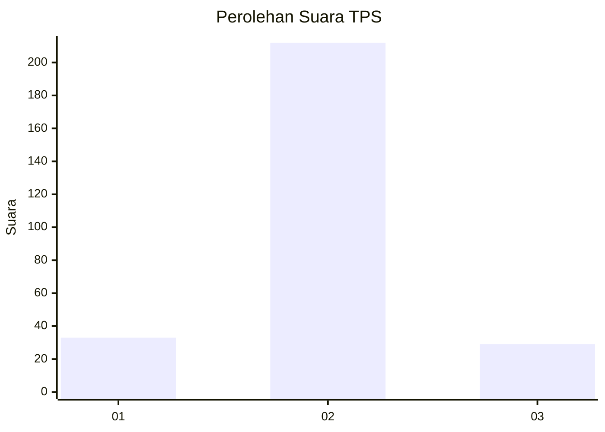
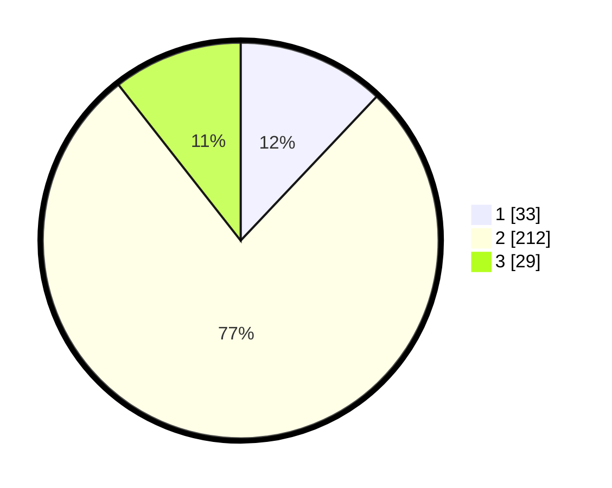

# Hasil

## Grafik

## Tabel

| No. | Nama Paslon    | Suara | Suara (raw) | Persentase |
|:--- |:-------------- | -----:| -----------:| ----------:|
| 1   | ANIES MUHAIMIN | 33    | [33][p-1]   | 12,04      |
| 2   | PRABOWO GIBRAN | 212   | [212][p-2]  | 77,37      |
| 3   | GANJAR MAHFUD  | 29    | [29][p-3]   | 10,58      |

[p-1]: https://github.com/gigit-pemilu/pemilu-2024/blob/main/pilpres/hitung-suara/sub/36-banten/sub/72-kota-cilegon/sub/01-cibeber/sub/1006-kalitimbang/sub/906-tps/sub/paslon-1.txt
[p-2]: https://github.com/gigit-pemilu/pemilu-2024/blob/main/pilpres/hitung-suara/sub/36-banten/sub/72-kota-cilegon/sub/01-cibeber/sub/1006-kalitimbang/sub/906-tps/sub/paslon-2.txt
[p-3]: https://github.com/gigit-pemilu/pemilu-2024/blob/main/pilpres/hitung-suara/sub/36-banten/sub/72-kota-cilegon/sub/01-cibeber/sub/1006-kalitimbang/sub/906-tps/sub/paslon-3.txt

## Foto C Plano

https://sirekap-obj-formc.kpu.go.id/0fab/pemilu/ppwp/36/72/01/10/06/3672011006906-20240214-235401--aa05bd0f-4450-4ffc-b048-8d1521cdd898.jpg

https://sirekap-obj-formc.kpu.go.id/0fab/pemilu/ppwp/36/72/01/10/06/3672011006906-20240214-232244--e122cf68-44a3-455a-a0cf-a48956842dec.jpg

https://sirekap-obj-formc.kpu.go.id/0fab/pemilu/ppwp/36/72/01/10/06/3672011006906-20240214-232415--23ad4ebd-de40-43fd-9d94-4b1136902f56.jpg

## Metadata

| Key        | Value               |
| ---------- | ------------------- |
| Time Stamp | 2024-02-15 15:00:29 |

