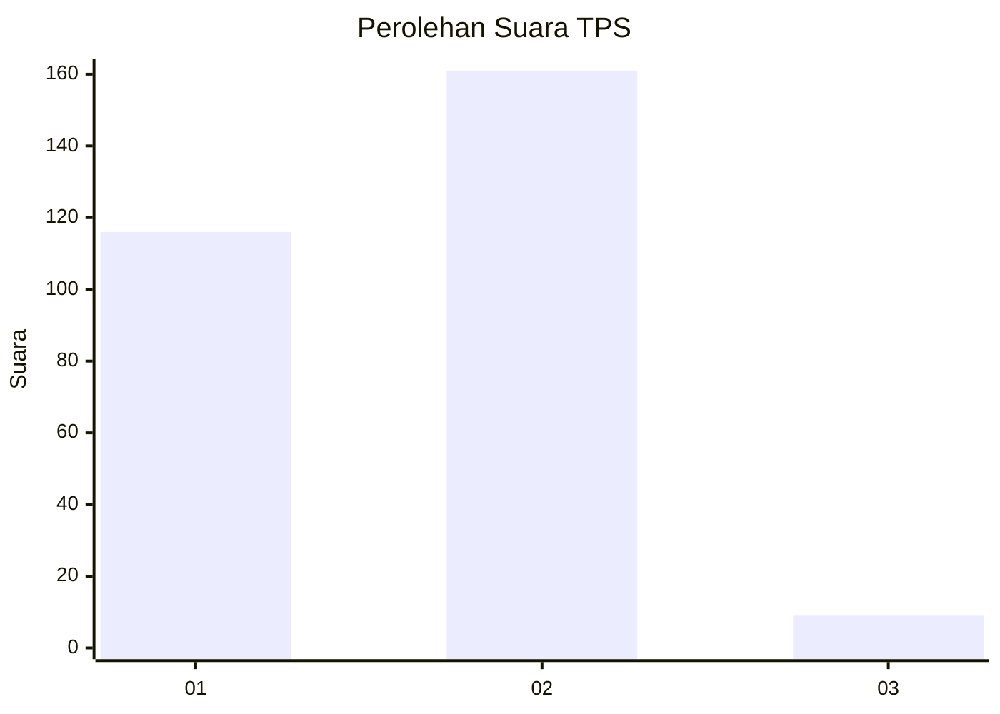
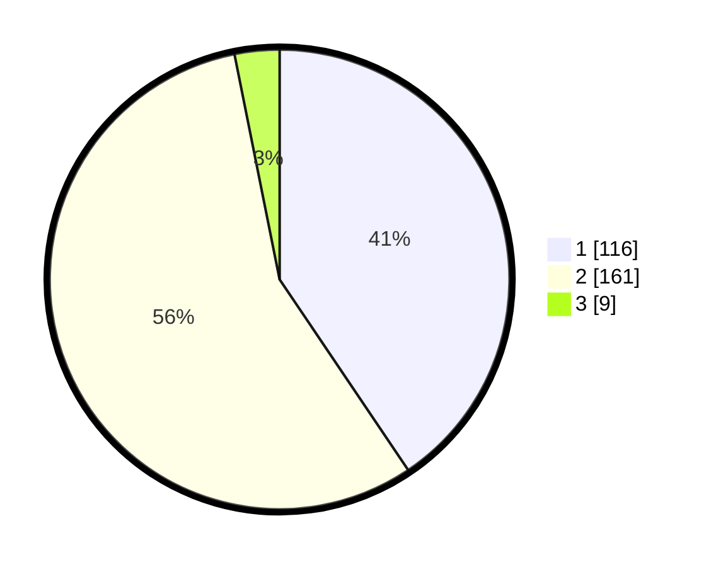

# Hasil

## Grafik

## Tabel

| No. | Nama Paslon    | Suara | Suara (raw) | Persentase |
|:--- |:-------------- | -----:| -----------:| ----------:|
| 1   | ANIES MUHAIMIN | 116   | [116][p-1]  | 40,56      |
| 2   | PRABOWO GIBRAN | 161   | [161][p-2]  | 56,29      |
| 3   | GANJAR MAHFUD  | 9     | [9][p-3]    | 3,15       |

[p-1]: https://github.com/gigit-pemilu/pemilu-2024/blob/main/pilpres/hitung-suara/sub/36-banten/sub/72-kota-cilegon/sub/02-cilegon/sub/1001-bagendung/sub/017-tps/sub/paslon-1.txt
[p-2]: https://github.com/gigit-pemilu/pemilu-2024/blob/main/pilpres/hitung-suara/sub/36-banten/sub/72-kota-cilegon/sub/02-cilegon/sub/1001-bagendung/sub/017-tps/sub/paslon-2.txt
[p-3]: https://github.com/gigit-pemilu/pemilu-2024/blob/main/pilpres/hitung-suara/sub/36-banten/sub/72-kota-cilegon/sub/02-cilegon/sub/1001-bagendung/sub/017-tps/sub/paslon-3.txt

## Foto C Plano

https://sirekap-obj-formc.kpu.go.id/0faf/pemilu/ppwp/36/72/02/10/01/3672021001017-20240215-070146--b80cfd47-7e21-4764-bb4c-ac0d4fdc1997.jpg

https://sirekap-obj-formc.kpu.go.id/0faf/pemilu/ppwp/36/72/02/10/01/3672021001017-20240215-070337--8bc28121-f559-49d9-91c0-dec8e0bdca80.jpg

https://sirekap-obj-formc.kpu.go.id/0faf/pemilu/ppwp/36/72/02/10/01/3672021001017-20240215-070435--ce43fb23-808f-40ea-a5ce-2dcf8c18cb32.jpg

## Metadata

| Key        | Value               |
| ---------- | ------------------- |
| Time Stamp | 2024-02-15 18:30:25 |

