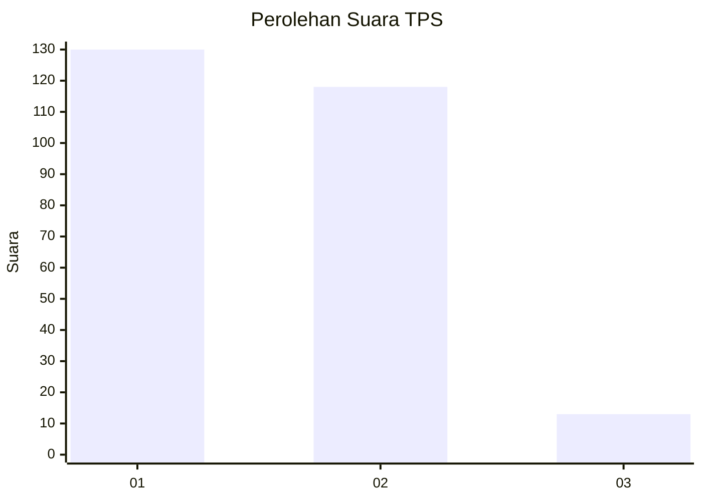
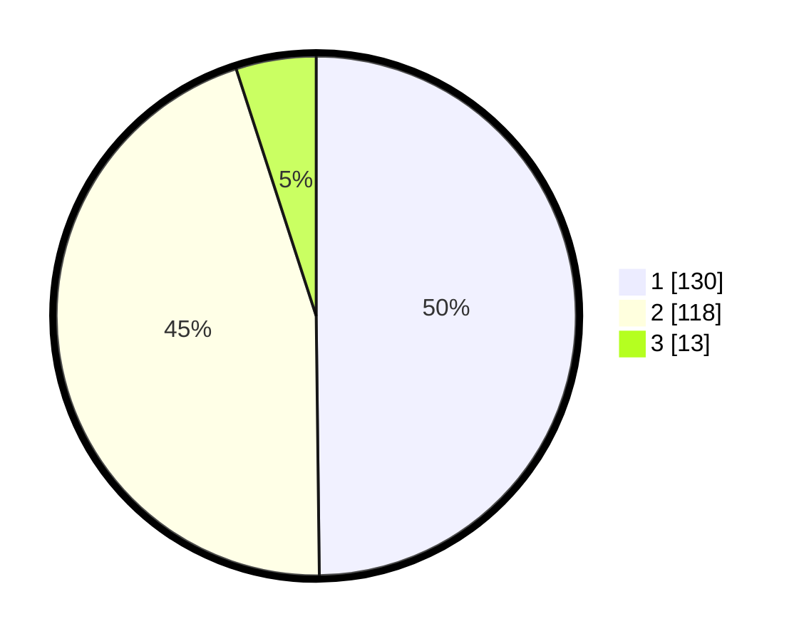

# Hasil

## Grafik

## Tabel

| No. | Nama Paslon    | Suara | Suara (raw) | Persentase |
|:--- |:-------------- | -----:| -----------:| ----------:|
| 1   | ANIES MUHAIMIN | 130   | [130][p-1]  | 49,81      |
| 2   | PRABOWO GIBRAN | 118   | [118][p-2]  | 45,21      |
| 3   | GANJAR MAHFUD  | 13    | [13][p-3]   | 4,98       |

[p-1]: https://github.com/gigit-pemilu/pemilu-2024/blob/main/pilpres/hitung-suara/sub/36-banten/sub/72-kota-cilegon/sub/02-cilegon/sub/1002-ciwedus/sub/006-tps/sub/paslon-1.txt
[p-2]: https://github.com/gigit-pemilu/pemilu-2024/blob/main/pilpres/hitung-suara/sub/36-banten/sub/72-kota-cilegon/sub/02-cilegon/sub/1002-ciwedus/sub/006-tps/sub/paslon-2.txt
[p-3]: https://github.com/gigit-pemilu/pemilu-2024/blob/main/pilpres/hitung-suara/sub/36-banten/sub/72-kota-cilegon/sub/02-cilegon/sub/1002-ciwedus/sub/006-tps/sub/paslon-3.txt

## Foto C Plano

https://sirekap-obj-formc.kpu.go.id/8b31/pemilu/ppwp/36/72/02/10/02/3672021002006-20240215-004641--307cb130-f70e-4981-8536-6e0266ac8562.jpg

https://sirekap-obj-formc.kpu.go.id/8b31/pemilu/ppwp/36/72/02/10/02/3672021002006-20240215-004659--aa07bcf4-addc-430a-857b-f5169fb504bd.jpg

https://sirekap-obj-formc.kpu.go.id/8b31/pemilu/ppwp/36/72/02/10/02/3672021002006-20240215-004709--e58ac046-59dc-4554-91ea-0f6eda10dd71.jpg

## Metadata

| Key        | Value               |
| ---------- | ------------------- |
| Time Stamp | 2024-02-15 23:29:50 |

