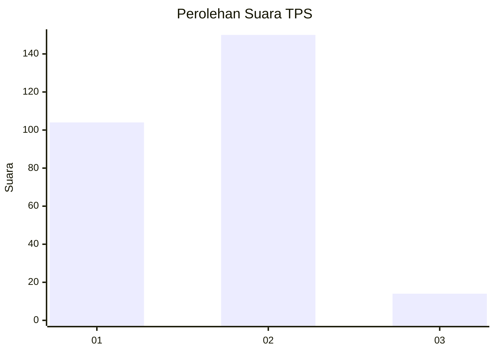
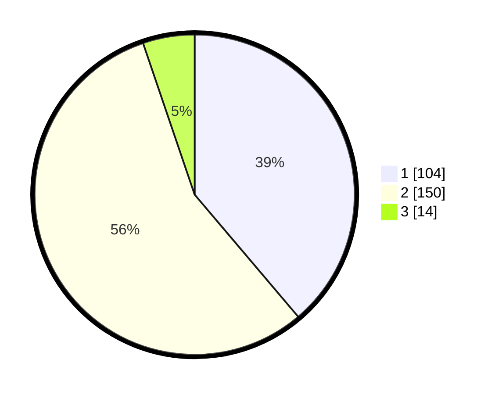

# Hasil

## Grafik

## Tabel

| No. | Nama Paslon    | Suara | Suara (raw) | Persentase |
|:--- |:-------------- | -----:| -----------:| ----------:|
| 1   | ANIES MUHAIMIN | 104   | [104][p-1]  | 38,81      |
| 2   | PRABOWO GIBRAN | 150   | [150][p-2]  | 55,97      |
| 3   | GANJAR MAHFUD  | 14    | [14][p-3]   | 5,22       |

[p-1]: https://github.com/gigit-pemilu/pemilu-2024/blob/main/pilpres/hitung-suara/sub/36-banten/sub/72-kota-cilegon/sub/02-cilegon/sub/1002-ciwedus/sub/009-tps/sub/paslon-1.txt
[p-2]: https://github.com/gigit-pemilu/pemilu-2024/blob/main/pilpres/hitung-suara/sub/36-banten/sub/72-kota-cilegon/sub/02-cilegon/sub/1002-ciwedus/sub/009-tps/sub/paslon-2.txt
[p-3]: https://github.com/gigit-pemilu/pemilu-2024/blob/main/pilpres/hitung-suara/sub/36-banten/sub/72-kota-cilegon/sub/02-cilegon/sub/1002-ciwedus/sub/009-tps/sub/paslon-3.txt

## Foto C Plano

https://sirekap-obj-formc.kpu.go.id/92ca/pemilu/ppwp/36/72/02/10/02/3672021002009-20240215-034955--97b97500-630a-4ac1-a537-3f5fffe333aa.jpg

https://sirekap-obj-formc.kpu.go.id/92ca/pemilu/ppwp/36/72/02/10/02/3672021002009-20240215-035009--49c517b7-ac49-43b0-a271-39f742e7e29e.jpg

https://sirekap-obj-formc.kpu.go.id/92ca/pemilu/ppwp/36/72/02/10/02/3672021002009-20240215-035018--583574be-55be-4ebf-a2e6-0c07c1ea4986.jpg

## Metadata

| Key        | Value               |
| ---------- | ------------------- |
| Time Stamp | 2024-02-15 16:00:26 |

