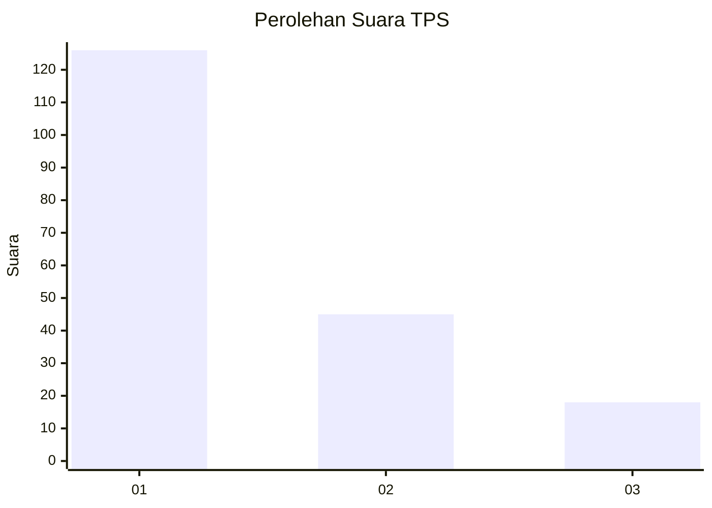
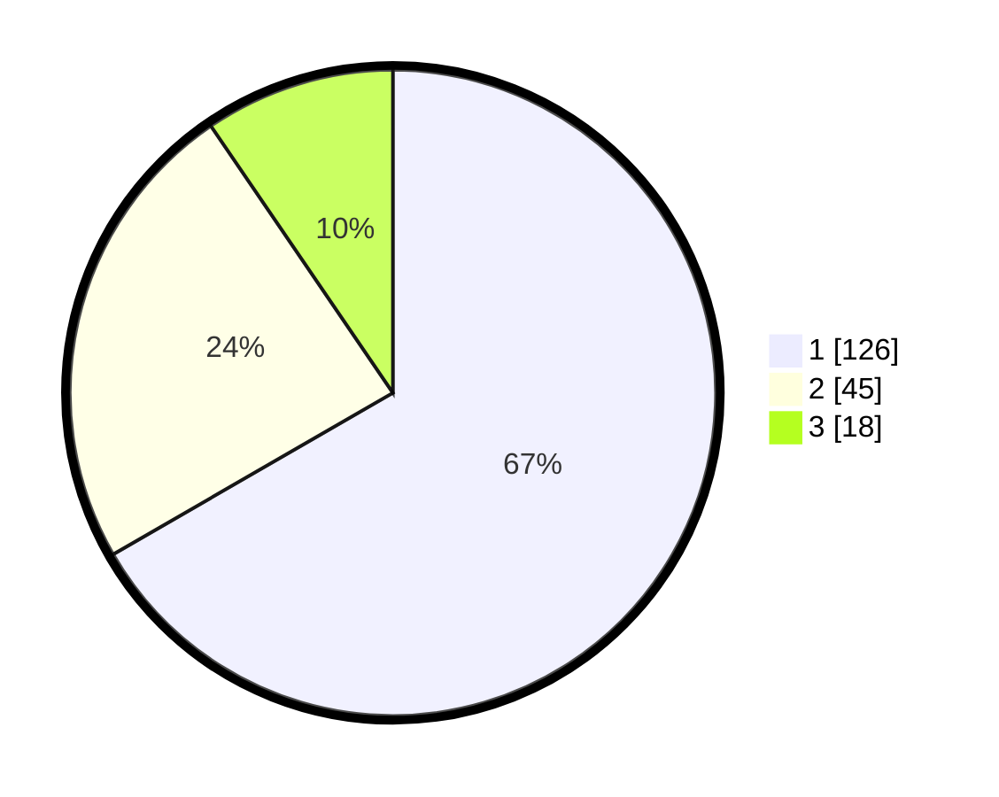

# Hasil

## Grafik

## Tabel

| No. | Nama Paslon    | Suara | Suara (raw) | Persentase |
|:--- |:-------------- | -----:| -----------:| ----------:|
| 1   | ANIES MUHAIMIN | 126   | [126][p-1]  | 66,67      |
| 2   | PRABOWO GIBRAN | 45    | [45][p-2]   | 23,81      |
| 3   | GANJAR MAHFUD  | 18    | [18][p-3]   | 9,52       |

[p-1]: https://github.com/gigit-pemilu/pemilu-2024-36-banten/blob/main/pilpres/hitung-suara/sub/36-banten/sub/72-kota-cilegon/sub/02-cilegon/sub/1005-ciwaduk/sub/032-tps/sub/paslon-1.txt
[p-2]: https://github.com/gigit-pemilu/pemilu-2024-36-banten/blob/main/pilpres/hitung-suara/sub/36-banten/sub/72-kota-cilegon/sub/02-cilegon/sub/1005-ciwaduk/sub/032-tps/sub/paslon-2.txt
[p-3]: https://github.com/gigit-pemilu/pemilu-2024-36-banten/blob/main/pilpres/hitung-suara/sub/36-banten/sub/72-kota-cilegon/sub/02-cilegon/sub/1005-ciwaduk/sub/032-tps/sub/paslon-3.txt

## Foto C Plano

https://sirekap-obj-formc.kpu.go.id/af22/pemilu/ppwp/36/72/02/10/05/3672021005032-20240215-185709--a5546be0-f23f-40c5-a12d-43e5e2b3b083.jpg

https://sirekap-obj-formc.kpu.go.id/af22/pemilu/ppwp/36/72/02/10/05/3672021005032-20240215-185748--08d87850-09dc-4898-add5-ef432055c27b.jpg

https://sirekap-obj-formc.kpu.go.id/af22/pemilu/ppwp/36/72/02/10/05/3672021005032-20240215-180614--6f4b28f6-fc58-4116-b98d-861a40b31e45.jpg

## Metadata

| Key        | Value               |
| ---------- | ------------------- |
| Time Stamp | 2024-02-25 16:00:00 |

