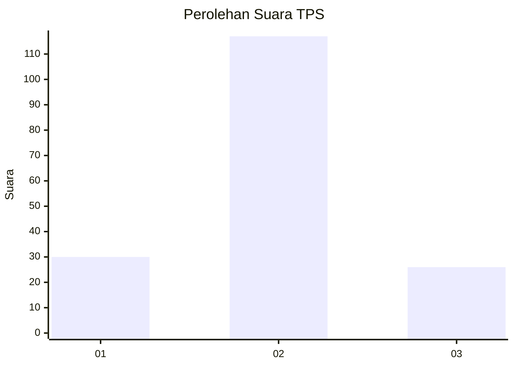
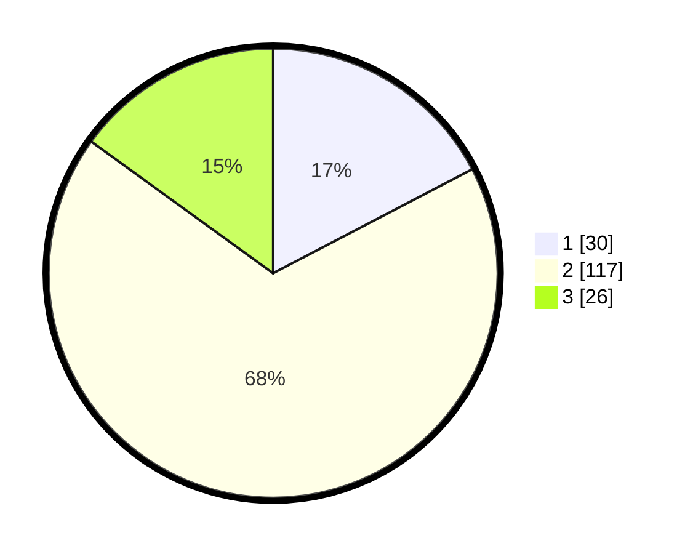

# Hasil

## Grafik

## Tabel

| No. | Nama Paslon    | Suara | Suara (raw) | Persentase |
|:--- |:-------------- | -----:| -----------:| ----------:|
| 1   | ANIES MUHAIMIN | 30    | [30][p-1]   | 17,34      |
| 2   | PRABOWO GIBRAN | 117   | [117][p-2]  | 67,63      |
| 3   | GANJAR MAHFUD  | 26    | [26][p-3]   | 15,03      |

[p-1]: https://github.com/gigit-pemilu/pemilu-2024-36-banten/blob/main/pilpres/hitung-suara/sub/36-banten/sub/72-kota-cilegon/sub/03-pulomerak/sub/1001-tamansari/sub/010-tps/sub/paslon-1.txt
[p-2]: https://github.com/gigit-pemilu/pemilu-2024-36-banten/blob/main/pilpres/hitung-suara/sub/36-banten/sub/72-kota-cilegon/sub/03-pulomerak/sub/1001-tamansari/sub/010-tps/sub/paslon-2.txt
[p-3]: https://github.com/gigit-pemilu/pemilu-2024-36-banten/blob/main/pilpres/hitung-suara/sub/36-banten/sub/72-kota-cilegon/sub/03-pulomerak/sub/1001-tamansari/sub/010-tps/sub/paslon-3.txt

## Foto C Plano

https://sirekap-obj-formc.kpu.go.id/3f29/pemilu/ppwp/36/72/03/10/01/3672031001010-20240216-054923--0638a86a-7a94-4fc3-b333-7829819c8ec9.jpg

https://sirekap-obj-formc.kpu.go.id/3f29/pemilu/ppwp/36/72/03/10/01/3672031001010-20240216-054930--4ca9b53b-25e5-4258-8932-4bb78f038c92.jpg

https://sirekap-obj-formc.kpu.go.id/3f29/pemilu/ppwp/36/72/03/10/01/3672031001010-20240216-054936--f3731abd-0765-4d97-b36c-2403da3d62e6.jpg

## Metadata

| Key        | Value               |
| ---------- | ------------------- |
| Time Stamp | 2024-02-16 10:30:29 |

