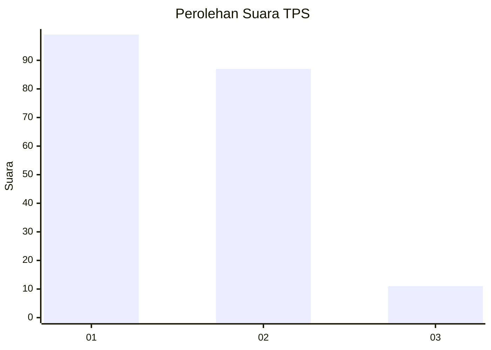
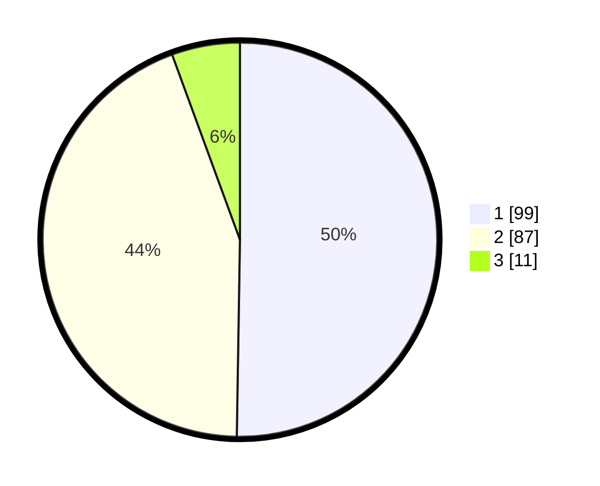

# Hasil

## Grafik

## Tabel

| No. | Nama Paslon    | Suara | Suara (raw) | Persentase |
|:--- |:-------------- | -----:| -----------:| ----------:|
| 1   | ANIES MUHAIMIN | 99    | [99][p-1]   | 50,25      |
| 2   | PRABOWO GIBRAN | 87    | [87][p-2]   | 44,16      |
| 3   | GANJAR MAHFUD  | 11    | [11][p-3]   | 5,58       |

[p-1]: https://github.com/gigit-pemilu/pemilu-2024-36-banten/blob/main/pilpres/hitung-suara/sub/36-banten/sub/72-kota-cilegon/sub/04-ciwandan/sub/1001-banjar-negara/sub/003-tps/sub/paslon-1.txt
[p-2]: https://github.com/gigit-pemilu/pemilu-2024-36-banten/blob/main/pilpres/hitung-suara/sub/36-banten/sub/72-kota-cilegon/sub/04-ciwandan/sub/1001-banjar-negara/sub/003-tps/sub/paslon-2.txt
[p-3]: https://github.com/gigit-pemilu/pemilu-2024-36-banten/blob/main/pilpres/hitung-suara/sub/36-banten/sub/72-kota-cilegon/sub/04-ciwandan/sub/1001-banjar-negara/sub/003-tps/sub/paslon-3.txt

## Foto C Plano

https://sirekap-obj-formc.kpu.go.id/5941/pemilu/ppwp/36/72/04/10/01/3672041001003-20240214-215911--4ec966e6-8b86-4ce0-9a17-d4812d165124.jpg

https://sirekap-obj-formc.kpu.go.id/5941/pemilu/ppwp/36/72/04/10/01/3672041001003-20240214-221018--204e201d-9316-4e2d-9638-38072fb98c96.jpg

https://sirekap-obj-formc.kpu.go.id/5941/pemilu/ppwp/36/72/04/10/01/3672041001003-20240214-213943--d58a68f4-b691-4469-801f-4201bd2b060d.jpg

## Metadata

| Key        | Value               |
| ---------- | ------------------- |
| Time Stamp | 2024-02-15 18:30:25 |

