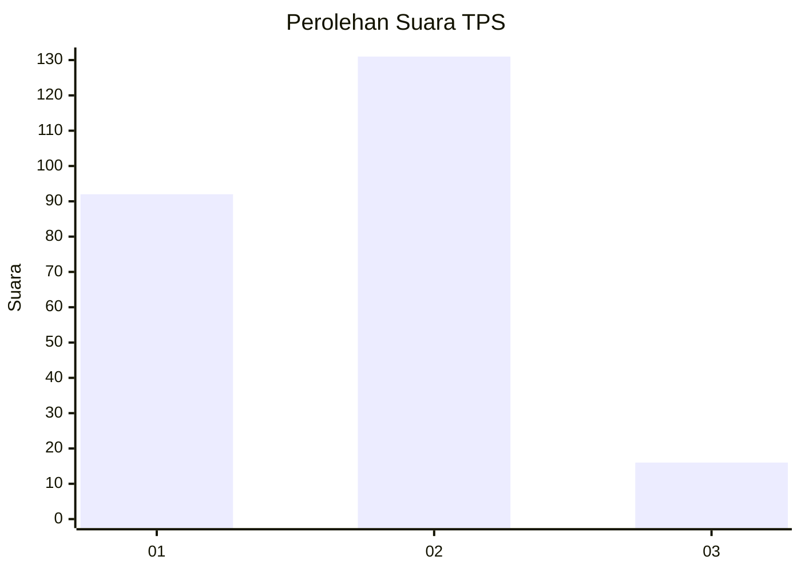

# Hasil

## Grafik

## Tabel

| No. | Nama Paslon    | Suara | Suara (raw) | Persentase |
|:--- |:-------------- | -----:| -----------:| ----------:|
| 1   | ANIES MUHAIMIN | 92    | [92][p-1]   | 38,49      |
| 2   | PRABOWO GIBRAN | 131   | [131][p-2]  | 54,81      |
| 3   | GANJAR MAHFUD  | 16    | [16][p-3]   | 6,69       |

[p-1]: https://github.com/gigit-pemilu/pemilu-2024-36-banten/blob/main/pilpres/hitung-suara/sub/36-banten/sub/72-kota-cilegon/sub/05-jombang/sub/1001-sukmajaya/sub/003-tps/sub/paslon-1.txt
[p-2]: https://github.com/gigit-pemilu/pemilu-2024-36-banten/blob/main/pilpres/hitung-suara/sub/36-banten/sub/72-kota-cilegon/sub/05-jombang/sub/1001-sukmajaya/sub/003-tps/sub/paslon-2.txt
[p-3]: https://github.com/gigit-pemilu/pemilu-2024-36-banten/blob/main/pilpres/hitung-suara/sub/36-banten/sub/72-kota-cilegon/sub/05-jombang/sub/1001-sukmajaya/sub/003-tps/sub/paslon-3.txt

## Foto C Plano

https://sirekap-obj-formc.kpu.go.id/04e8/pemilu/ppwp/36/72/05/10/01/3672051001003-20240215-030555--10cfe11d-4ae8-4b7f-9522-edf251dd10c4.jpg

https://sirekap-obj-formc.kpu.go.id/04e8/pemilu/ppwp/36/72/05/10/01/3672051001003-20240215-030711--ea1214a7-3bd0-47c3-a1f8-e8637bf92a56.jpg

https://sirekap-obj-formc.kpu.go.id/04e8/pemilu/ppwp/36/72/05/10/01/3672051001003-20240215-030913--da998e46-5ce5-4057-99a7-7bbcbac5e699.jpg

## Metadata

| Key        | Value               |
| ---------- | ------------------- |
| Time Stamp | 2024-02-15 17:00:25 |

