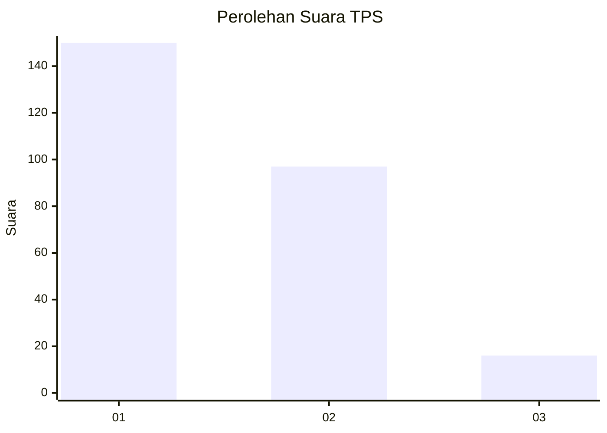
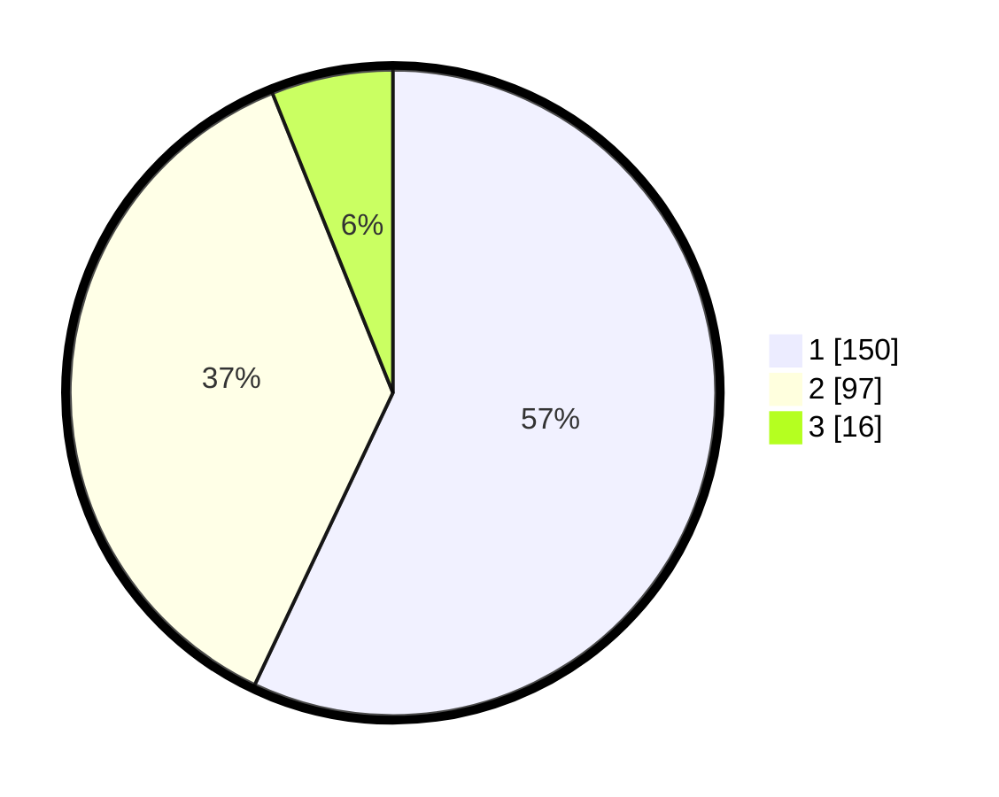

# Hasil

## Grafik

## Tabel

| No. | Nama Paslon    | Suara | Suara (raw) | Persentase |
|:--- |:-------------- | -----:| -----------:| ----------:|
| 1   | ANIES MUHAIMIN | 150   | [150][p-1]  | 57,03      |
| 2   | PRABOWO GIBRAN | 97    | [97][p-2]   | 36,88      |
| 3   | GANJAR MAHFUD  | 16    | [16][p-3]   | 6,08       |

[p-1]: https://github.com/gigit-pemilu/pemilu-2024/blob/main/pilpres/hitung-suara/sub/36-banten/sub/72-kota-cilegon/sub/06-gerogol/sub/1002-grogol/sub/012-tps/sub/paslon-1.txt
[p-2]: https://github.com/gigit-pemilu/pemilu-2024/blob/main/pilpres/hitung-suara/sub/36-banten/sub/72-kota-cilegon/sub/06-gerogol/sub/1002-grogol/sub/012-tps/sub/paslon-2.txt
[p-3]: https://github.com/gigit-pemilu/pemilu-2024/blob/main/pilpres/hitung-suara/sub/36-banten/sub/72-kota-cilegon/sub/06-gerogol/sub/1002-grogol/sub/012-tps/sub/paslon-3.txt

## Foto C Plano

https://sirekap-obj-formc.kpu.go.id/0be4/pemilu/ppwp/36/72/06/10/02/3672061002012-20240215-044638--aa8e5624-f4dd-48d8-b688-3cc1f59e1cf4.jpg

https://sirekap-obj-formc.kpu.go.id/0be4/pemilu/ppwp/36/72/06/10/02/3672061002012-20240215-045032--d3217a67-9601-49b4-9339-85dfc8e06ed4.jpg

https://sirekap-obj-formc.kpu.go.id/0be4/pemilu/ppwp/36/72/06/10/02/3672061002012-20240214-231838--a31deff5-9acc-4ef7-89be-387fb83f6892.jpg

## Metadata

| Key        | Value               |
| ---------- | ------------------- |
| Time Stamp | 2024-02-15 20:30:46 |

