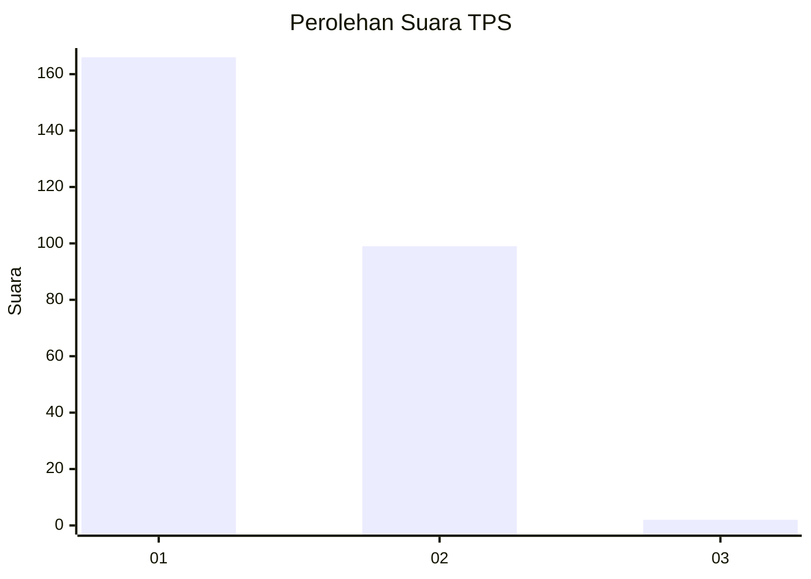
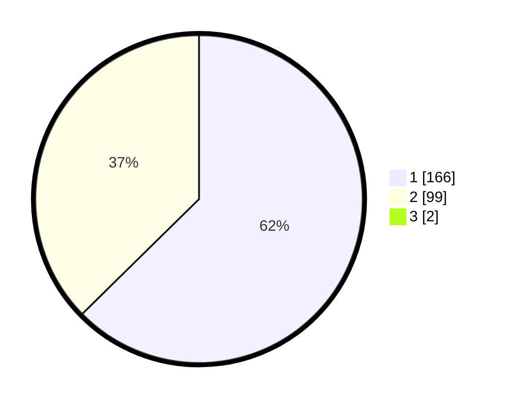

# Hasil

## Grafik

## Tabel

| No. | Nama Paslon    | Suara | Suara (raw) | Persentase |
|:--- |:-------------- | -----:| -----------:| ----------:|
| 1   | ANIES MUHAIMIN | 166   | [166][p-1]  | 62,17      |
| 2   | PRABOWO GIBRAN | 99    | [99][p-2]   | 37,08      |
| 3   | GANJAR MAHFUD  | 2     | [2][p-3]    | 0,75       |

[p-1]: https://github.com/gigit-pemilu/pemilu-2024-36-banten/blob/main/pilpres/hitung-suara/sub/36-banten/sub/72-kota-cilegon/sub/06-gerogol/sub/1004-gerem/sub/018-tps/sub/paslon-1.txt
[p-2]: https://github.com/gigit-pemilu/pemilu-2024-36-banten/blob/main/pilpres/hitung-suara/sub/36-banten/sub/72-kota-cilegon/sub/06-gerogol/sub/1004-gerem/sub/018-tps/sub/paslon-2.txt
[p-3]: https://github.com/gigit-pemilu/pemilu-2024-36-banten/blob/main/pilpres/hitung-suara/sub/36-banten/sub/72-kota-cilegon/sub/06-gerogol/sub/1004-gerem/sub/018-tps/sub/paslon-3.txt

## Foto C Plano

https://sirekap-obj-formc.kpu.go.id/f7e5/pemilu/ppwp/36/72/06/10/04/3672061004018-20240215-023730--29a9ed4d-9f4e-4d63-92c3-3f457e3526eb.jpg

https://sirekap-obj-formc.kpu.go.id/f7e5/pemilu/ppwp/36/72/06/10/04/3672061004018-20240215-023808--cfd6972b-2193-45f5-9dd4-627667e6030f.jpg

https://sirekap-obj-formc.kpu.go.id/f7e5/pemilu/ppwp/36/72/06/10/04/3672061004018-20240215-023849--26dd6613-5e6e-4bd5-91a1-5bcce3537d92.jpg

## Metadata

| Key        | Value               |
| ---------- | ------------------- |
| Time Stamp | 2024-02-15 15:00:29 |

