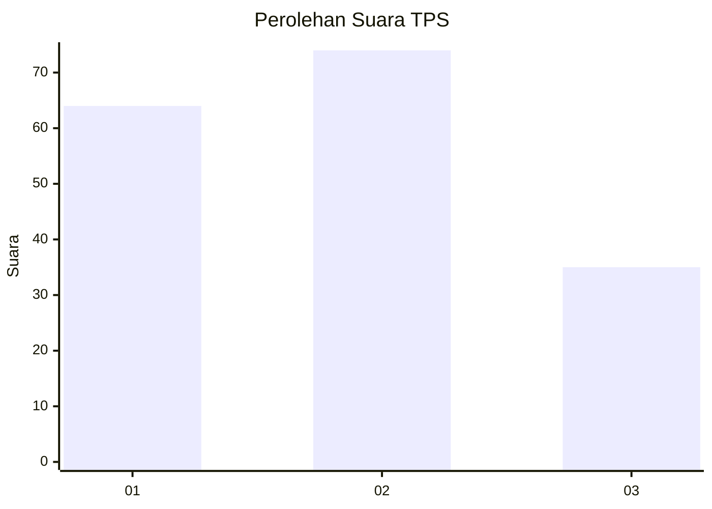
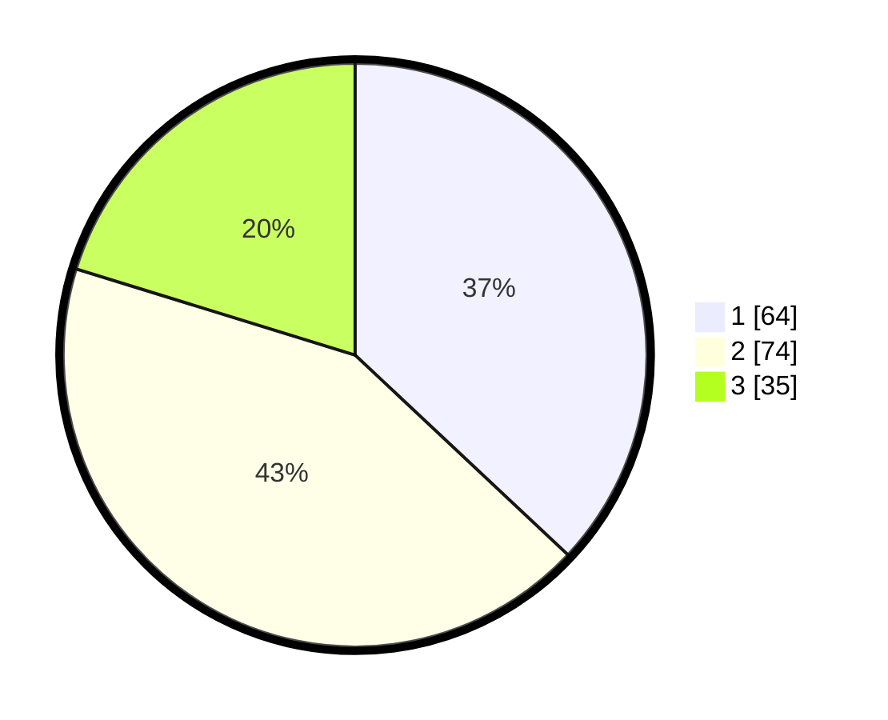

# Hasil

## Grafik

## Tabel

| No. | Nama Paslon    | Suara | Suara (raw) | Persentase |
|:--- |:-------------- | -----:| -----------:| ----------:|
| 1   | ANIES MUHAIMIN | 64    | [64][p-1]   | 36,99      |
| 2   | PRABOWO GIBRAN | 74    | [74][p-2]   | 42,77      |
| 3   | GANJAR MAHFUD  | 35    | [35][p-3]   | 20,23      |

[p-1]: https://github.com/gigit-pemilu/pemilu-2024/blob/main/pilpres/hitung-suara/sub/36-banten/sub/72-kota-cilegon/sub/07-purwakarta/sub/1001-ramanuju/sub/004-tps/sub/paslon-1.txt
[p-2]: https://github.com/gigit-pemilu/pemilu-2024/blob/main/pilpres/hitung-suara/sub/36-banten/sub/72-kota-cilegon/sub/07-purwakarta/sub/1001-ramanuju/sub/004-tps/sub/paslon-2.txt
[p-3]: https://github.com/gigit-pemilu/pemilu-2024/blob/main/pilpres/hitung-suara/sub/36-banten/sub/72-kota-cilegon/sub/07-purwakarta/sub/1001-ramanuju/sub/004-tps/sub/paslon-3.txt

## Foto C Plano

https://sirekap-obj-formc.kpu.go.id/7fd8/pemilu/ppwp/36/72/07/10/01/3672071001004-20240215-023336--33c91451-f369-45fe-be59-9002b3408271.jpg

https://sirekap-obj-formc.kpu.go.id/7fd8/pemilu/ppwp/36/72/07/10/01/3672071001004-20240215-023529--ed162c56-7853-4f70-ba20-8a4f97eb0545.jpg

https://sirekap-obj-formc.kpu.go.id/7fd8/pemilu/ppwp/36/72/07/10/01/3672071001004-20240214-220537--d8e95d69-7126-4a30-98ae-60c4e827d59f.jpg

## Metadata

| Key        | Value               |
| ---------- | ------------------- |
| Time Stamp | 2024-02-15 22:00:27 |

