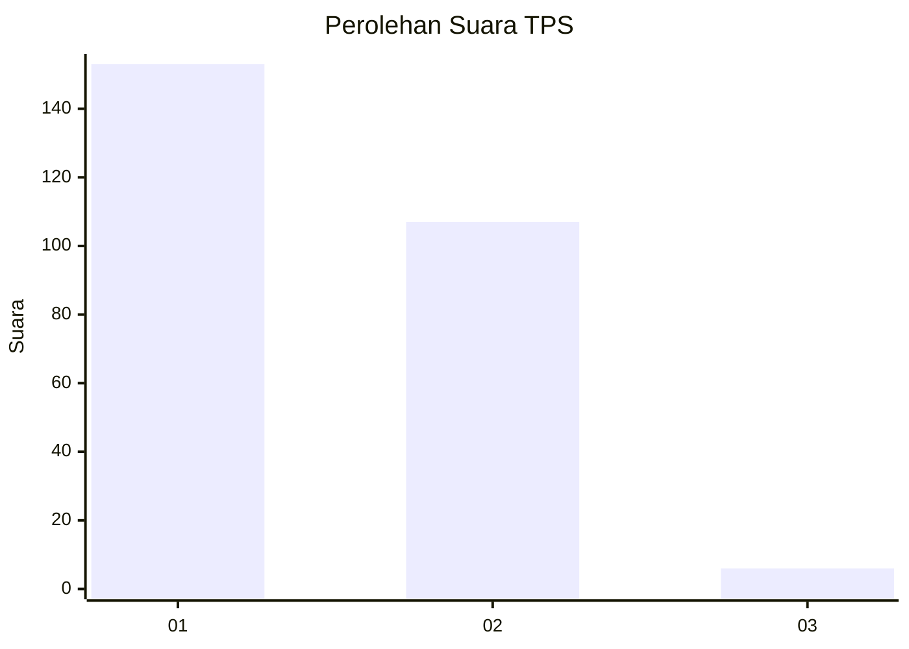
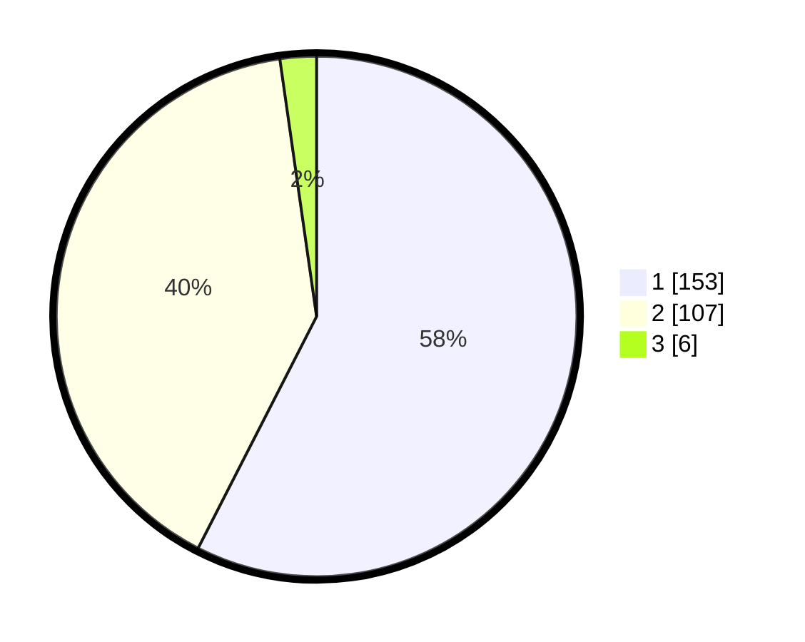

# Hasil

## Grafik

## Tabel

| No. | Nama Paslon    | Suara | Suara (raw) | Persentase |
|:--- |:-------------- | -----:| -----------:| ----------:|
| 1   | ANIES MUHAIMIN | 153   | [153][p-1]  | 57,52      |
| 2   | PRABOWO GIBRAN | 107   | [107][p-2]  | 40,23      |
| 3   | GANJAR MAHFUD  | 6     | [6][p-3]    | 2,26       |

[p-1]: https://github.com/gigit-pemilu/pemilu-2024-36-banten/blob/main/pilpres/hitung-suara/sub/36-banten/sub/72-kota-cilegon/sub/07-purwakarta/sub/1005-tegal-bunder/sub/001-tps/sub/paslon-1.txt
[p-2]: https://github.com/gigit-pemilu/pemilu-2024-36-banten/blob/main/pilpres/hitung-suara/sub/36-banten/sub/72-kota-cilegon/sub/07-purwakarta/sub/1005-tegal-bunder/sub/001-tps/sub/paslon-2.txt
[p-3]: https://github.com/gigit-pemilu/pemilu-2024-36-banten/blob/main/pilpres/hitung-suara/sub/36-banten/sub/72-kota-cilegon/sub/07-purwakarta/sub/1005-tegal-bunder/sub/001-tps/sub/paslon-3.txt

## Foto C Plano

https://sirekap-obj-formc.kpu.go.id/3cd3/pemilu/ppwp/36/72/07/10/05/3672071005001-20240214-222254--805d78d0-1f97-4a3f-95fa-66854f241c47.jpg

https://sirekap-obj-formc.kpu.go.id/3cd3/pemilu/ppwp/36/72/07/10/05/3672071005001-20240214-210430--b20f858d-1b70-4586-9283-a3be36fbc655.jpg

https://sirekap-obj-formc.kpu.go.id/3cd3/pemilu/ppwp/36/72/07/10/05/3672071005001-20240214-210438--78a721e1-b5fc-4bc7-b09c-419b54094dfe.jpg

## Metadata

| Key        | Value               |
| ---------- | ------------------- |
| Time Stamp | 2024-02-15 15:00:29 |

