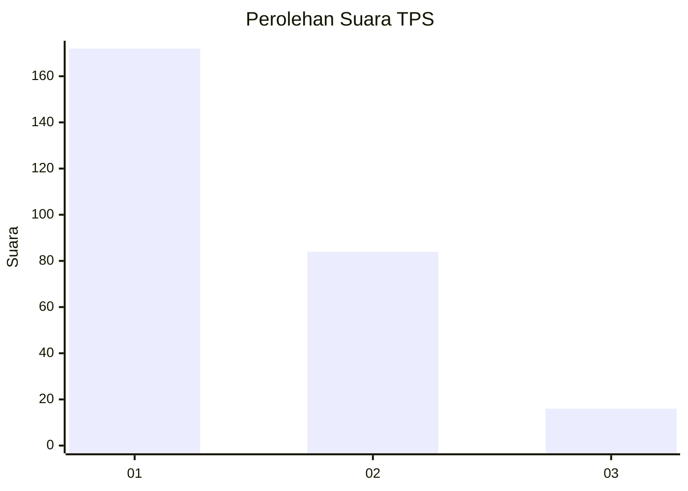
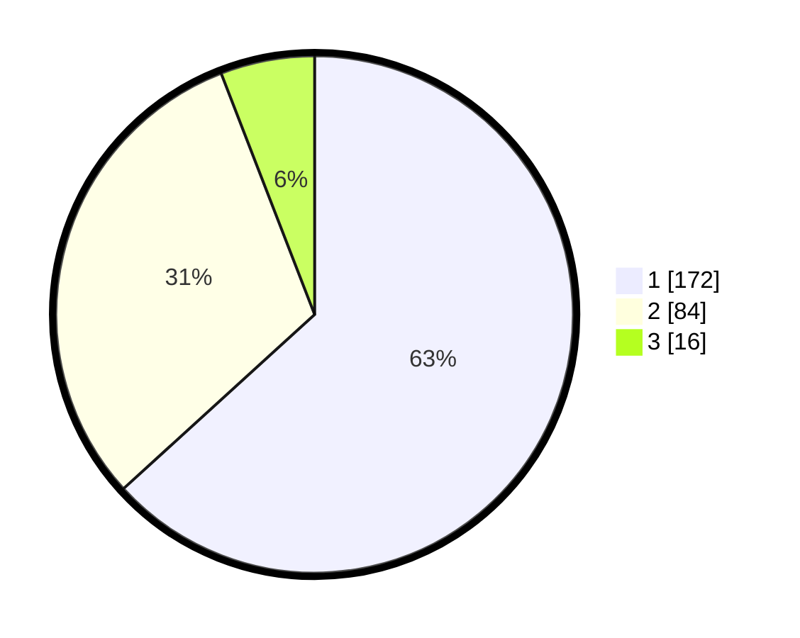

# Hasil

## Grafik

## Tabel

| No. | Nama Paslon    | Suara | Suara (raw) | Persentase |
|:--- |:-------------- | -----:| -----------:| ----------:|
| 1   | ANIES MUHAIMIN | 172   | [172][p-1]  | 63,24      |
| 2   | PRABOWO GIBRAN | 84    | [84][p-2]   | 30,88      |
| 3   | GANJAR MAHFUD  | 16    | [16][p-3]   | 5,88       |

[p-1]: https://github.com/gigit-pemilu/pemilu-2024/blob/main/pilpres/hitung-suara/sub/36-banten/sub/72-kota-cilegon/sub/08-citangkil/sub/1003-lebak-denok/sub/001-tps/sub/paslon-1.txt
[p-2]: https://github.com/gigit-pemilu/pemilu-2024/blob/main/pilpres/hitung-suara/sub/36-banten/sub/72-kota-cilegon/sub/08-citangkil/sub/1003-lebak-denok/sub/001-tps/sub/paslon-2.txt
[p-3]: https://github.com/gigit-pemilu/pemilu-2024/blob/main/pilpres/hitung-suara/sub/36-banten/sub/72-kota-cilegon/sub/08-citangkil/sub/1003-lebak-denok/sub/001-tps/sub/paslon-3.txt

## Foto C Plano

https://sirekap-obj-formc.kpu.go.id/f5a3/pemilu/ppwp/36/72/08/10/03/3672081003001-20240215-022335--90c16a0e-d7a5-492f-8742-92cb0c2df922.jpg

https://sirekap-obj-formc.kpu.go.id/f5a3/pemilu/ppwp/36/72/08/10/03/3672081003001-20240215-022425--4a83c87b-cf15-495f-98a7-ea12cb8db6f6.jpg

https://sirekap-obj-formc.kpu.go.id/f5a3/pemilu/ppwp/36/72/08/10/03/3672081003001-20240215-022526--35e2cd36-7398-40a8-9e54-ee4258a2f65f.jpg

## Metadata

| Key        | Value               |
| ---------- | ------------------- |
| Time Stamp | 2024-02-15 15:30:25 |

