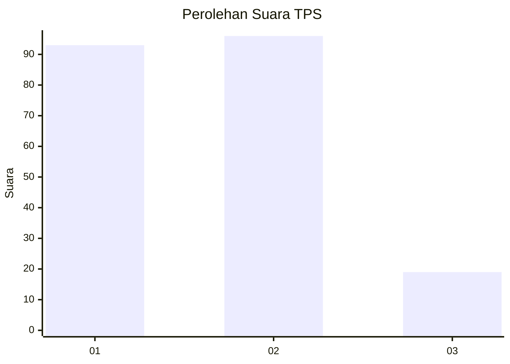
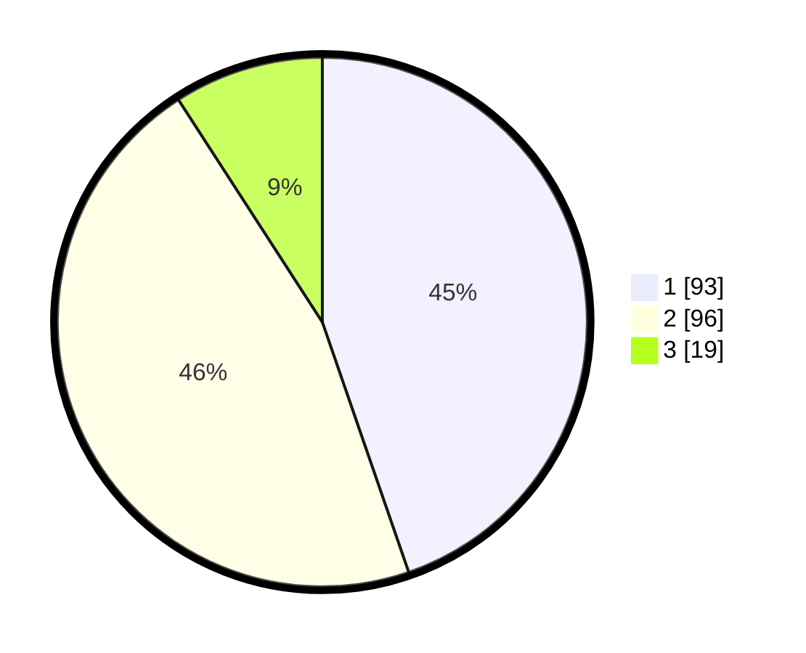

# Hasil

## Grafik

## Tabel

| No. | Nama Paslon    | Suara | Suara (raw) | Persentase |
|:--- |:-------------- | -----:| -----------:| ----------:|
| 1   | ANIES MUHAIMIN | 93    | [93][p-1]   | 44,71      |
| 2   | PRABOWO GIBRAN | 96    | [96][p-2]   | 46,15      |
| 3   | GANJAR MAHFUD  | 19    | [19][p-3]   | 9,13       |

[p-1]: https://github.com/gigit-pemilu/pemilu-2024/blob/main/pilpres/hitung-suara/sub/36-banten/sub/73-kota-serang/sub/01-serang/sub/1001-serang/sub/001-tps/sub/paslon-1.txt
[p-2]: https://github.com/gigit-pemilu/pemilu-2024/blob/main/pilpres/hitung-suara/sub/36-banten/sub/73-kota-serang/sub/01-serang/sub/1001-serang/sub/001-tps/sub/paslon-2.txt
[p-3]: https://github.com/gigit-pemilu/pemilu-2024/blob/main/pilpres/hitung-suara/sub/36-banten/sub/73-kota-serang/sub/01-serang/sub/1001-serang/sub/001-tps/sub/paslon-3.txt

## Foto C Plano

https://sirekap-obj-formc.kpu.go.id/5acc/pemilu/ppwp/36/73/01/10/01/3673011001001-20240214-194956--d69eb928-333e-4c6f-8097-ca9f5732b279.jpg

https://sirekap-obj-formc.kpu.go.id/5acc/pemilu/ppwp/36/73/01/10/01/3673011001001-20240214-160056--d4ca1eb6-86ba-481a-9894-febd38b67a59.jpg

https://sirekap-obj-formc.kpu.go.id/5acc/pemilu/ppwp/36/73/01/10/01/3673011001001-20240215-020403--de1ce280-8181-41ce-a094-403ddbaafebc.jpg

## Metadata

| Key        | Value               |
| ---------- | ------------------- |
| Time Stamp | 2024-02-15 15:30:25 |

