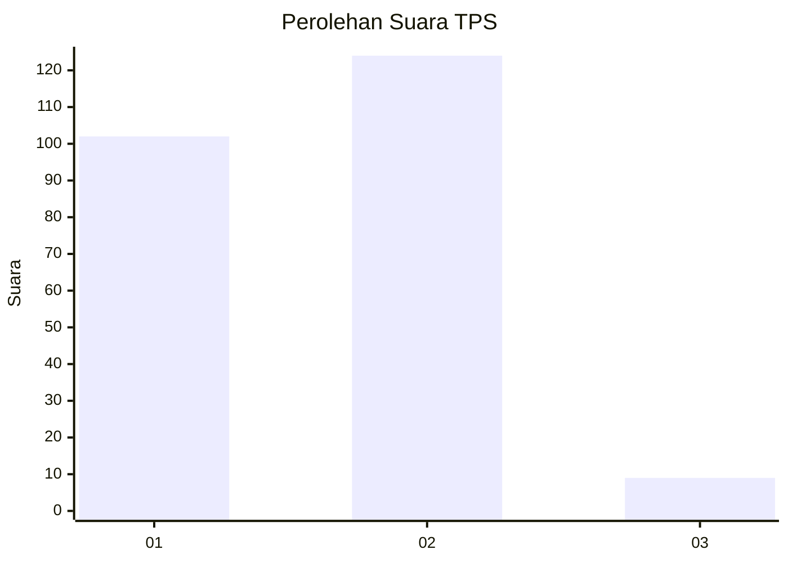
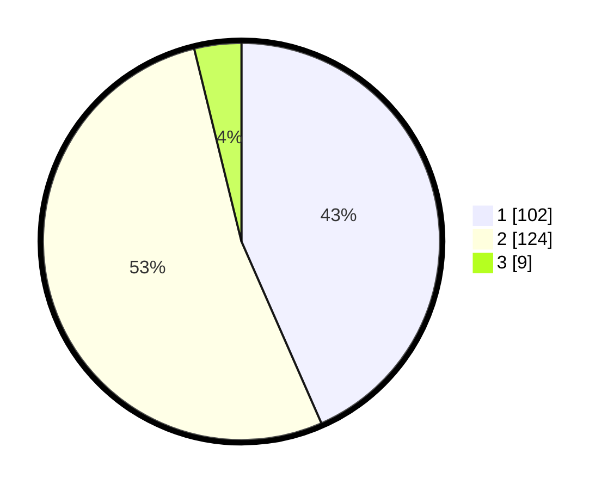

# Hasil

## Grafik

## Tabel

| No. | Nama Paslon    | Suara | Suara (raw) | Persentase |
|:--- |:-------------- | -----:| -----------:| ----------:|
| 1   | ANIES MUHAIMIN | 102   | [102][p-1]  | 43,40      |
| 2   | PRABOWO GIBRAN | 124   | [124][p-2]  | 52,77      |
| 3   | GANJAR MAHFUD  | 9     | [9][p-3]    | 3,83       |

[p-1]: https://github.com/gigit-pemilu/pemilu-2024-36-banten/blob/main/pilpres/hitung-suara/sub/36-banten/sub/73-kota-serang/sub/01-serang/sub/1001-serang/sub/002-tps/sub/paslon-1.txt
[p-2]: https://github.com/gigit-pemilu/pemilu-2024-36-banten/blob/main/pilpres/hitung-suara/sub/36-banten/sub/73-kota-serang/sub/01-serang/sub/1001-serang/sub/002-tps/sub/paslon-2.txt
[p-3]: https://github.com/gigit-pemilu/pemilu-2024-36-banten/blob/main/pilpres/hitung-suara/sub/36-banten/sub/73-kota-serang/sub/01-serang/sub/1001-serang/sub/002-tps/sub/paslon-3.txt

## Foto C Plano

https://sirekap-obj-formc.kpu.go.id/d5fa/pemilu/ppwp/36/73/01/10/01/3673011001002-20240216-192006--1438a14a-9e3f-4223-bbb0-803372150d86.jpg

https://sirekap-obj-formc.kpu.go.id/d5fa/pemilu/ppwp/36/73/01/10/01/3673011001002-20240215-072144--6c8616d8-9534-46b3-b6d3-75d7916ca06b.jpg

https://sirekap-obj-formc.kpu.go.id/d5fa/pemilu/ppwp/36/73/01/10/01/3673011001002-20240215-072233--18212f74-0625-4d63-a477-2cf0b44bed9f.jpg

## Metadata

| Key        | Value               |
| ---------- | ------------------- |
| Time Stamp | 2024-02-16 21:01:00 |

